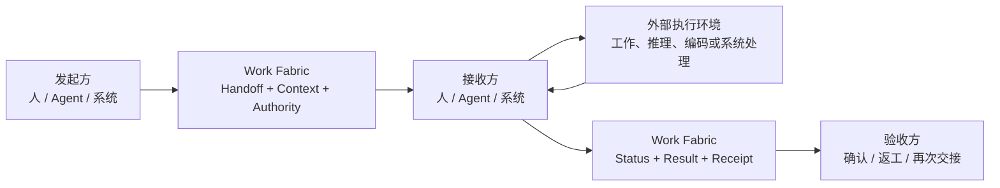

# Work Fabric

> **A protocol-driven collaboration interconnect for humans, agents, and work systems.**

Work Fabric 是面向人、AI Agent 与各类工作系统的协作对接和工作交接服务。它通过统一参与协议，让不同参与方能够发现彼此、接受委托、传递上下文、移交责任、同步状态、返回结果并完成验收。

Work Fabric 不执行参与方的专业工作。人的实际工作、Agent 的规划与推理、Codex 的代码实施，以及飞书、CRM、Git、知识库和运维平台的业务逻辑，始终发生在各自系统内部。

## 为什么需要 Work Fabric

企业的工作通常分散在文档、需求、代码、知识、沟通和运维系统中。AI Agent 即使具备足够的推理或工具能力，也仍然需要解决一组协作边界问题：

- 它代表谁参与，拥有哪些权限？
- 它如何获知一项工作正在等待接手？
- 人或另一个 Agent 如何把责任和上下文可靠地交给它？
- 执行过程发生在外部时，状态和阻塞如何透明化？
- 结果返回给谁，由谁验收，失败后如何退回或再次交接？
- 旧系统如何在不重建的情况下加入同一张协作网络？

Work Fabric 聚焦这些“协作对接”问题，使人、Agent 与系统可以在统一语义下互相替换、组合和协同。

## 核心思想

Work Fabric 的中心不是内部工作流引擎，而是两个稳定能力：

### Unified Participation Protocol

统一描述参与和交接所需的语义：

- Identity & Delegation
- Endpoint & Capability
- Work Reference & Intent
- Assignment & Handoff
- Context Exchange
- Status & Checkpoint
- Result, Receipt & Acceptance
- Event & Subscription

### Collaboration & Handoff Exchange

持久化框架真正拥有的协作事实：谁把什么交给了谁、接收方是否承担责任、附带了哪些上下文和授权、当前报告了什么状态、结果返回到哪里，以及是否通过验收。

全局事件、订阅、通知、Context 和关系视图都服务于这条交接主线。

## 职责边界

| Work Fabric 原生负责 | 执行主体或外部系统负责 |
|---|---|
| 参与者、端点、能力和委托关系 | 人的专业工作过程 |
| 外部工作项的统一引用 | Agent 的规划、推理和工具调用 |
| Collaboration Thread、Assignment 和 Handoff | Codex 的代码实施 |
| Context 的范围化传递 | 外部 Workflow 的内部执行 |
| 状态报告、结果引用和验收回执 | 飞书、CRM、Git 等系统的业务内容 |
| 协作事件、订阅、通知和追踪 | 部署、运行和运维处置本身 |

### 目标解析、派发与执行边界

Work Fabric 是连接和交换层，不是任务决策或执行大脑：

| 能力 | 责任归属 |
|---|---|
| Target Resolution：根据能力、负载、成本或风险决定交给谁 | 外部人、规则服务、Agent Brain 或可插拔 Resolver |
| Handoff Dispatch：把已确定的交接可靠送达，处理 Binding、Delivery、Ack、重试和恢复 | Work Fabric |
| Execution Scheduling：拆解步骤、选择模型与工具、安排参与方内部执行 | 人、Agent Runtime、Workflow 或外部系统 |

直接指定 Actor 或 Endpoint 的 Handoff 不依赖任何 Resolver。Capability Target 只表达待解析的能力需求；Work Fabric 可以提供候选 Endpoint 事实，但不排名、不推荐、不自动选择。外部 Resolver 通过统一协议提交目标解析结果后，Work Fabric 校验目标、记录决策来源并完成派发。消息送达不等于责任接受，只有接收方明确接受 Handoff 后责任才发生迁移。

## 一次交接如何完成



标准 Handoff Package 至少包含：

```text
Work Reference    交接什么
From / To         谁交给谁
Intent            交接目的和期望结果
Context           必要输入和背景
Authority         授权范围和边界
Acceptance        结果验收条件
Status Channel    状态、问题和结果回传方式
Correlation       所属协作链和直接原因
```

## 架构概览

Work Fabric 由以下逻辑能力组成：

- **Participation Edge**：Human Channel Adapter、Agent Endpoint 和 System Connector。
- **Protocol & Contract**：统一领域语义、交互状态机、消息契约和传输绑定。
- **Handoff Core**：参与者目录、工作引用、协作线程、目标绑定、交接、状态和回执。
- **Signal Network**：事件、订阅、通知、确认、游标和重放。
- **Context Exchange**：外部引用、必要快照、范围化 Context Bundle 和交接摘要。
- **Trust & Trace**：身份、委托、权限、因果、审计和责任历史。
- **Read Projections**：Inbox、项目状态、协作时间线和关系视图。

详细说明见[整体架构文档](docs/architecture.md)。可执行的协议规范、Canonical Schema、Handoff 状态机、Golden Fixtures 和参考序列见 [WFPP v1 Core Protocol](protocol/README.md)。

## 示例接入

- 飞书消息作为人类通知、审批、提问和人工接管通道。
- 飞书文档作为客户资料、需求和交付文档的内容来源。
- 本地 Agent Runtime 作为可注册能力、接收 Handoff 和返回结果的 Agent Endpoint。
- Codex 作为 Agent Runtime 暴露的代码实施能力，或作为独立 Agent Endpoint。
- Git、需求系统和部署平台通过 Connector 提供工作引用、状态事件和结果写回。

## HTTP Service Binding

阶段 3B 已提供 `@work-fabric/transport-http`。它把同一个 Exchange Application、Query、Subscription 与 Health 能力绑定为 Node.js HTTP 服务；Fastify 只是包内实现，不进入公共接口。人、Agent、Console 和外部系统使用同一套 API，差别只来自可信身份、代表关系与 Authority Policy，不存在 Console 专用或 Agent 专用的状态通道。

主要入口：

| 能力 | HTTP API |
|---|---|
| Canonical WFPP 命令 | `POST /v1/commands` |
| Handoff 与安全事件查询 | `GET /v1/handoffs/{id}`、`GET /v1/handoffs/{id}/events` |
| Durable Subscription | `GET/PUT /v1/subscriptions/{id}` |
| Cursor Pull / Ack | `POST /v1/subscriptions/{id}/pull`、`POST /v1/subscriptions/{id}/ack` |
| SSE | `GET /v1/subscriptions/{id}/events?partition_id=...` |
| 运维只读接口 | `/v1/partitions/*`、`/v1/admin/*` |
| 健康检查 | `/health/live`、`/health/ready`、`/v1/admin/health` |

程序化启动：

```ts
import {
  BearerAuthenticationEvidenceMapper,
  createHttpService,
  normalizeHttpServiceConfig,
} from "@work-fabric/transport-http";

const service = createHttpService(
  {
    application,
    authenticator: new BearerAuthenticationEvidenceMapper(),
    identity,
    authority,
    query,
    subscriptions,
    schemas,
    delivery,
    health_probes,
  },
  normalizeHttpServiceConfig({}),
);

await service.listen({ host: "127.0.0.1", port: 8080 });
```

Query/Admin 请求使用 `X-WF-Actor-ID`、`X-WF-Endpoint-ID` 和可选 `X-WF-Delegation-ID` 声明代表关系；这些 Header 只是待验证声明，不是权限。默认 Bearer mapper 只生成 authentication evidence，令牌验证仍由 Identity Adapter 负责。

HTTP 配置统一限制请求体、默认/最大分页、请求超时、健康探针超时、SSE 连接数、轮询/心跳/空闲时间和优雅关停截止时间。Pull、Ack 与 SSE 共用一个持久交付账本；SSE 的 `id` 是不透明交付游标，`data` 是仅含一个 Protocol Event 的 canonical Event Delivery，因此客户端可直接取得 `delivery_id` 并提交标准 Ack。只有有效 Ack 才推进位置。

## 当前状态

项目已经完成阶段 1 的 WFPP v1 Core Protocol Artifacts 与 Exchange Core transport-free 参考实现、阶段 2 的 PostgreSQL Production Persistence Foundation、阶段 3A 的 Target Resolution Protocol/Core，以及阶段 3B 的 HTTP Service Binding。Canonical 命令、授权查询、运维可见性、Durable Pull/Ack、SSE、健康检查和服务生命周期已经可以通过同一个公共 HTTP Surface 使用；Webhook Worker、A2A、MCP、飞书、Agent Runtime、SDK 和 Console 仍属于后续阶段，参与方的专业工作与 Agent 执行始终在 Core 之外。

当前阶段路线：

| 阶段 | 范围 | 状态 |
|---|---|---|
| 1 | Exchange Core + Memory Reference | 已完成 |
| 2 | PostgreSQL Production Adapter Foundation | 已完成 |
| 3A | Target Resolution Protocol / Core | 已完成 |
| 3B | HTTP Service Binding | 已完成 |
| 3C | TypeScript SDK | 下一步 |
| 4 | 飞书与本地 Agent Runtime 接入 | 未开始 |
| 5 | 查询、运维、可观测性与 Read-mostly Console | 未开始 |
| 6 | 高吞吐 Signal 与集群分区 | 未开始 |
| 7 | 跨 Exchange Federation Profile | 未开始 |

阶段严格按顺序推进。Console 不进入阶段 3，也不是任务执行的必要组件；它在阶段 5 作为可关闭、可替换的查询与运维客户端，以状态呈现为主，并且任何人工干预都必须通过标准 API 提交协议命令。

当前实现边界如下：

- `Handoff` 是责任与生命周期的权威事实；`Assignment` 只能从 Handoff 读模型投影得到，不能独立写入。
- Capability Target 会先进入 `target_resolution_pending`；外部人、规则服务或 Agent Brain 通过统一命令提交一个明确 Actor/Endpoint，Core 只做授权、资格校验、原子绑定与审计，不做候选选择或调度。
- 原始 Capability Requirement 保持不变，解析结果单独保存在 `TargetBinding`；未配置 `TargetEligibilityVerifier` 或资格服务不可用时，解析命令 fail-closed 且不落盘。
- Journal、幂等记录、投影检查点、投递位置、重试和死信具有技术中立 SPI。
- Memory Adapter 是可执行参考和一致性测试载体，不是生产存储。
- PostgreSQL Production Adapter Foundation 已完成；它不是 Exchange Core 或 SPI 的依赖，也没有改变公共接口。
- PostgreSQL 适配器已覆盖 authority、outbox、projection、subscription、delivery、lease 和 Context 元数据；部署与迁移说明见 [PostgreSQL 部署文档](docs/postgresql-deployment.md)。
- `npm run postgres:migrate -- --dry-run` 可预览迁移，`npm run postgres:smoke` 在设置 `PG_TEST_URL` 后执行租户 RLS 烟测。
- “全局订阅”是跨逻辑 Partition 的查询与消费视图；恢复、确认和重放位置始终按 Subscription × Partition 独立保存，不承诺全局顺序。
- 公共 WFPP Protocol Event 只包含协议字段，不暴露内部 `domain_data`、Partition position、Commit ID 或其他存储游标元数据。
- HTTP Route 只做传输映射、身份/代表关系校验、Authority 调用和有界序列化；它不调用 Decider、不选择目标、不直接访问数据库。
- Pull 与 SSE 是同一个 Durable Subscription 的两种呈现，复用交付位置、Pending Delivery、Ack、重放和至少一次语义；WebSocket 未进入 3B。
- `/health/live` 与 `/health/ready` 只返回有界进程状态；受保护的 `/v1/admin/health` 才返回不含错误文本的依赖摘要。

可执行的人 → Agent → 人工验收参考流、并发与恢复场景以及公共 Reference Suite 已纳入：

```bash
npm run verify
npm run verify:exchange
```

下一步严格进入 3C TypeScript SDK：SDK 只封装当前公共 HTTP Contract，不创建第二套状态模型或 Agent 专用捷径。随后再进入飞书、本地 Agent Runtime、查询运维和 Console。阶段 3 不包含 Console UI，Webhook Worker、OIDC Adapter、Agent Gateway 和生产部署组合也不因 3B 完成而被宣称就绪。

## 文档

- [整体架构](docs/architecture.md)
- [WFPP v1 Core Protocol 与 Schema 索引](protocol/README.md)
- [机器可读 Handoff 生命周期](protocol/spec/handoff-lifecycle.json)
- [一致性用例与 Exchange Contract](protocol/conformance/)
- [人、Agent 与系统参考序列](protocol/examples/)
- [协作对接与工作交接详细设计](docs/superpowers/specs/2026-07-13-collaboration-handoff-fabric-design.md)
- [Work Fabric Participation Protocol v1 设计](docs/superpowers/specs/2026-07-13-work-fabric-participation-protocol-v1-design.md)
- [HTTP Service Binding 设计](docs/superpowers/specs/2026-07-15-http-service-binding-design.md)
- [Core Protocol Artifacts 实施计划](docs/superpowers/plans/2026-07-14-core-protocol-artifacts.md)
- [项目文档实施计划](docs/superpowers/plans/2026-07-13-project-documentation.md)
