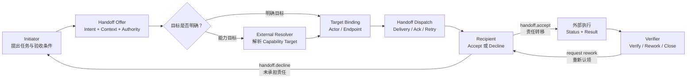
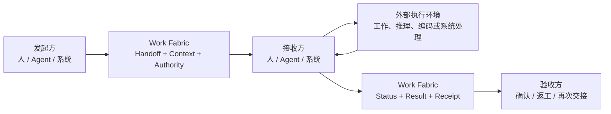

# Work Fabric

> **A protocol-driven collaboration interconnect for humans, agents, and work systems.**

从愿景上，Work Fabric 可以浓缩为：

> **一个去中心化、AI 友好的智能与信息万物互联方案。**

这里的“去中心化”是指不同参与方、工作系统与 Work Fabric Exchange 各自保持独立权威，通过协议和签名交接形成联邦式协作网络，而不是依赖一个全局数据库或中央执行大脑；“AI 友好”是指 Agent 作为一等参与者，能够通过机器可读的身份、能力、上下文、授权、状态和结果契约加入协作；“万物互联”聚焦人、Agent、工作系统及其工作引用与协作事实。智能决策和专业执行仍由外部 Agent、Resolver、人或业务系统负责，Work Fabric 提供互联、信任、交接和追踪基础设施。

Work Fabric 是面向人、AI Agent 与各类工作系统的协作对接和工作交接服务。它通过统一参与协议，让不同参与方能够发现彼此、接受委托、传递上下文、移交责任、同步状态、返回结果并完成验收。

Work Fabric 不执行参与方的专业工作。人的实际工作、Agent 的规划与推理、Codex 的代码实施，以及飞书、CRM、Git、知识库和运维平台的业务逻辑，始终发生在各自系统内部。

## 为什么需要 Work Fabric

企业的工作通常分散在文档、需求、代码、知识、沟通和运维系统中。AI Agent 即使具备足够的推理或工具能力，也仍然需要解决一组协作边界问题：

- 它代表谁参与，拥有哪些权限？
- 它如何获知一项工作正在等待接手？
- 人或另一个 Agent 如何把责任和上下文可靠地交给它？
- 执行过程发生在外部时，状态和阻塞如何透明化？
- 结果返回给谁，由谁验收，失败后如何退回或再次交接？
- 旧系统如何在不重建的情况下加入同一张协作网络？

Work Fabric 聚焦这些“协作对接”问题，使人、Agent 与系统可以在统一语义下互相替换、组合和协同。

## 协作网络中的三类公民

Work Fabric 将所有能够独立参与协作、承担责任并返回结果的主体视为**协作公民**。这是产品层的统一视角；在 WFPP v1 中，它对应 `Actor`，并由 `actor_type` 明确分为三类：

| 公民类型 | 协议类型 | 典型形态 | 参与方式 |
|---|---|---|---|
| 人类公民 | `human` | 员工、专家、审批人、客户 | 通过飞书、Console、API 或其他 Human Adapter 参与 |
| 智能体公民 | `agent` | Daily Assistant、Codex、本地或远程 Agent | 通过 Agent Endpoint 声明能力、接收交接并返回结果 |
| 系统公民 | `system` | CRM、Git、知识库、部署、监控或自动化服务 | 通过 Connector 暴露工作引用、状态、动作和结果 |

三类公民共享同一套身份、能力、上下文、授权、Handoff、状态、结果和验收语义，不因入口不同而产生协议特权。差异只体现在身份凭据、Endpoint、Capability、Admission Policy 和实际执行方式。

“公民类型”和“协作角色”必须分开：同一个 Human、Agent 或 System Actor 在不同 Handoff 中都可以成为发起方 `Initiator`、接收方 `Recipient` 或验收方 `Verifier`；可选的 `Target Resolver` 是一次目标解析中的动态角色，不是第四类公民。认证调用者 `Principal`、责任主体 `Actor` 和收发入口 `Endpoint` 也必须分别建模。

## 核心思想

Work Fabric 的中心不是内部工作流引擎，而是两个稳定能力：

### Unified Participation Protocol

统一描述参与和交接所需的语义：

- Identity & Delegation
- Endpoint & Capability
- Work Reference & Intent
- Assignment & Handoff
- Context Exchange
- Status & Checkpoint
- Result, Receipt & Acceptance
- Event & Subscription

### Collaboration & Handoff Exchange

持久化框架真正拥有的协作事实：谁把什么交给了谁、接收方是否承担责任、附带了哪些上下文和授权、当前报告了什么状态、结果返回到哪里，以及是否通过验收。

全局事件、订阅、通知、Context 和关系视图都服务于这条交接主线。

### Participation Discovery

`workfabric.discovery.v1` 让新接入的通用 Agent 查询其被授权看到的 Exchange、聚合能力、参与者、Endpoint 和安全 Binding。它采用显式 Peer、签名短 TTL 记录、增量拉取和有预算的按需查询，不使用全网广播、匿名 Gossip 或全局注册中心。

Discovery 只返回带来源、版本、新鲜度和签名证明的未排序事实。候选比较与目标选择由 Agent、人或外部 Resolver 完成；实际调用继续经过目标 Exchange 的 Identity、Authority、Federation 与 Handoff 流程。公开一项发现记录不等于授权调用，也不等于目标已经接受责任。

### 任务派发与认领

Work Fabric 将“找到接收方”“可靠送达”和“承担责任”拆成三个独立事实：

1. **目标解析**：发起方可以直接指定 Actor/Endpoint；如果只声明 Capability Requirement，则由外部人、规则服务或 Agent Brain 解析出唯一明确目标。
2. **任务派发**：Exchange 校验目标和授权，记录不可变 Target Binding，再通过兼容 Endpoint 可靠投递，处理 Delivery、Ack、重试和恢复。
3. **任务认领**：指定 Recipient 明确执行 `handoff.accept` 后，责任才从 Initiator 转移给 Recipient。收到消息、读取通知或发送 Delivery Ack 都不等于认领。



因此，“认领”不是无目标的公开抢单或首个响应者获胜，而是已经完成目标绑定的接收方对责任作出显式、可审计、可授权校验的承诺。若未来需要任务市场或竞争式认领，应由外部 Resolver 定义选择规则，再把唯一结果提交给 Work Fabric。

## 职责边界

| Work Fabric 原生负责 | 执行主体或外部系统负责 |
|---|---|
| 参与者、端点、能力和委托关系 | 人的专业工作过程 |
| 外部工作项的统一引用 | Agent 的规划、推理和工具调用 |
| Collaboration Thread、Assignment 和 Handoff | Codex 的代码实施 |
| Context 的范围化传递 | 外部 Workflow 的内部执行 |
| 状态报告、结果引用和验收回执 | 飞书、CRM、Git 等系统的业务内容 |
| 协作事件、订阅、通知和追踪 | 部署、运行和运维处置本身 |

### 目标解析、派发与执行边界

Work Fabric 是连接和交换层，不是任务决策或执行大脑：

| 能力 | 责任归属 |
|---|---|
| Target Resolution：根据能力、负载、成本或风险决定交给谁 | 外部人、规则服务、Agent Brain 或可插拔 Resolver |
| Handoff Dispatch：把已确定的交接可靠送达，处理 Binding、Delivery、Ack、重试和恢复 | Work Fabric |
| Execution Scheduling：拆解步骤、选择模型与工具、安排参与方内部执行 | 人、Agent Runtime、Workflow 或外部系统 |

直接指定 Actor 或 Endpoint 的 Handoff 不依赖任何 Resolver。Capability Target 只表达待解析的能力需求；Work Fabric 可以提供候选 Endpoint 事实，但不排名、不推荐、不自动选择。外部 Resolver 通过统一协议提交目标解析结果后，Work Fabric 校验目标、记录决策来源并完成派发。消息送达不等于责任接受，只有接收方明确接受 Handoff 后责任才发生迁移。

## 一次交接如何完成



标准 Handoff Package 至少包含：

```text
Work Reference    交接什么
From / To         谁交给谁
Intent            交接目的和期望结果
Context           必要输入和背景
Authority         授权范围和边界
Acceptance        结果验收条件
Status Channel    状态、问题和结果回传方式
Correlation       所属协作链和直接原因
```

## 架构概览

Work Fabric 由以下逻辑能力组成：

- **Participation Edge**：Human Channel Adapter、Agent Endpoint 和 System Connector。
- **Protocol & Contract**：统一领域语义、交互状态机、消息契约和传输绑定。
- **Handoff Core**：参与者目录、工作引用、协作线程、目标绑定、交接、状态和回执。
- **Signal Network**：事件、订阅、通知、确认、游标和重放。
- **Context Exchange**：外部引用、必要快照、范围化 Context Bundle 和交接摘要。
- **Trust & Trace**：身份、委托、权限、因果、审计和责任历史。
- **Read Projections**：Inbox、项目状态、协作时间线和关系视图。

详细说明见[整体架构文档](docs/architecture.md)。可执行的协议规范、Canonical Schema、Handoff 状态机、Golden Fixtures 和参考序列见 [WFPP v1 Core Protocol](protocol/README.md)。

## 示例接入

- 飞书消息作为人类通知、审批、提问和人工接管通道。
- 飞书文档作为客户资料、需求和交付文档的内容来源。
- 本地 Agent Runtime 作为可注册能力、接收 Handoff 和返回结果的 Agent Endpoint。
- Codex 作为 Agent Runtime 暴露的代码实施能力，或作为独立 Agent Endpoint。
- Git、需求系统和部署平台通过 Connector 提供工作引用、状态事件和结果写回。

## HTTP Service Binding

阶段 3B 已提供 `@work-fabric/transport-http`。它把同一个 Exchange Application、Query、Subscription 与 Health 能力绑定为 Node.js HTTP 服务；Fastify 只是包内实现，不进入公共接口。人、Agent、Console 和外部系统使用同一套 API，差别只来自可信身份、代表关系与 Authority Policy，不存在 Console 专用或 Agent 专用的状态通道。

主要入口：

| 能力 | HTTP API |
|---|---|
| Canonical WFPP 命令 | `POST /v1/commands` |
| Handoff 与安全事件查询 | `GET /v1/handoffs/{id}`、`GET /v1/handoffs/{id}/events` |
| Durable Subscription | `GET/PUT /v1/subscriptions/{id}` |
| Cursor Pull / Ack | `POST /v1/subscriptions/{id}/pull`、`POST /v1/subscriptions/{id}/ack` |
| SSE | `GET /v1/subscriptions/{id}/events?partition_id=...` |
| 协作视图 | `/v1/responsibilities`、`/v1/timeline`、`/v1/relationships` |
| 运维视图与恢复意图 | `/v1/operations/*`（含 projection、delivery、connector、discrepancy、audit、recovery） |
| 兼容管理查询 | `/v1/partitions/*`、`/v1/admin/*` |
| 健康检查 | `/health/live`、`/health/ready`、`/v1/admin/health` |

程序化启动：

```ts
import {
  BearerAuthenticationEvidenceMapper,
  createHttpService,
  normalizeHttpServiceConfig,
} from "@work-fabric/transport-http";

const service = createHttpService(
  {
    application,
    authenticator: new BearerAuthenticationEvidenceMapper(),
    identity,
    authority,
    query,
    subscriptions,
    schemas,
    delivery,
    health_probes,
  },
  normalizeHttpServiceConfig({}),
);

await service.listen({ host: "127.0.0.1", port: 8080 });
```

Query/Admin 请求使用 `X-WF-Actor-ID`、`X-WF-Endpoint-ID` 和可选 `X-WF-Delegation-ID` 声明代表关系；这些 Header 只是待验证声明，不是权限。默认 Bearer mapper 只生成 authentication evidence，令牌验证仍由 Identity Adapter 负责。

HTTP 配置统一限制请求体、默认/最大分页、请求超时、健康探针超时、SSE 连接数、轮询/心跳/空闲时间和优雅关停截止时间。Pull、Ack 与 SSE 共用一个持久交付账本；SSE 的 `id` 是不透明交付游标，`data` 是仅含一个 Protocol Event 的 canonical Event Delivery，因此客户端可直接取得 `delivery_id` 并提交标准 Ack。只有有效 Ack 才推进位置。

## TypeScript SDK

阶段 3C 已提供 `@work-fabric/sdk-typescript`，在 Node.js 与兼容 Web Standards 的运行时上统一封装阶段 3B 的公共 HTTP Contract。Human 应用、Agent Runtime、Connector 和 Console 使用同一个 `WorkFabricClient`，不存在 Agent 专用或 Admin 旁路客户端。

```ts
import { BearerTokenProvider, WorkFabricClient } from "@work-fabric/sdk-typescript";

const fabric = new WorkFabricClient({
  baseUrl: "http://127.0.0.1:8080",
  tenantId: "tenant_01",
  exchangeId: "exchange_01",
  representation: {
    actorId: "agent_implementation",
    endpointId: "runtime_local",
  },
  authentication: new BearerTokenProvider(() => obtainAccessToken()),
});

const handoff = await fabric.queries.getHandoff("handoff_01");
await fabric.handoffs.accept(
  { handoff_id: handoff.handoff_id },
  { expectedVersion: handoff.resource_version, idempotencyKey: "accept-01" },
);
```

SDK 提供 Canonical Command、完整 Handoff 便捷方法、Query、Operations、Subscription Put/Pull/Ack 和认证 SSE。写请求不自动重试；查询只有有界重试；SSE 保留至少一次、显式 Ack 和未确认重放语义。SDK 不缓存权威状态、不选择目标、不执行工作，也不替调用方处理或确认事件。完整 API、浏览器约束和错误模型见 [TypeScript SDK 文档](packages/sdk-typescript/README.md)。

## Endpoint 与外部 Agent Runtime

阶段 4A 已提供生产形态的原生 Agent 连接边界：管理员注册绑定 Actor 的 Endpoint；外部 Runtime 通过单活 fenced Session 声明 Capability 和可用性；外部 Resolver 读取未排序、未评分的事实并用标准命令提交明确目标；Endpoint Inbox 把已提交 Handoff Event 投影为可重建的路由事实；`@work-fabric/agent-gateway` 通过公开 TypeScript SDK 维护租约、发现分区并汇聚 Durable SSE。

```text
Admin provision
  -> Runtime session + heartbeat
  -> Resolver discovers facts and explicitly resolves target
  -> Endpoint inbox exposes Handoff partition
  -> Gateway receives Delivery
  -> External Runtime persists + Ack
  -> External Runtime explicitly accepts/declines and performs work
```

Gateway 只处理连接机械：它不比较候选、不安排任务、不调用模型或 Codex、不自动 Ack，也不自动接受 Handoff。Delivery Ack 仅表示信号已持久接收；Handoff Accept 才表示责任移交，两者必须分别显式提交。每个 Subscription × Partition 独立保存游标和 Ack 位置，不承诺跨分区全局顺序；有界队列通过背压等待，不丢弃信号。

本地评估可使用 Memory Endpoint Adapter；持久部署可使用 PostgreSQL Endpoint Directory/Inbox Adapter，公共 SPI、HTTP 和 SDK 不绑定数据库。完整接入顺序、配置上限、错误模型和外部 Runtime 示例见 [Endpoint 与外部 Agent Runtime 接入](docs/endpoint-agent-boundary.md)。

## Feishu Connector

阶段 4B 已提供第一个具体协作系统连接器，同时把可复用的 Connector 边界从飞书实现中拆出：

- `@work-fabric/connector-spi`：技术中立的 durable ingress、映射、身份、资源和对账契约。
- Memory 与 PostgreSQL ingress adapters：共享去重、租约、fencing、重试、死信、显式 requeue 和租户隔离行为。
- `@work-fabric/connector-runtime`：异步映射 worker 和只比较、不静默修改任一侧的 reconciliation service。
- `@work-fabric/connector-feishu`：Webhook 验签/解密、可选长连接、明确身份映射、受认证的交互动作、文档引用、OpenAPI 和既有 `SignalAdapter` 的飞书实现。
- `@work-fabric/transport-http`：`POST /v1/connectors/feishu/{connector_id}/events` 只完成安全校验、归一化和 durable accept，不等待映射或 SDK 命令。

```text
Feishu callback -> durable ingress -> Connector worker -> public TypeScript SDK
Work Fabric event -> existing SignalDispatcher -> FeishuSignalAdapter -> Feishu
```

完整 callback、SDK、Exchange、Subscription、卡片动作回流测试证明了连接闭环，同时保持四类事实独立：callback 被持久接收、映射完成、飞书接受出站消息、Actor 接受 Handoff 责任。任一前置事实都不能替代后一个事实。

部署组合、权限、凭据、保留策略和本地验证见 [Feishu Connector 示例](examples/feishu-connector/README.md)；客户意向到交付运维的完整连接场景见 [飞书客户项目生命周期示例](docs/feishu-customer-lifecycle-example.md)。

内置的 `collaboration-channel.feishu` 插件进一步提供可直接启动的双向协作通道：全局配置通过可替换的 Configuration Provider 加载，飞书 `@机器人` 文本进入一个外部 Agent 的 Intake Handoff，后续 Handoff 事件通过 canonical Subscription 返回原会话。插件只做连接和交接，不做自然语言理解或需求创建。双模式步骤见 [飞书协作通道接入](docs/guides/feishu-collaboration-channel.md)，无需域名的本地配置见 [SQLite 长连接示例](examples/config/service-feishu-long-connection.yaml)。

## 查询、运维与 Console

阶段 5 已完成责任、时间线和关系投影，以及 Projection、Delivery、Connector、差异和审计的有界运维视图。所有能力都通过同一 HTTP/TypeScript SDK 暴露，Human、Agent、Connector、客户服务与可选 Console 只有身份和 Authority 差异，没有专用数据旁路。

恢复采用“显式意图 + 预期版本 + 幂等键 + fenced worker”模式，只能请求 Connector requeue、Delivery replay、投影重建或差异确认。它不直接编辑 Handoff，也不决定何时恢复。OpenTelemetry 适配只输出固定低基数语义；内容、凭据、Tenant/Actor/Handoff/Event ID 不进入指标标签。

可运行组合提供：

- `memory-demo`：显式开发模式、重启丢失；
- `sqlite-local`：本地单进程、完整侧存储重启持久化；
- `postgres`：由部署注入既有生产适配器，不隐式读取凭据。

```bash
export WORK_FABRIC_CONFIG=/absolute/path/work-fabric.yaml
npm run service:start
npm run console:build
```

Read-mostly Console 只依赖公共 SDK，展示责任、时间线、关系、运维事实和窄恢复表单。它不是执行过程的必要组件，不保存协议真相，不运行 Agent/自动化，不自动 Ack SSE。部署与认证接入见 [Console 文档](docs/console.md)，运维与恢复见 [Operations 文档](docs/operations.md)，SQLite 本地部署见 [SQLite 文档](docs/sqlite-deployment.md)，性能证据见 [Phase 5 性能基线](docs/performance-baseline.md)。

## 集群分区运行时

阶段 6A 已完成可水平协调的机械 Owner 运行时：数据库 Journal、Outbox、投影检查点、投递位置和租约保持权威；可选 Wakeup 只携带 Tenant、Partition、Work Kind 和观察位置，可以丢失或重复。定期有界扫描恢复丢失提示，Tenant 公平队列合并重复提示，租约与 fencing 阻止过期 Owner 推进状态。

运行时只拥有四类机械 Turn：Outbox Wakeup、Handoff Projection、Collaboration Projection 和 Signal Delivery。它不选择接收方、不拆解 Workflow、不安排 Agent、不调用模型/工具，也不执行参与方工作。`service-node` 支持 `api`、`worker` 和 `all` 角色；Worker 端口与凭据由部署显式注入，`sqlite-local` 明确拒绝集群配置。

真实 HTTP/TypeScript SDK 的五步 Handoff 生命周期已通过双 Host、丢失/重复 Wakeup、外部 Signal Probe 和过期 Owner 接管测试。阶段 6B 又增加了可选 NATS JetStream 元数据提示：严格 4,096 字节 payload、HMAC Tenant Subject、有界 Pull/Ack/Retry、显式非破坏拓扑管理和 Broker 断线回退；数据库扫描始终保持开启与权威。部署边界见[集群分区运行时](docs/cluster-runtime.md)和 [NATS Wakeup 部署](docs/nats-wakeup-deployment.md)。

## 跨 Exchange Federation

阶段 7 已完成 `workfabric.federation.v1`。当 Source 已明确选择 Target Exchange 后，双方通过 Ed25519 签名的 `transfer_offer` / `transfer_receipt` 完成交接对接：严格校验受众、TTL、canonical digest 和显式 Peer/Key 信任；重复请求返回 byte-identical Receipt，冲突重放 fail closed，传输故障只重发原始签名字节。

Federation Gateway 仍不是大脑。它不发现或排名 Peer、不选择目标、不复制远端状态、不建立全局事务，也不执行参与方工作。部署 Bridge 通过目标 Exchange 的既有公共 API/SDK 幂等创建本地 Handoff；每个 Exchange 只对自己的 Handoff、Journal、版本和 Authority 决策权威。HTTP Federation Binding 与生产 Replay Store 是可独立替换的后续 Adapter，不进入 Core、Cluster Runtime、公共 HTTP 或统一 SDK。

参考实现提供技术中立 SPI、严格 Runtime、Memory Replay Store、Node Ed25519 Adapter、可复用 Conformance Profile、边界门禁，以及两套真实 HTTP/TypeScript SDK/Exchange 的本地权威隔离端到端证明。部署、信任轮换和失败语义见[跨 Exchange Federation](docs/federation.md)。

## 当前状态

项目已经完成阶段 1–7：从 WFPP/Exchange Core、生产持久化、HTTP/SDK、Endpoint/Agent、Connector/飞书、查询运维 Console、集群分区所有权和可选 NATS Wakeup，到跨 Exchange 签名交接 Profile。Human、Agent、Connector、Console 和开放服务共享同一个公共协议与权限链；参与方的专业工作与 Agent 执行始终在 Work Fabric 之外。

当前阶段路线：

| 阶段 | 范围 | 状态 |
|---|---|---|
| 1 | Exchange Core + Memory Reference | 已完成 |
| 2 | PostgreSQL Production Adapter Foundation | 已完成 |
| 3A | Target Resolution Protocol / Core | 已完成 |
| 3B | HTTP Service Binding | 已完成 |
| 3C | TypeScript SDK | 已完成 |
| 4A | Endpoint 与外部 Agent Runtime 连接边界 | 已完成 |
| 4B | Generic Connector + 飞书 Connector | 已完成 |
| 5 | 查询、运维、可观测性与 Read-mostly Console | 已完成 |
| 6A | 集群分区所有权与数据库恢复 | 已完成 |
| 6B | Broker-backed Signal/Wakeup 加速 | 已完成 |
| 7 | 跨 Exchange Federation Profile | 已完成 |

阶段严格按顺序推进。Console 没有进入阶段 3，也不是任务执行的必要组件；它在阶段 5 作为可关闭、可替换的查询与运维客户端，以状态呈现为主，并且任何人工干预都通过标准 API 提交恢复意图。

当前实现边界如下：

- `Handoff` 是责任与生命周期的权威事实；`Assignment` 只能从 Handoff 读模型投影得到，不能独立写入。
- Capability Target 会先进入 `target_resolution_pending`；外部人、规则服务或 Agent Brain 通过统一命令提交一个明确 Actor/Endpoint，Core 只做授权、资格校验、原子绑定与审计，不做候选选择或调度。
- 原始 Capability Requirement 保持不变，解析结果单独保存在 `TargetBinding`；未配置 `TargetEligibilityVerifier` 或资格服务不可用时，解析命令 fail-closed 且不落盘。
- Journal、幂等记录、投影检查点、投递位置、重试和死信具有技术中立 SPI。
- Memory Adapter 是可执行参考和一致性测试载体，不是生产存储。
- PostgreSQL Production Adapter Foundation 已完成；它不是 Exchange Core 或 SPI 的依赖，也没有改变公共接口。
- PostgreSQL 适配器已覆盖 authority、outbox、projection、subscription、delivery、lease 和 Context 元数据；部署与迁移说明见 [PostgreSQL 部署文档](docs/postgresql-deployment.md)。
- `npm run postgres:migrate -- --dry-run` 可预览迁移，`npm run postgres:smoke` 在设置 `PG_TEST_URL` 后执行租户 RLS 烟测。
- “全局订阅”是跨逻辑 Partition 的查询与消费视图；恢复、确认和重放位置始终按 Subscription × Partition 独立保存，不承诺全局顺序。
- 公共 WFPP Protocol Event 只包含协议字段，不暴露内部 `domain_data`、Partition position、Commit ID 或其他存储游标元数据。
- HTTP Route 只做传输映射、身份/代表关系校验、Authority 调用和有界序列化；它不调用 Decider、不选择目标、不直接访问数据库。
- Pull 与 SSE 是同一个 Durable Subscription 的两种呈现，复用交付位置、Pending Delivery、Ack、重放和至少一次语义；WebSocket 未进入 3B。
- TypeScript SDK 只封装公共 HTTP Contract；Human、Agent、Connector 与 Operations 调用共享认证、表示和 Authority 链，不创建第二套状态、Admin 旁路或自动执行层。
- Endpoint Directory 保存注册、Capability、Binding、租约和 availability 事实；Discovery 只返回确定分页的事实，不包含 score、rank、recommendation 或 selected target。
- Agent Gateway 只依赖公开 TypeScript SDK，处理 Session 续租、Inbox Partition 刷新、SSE 汇聚和有界背压；Agent Runtime、Resolver、模型、工具与执行回调都在包外。
- Endpoint Inbox 是可重建的路由投影，不复制 Context、Prompt、结果正文、凭据或外部执行状态；Delivery Ack 与 Handoff Accept 保持独立。
- Connector ingress 是有界、可保留清理的操作缓冲，不是新的业务真相库；Webhook/长连接只 durable accept，映射 worker 才通过公开 SDK 提交命令。
- 飞书身份必须映射到已有 Actor/Endpoint；任意聊天默认 inert，只有配置策略或本 Connector 签发的受限动作可以产生协议操作。
- 飞书文档仍由飞书持有，Exchange 只保存版本化引用和有界元数据；凭据只以 opaque reference 出现在配置中。
- Reconciliation 只产生可见 discrepancy，不静默覆盖 Work Fabric 或外部系统状态。
- Connector Worker 在公共 side effect 前续租并校验 fencing；PostgreSQL retention 使用有界 `pruneExpired()` 批次，不让 ingress 成为永久内容库。
- 交互动作同时绑定飞书用户与签发时的 Work Fabric 身份快照；文档原文读取需要 tenant/connector scope 和显式授权。
- `/health/live` 与 `/health/ready` 只返回有界进程状态；受保护的 `/v1/admin/health` 才返回不含错误文本的依赖摘要。
- Responsibility、Timeline 与 Relationship 是可重建投影；每页显式返回 projected/journal position 和 observed time，不把滞后伪装为实时。
- Operation Audit 是不可变、有界分页的租户事实；保留清理由部署按合规策略显式批处理，不记录 Header、命令体、Context 或结果正文。
- 运维恢复只提交幂等、expected-version 检查的窄意图；实际动作由 fenced worker 和专用端口执行，不经过 Console 直写。
- `service-node` 是显式组合根；SQLite 使用同一技术中立 SPI 并声明单进程能力，PostgreSQL 仍是生产导向基线。
- Console 仅使用公共 SDK；SSE 只使查询失效且不自动 Ack，轮询有间隔、抖动、Abort 和单并发上限。
- Federation 只连接显式 Source/Target Exchange；每方只对本地记录权威，签名 Receipt 不能覆盖本地状态，Bridge 必须使用公共 API/SDK 且以 Transfer ID 幂等。
- Federation 不做 Peer discovery/ranking、目标选择、状态复制、两阶段提交、全局顺序、Agent 推理或工作执行；生产 Transport、持久 Replay Store 与密钥托管保持可插拔。
- Participation Discovery 只同步经发布/导出策略允许的签名事实；读取、转发和实际调用各自重新授权，停止发布后必须发送 Tombstone 或等待短 TTL 到期，不能把“停止同步”误当成立即撤回。

可执行的人 → Agent → 人工验收参考流、并发与恢复场景以及公共 Reference Suite 已纳入：

```bash
npm run verify
npm run verify:exchange
```

阶段 1–10 的当前架构闭环已经完成。后续可以按部署需要增加生产 Peer Transport、密钥托管、更多 Connector 或 A2A/MCP Binding，但它们不能改变 Exchange 权威与“连接/发现/交接而非决策/执行”的边界。Agent Brain 和业务自动化继续是外部参与模块。完整阶段状态见 [Roadmap](docs/roadmap.md)。

## 文档

- [整体架构](docs/architecture.md)
- [WFPP v1 Core Protocol 与 Schema 索引](protocol/README.md)
- [机器可读 Handoff 生命周期](protocol/spec/handoff-lifecycle.json)
- [一致性用例与 Exchange Contract](protocol/conformance/)
- [人、Agent 与系统参考序列](protocol/examples/)
- [协作对接与工作交接详细设计](docs/superpowers/specs/2026-07-13-collaboration-handoff-fabric-design.md)
- [Work Fabric Participation Protocol v1 设计](docs/superpowers/specs/2026-07-13-work-fabric-participation-protocol-v1-design.md)
- [HTTP Service Binding 设计](docs/superpowers/specs/2026-07-15-http-service-binding-design.md)
- [TypeScript SDK](packages/sdk-typescript/README.md)
- [Endpoint 与外部 Agent Runtime 接入](docs/endpoint-agent-boundary.md)
- [Operations、审计与恢复](docs/operations.md)
- [SQLite 本地部署](docs/sqlite-deployment.md)
- [Read-mostly Console](docs/console.md)
- [Phase 5 性能基线](docs/performance-baseline.md)
- [集群分区运行时](docs/cluster-runtime.md)
- [Phase 6A 性能基线](docs/performance-cluster-baseline.md)
- [NATS Wakeup 部署](docs/nats-wakeup-deployment.md)
- [Phase 6B NATS Wakeup 性能基线](docs/performance-nats-wakeup-baseline.md)
- [跨 Exchange Federation](docs/federation.md)
- [Participation Discovery 部署与边界](docs/participation-discovery.md)
- [Participation Discovery 性能基线](docs/performance-discovery-baseline.md)
- [TypeScript SDK 设计](docs/superpowers/specs/2026-07-15-typescript-sdk-design.md)
- [Core Protocol Artifacts 实施计划](docs/superpowers/plans/2026-07-14-core-protocol-artifacts.md)
- [项目文档实施计划](docs/superpowers/plans/2026-07-13-project-documentation.md)
