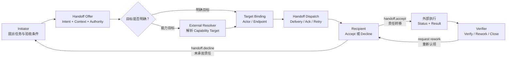
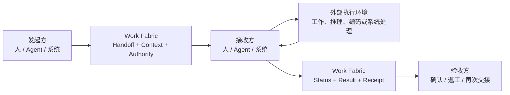

# Work Fabric

> **A protocol-driven collaboration interconnect for humans, agents, and work systems.**

> **当前项目正在探索中，欢迎参与讨论和贡献。**

从愿景上，Work Fabric 可以浓缩为：

> **一个去中心化、AI 友好的智能与信息万物互联方案。**

这里的“去中心化”是指不同参与方、工作系统与 Work Fabric Exchange 各自保持独立权威，通过协议和签名交接形成联邦式协作网络，而不是依赖一个全局数据库或中央执行大脑；“AI 友好”是指 Agent 作为一等参与者，能够通过机器可读的身份、能力、上下文、授权、状态和结果契约加入协作；“万物互联”聚焦人、Agent、工作系统及其工作引用与协作事实。智能决策和专业执行仍由外部 Agent、Resolver、人或业务系统负责，Work Fabric 提供互联、信任、交接和追踪基础设施。

Work Fabric 是面向人、AI Agent 与各类工作系统的协作对接和工作交接服务。它通过统一参与协议，让不同参与方能够发现彼此、接受委托、传递上下文、移交责任、同步状态、返回结果并完成验收。

Work Fabric 不执行参与方的专业工作。人的实际工作、Agent 的规划与推理、Codex 的代码实施，以及飞书、CRM、Git、知识库和运维平台的业务逻辑，始终发生在各自系统内部。

项目的稳定边界由
[Work Fabric 项目章程与不可妥协架构规则](PROJECT_CHARTER.md)定义：Fabric
只做公民接入、协议校验、可靠传播、浅层协作状态记录和审计；它不根据业务
内容、时间或结果主动调用 Citizen、选择下一步或推进业务流程。

## 为什么需要 Work Fabric

企业的工作通常分散在文档、需求、代码、知识、沟通和运维系统中。AI Agent 即使具备足够的推理或工具能力，也仍然需要解决一组协作边界问题：

- 它代表谁参与，拥有哪些权限？
- 它如何获知一项工作正在等待接手？
- 人或另一个 Agent 如何把责任和上下文可靠地交给它？
- 执行过程发生在外部时，状态和阻塞如何透明化？
- 结果返回给谁，由谁验收，失败后如何退回或再次交接？
- 旧系统如何在不重建的情况下加入同一张协作网络？

Work Fabric 聚焦这些“协作对接”问题，使人、Agent 与系统可以在统一语义下互相替换、组合和协同。

## 参与主体与 Network Citizen

Work Fabric 分别建模协作主体与接入模块的网络职责。

`Actor type` 回答**谁参与或被代表**，WFPP v1 目前有 `human`、`agent`、`system`
三种：

| Actor type | 典型主体 | 说明 |
|---|---|---|
| `human` | 员工、专家、审批人、客户 | 人类责任主体，可通过 Channel、Console 或 API 被表示 |
| `agent` | Daily Assistant、Codex、本地或远程 Agent | 能理解意图、作出选择、承担工作责任的智能主体 |
| `system` | CRM、GitHub、知识库、部署或监控系统 | 外部系统主体，通常由 Connector 或 Provider 代表 |

`Network Citizen kind` 回答**接入模块对协作网络闭环承担哪一种责任**，目前有
六种：

| Citizen kind | 对外闭环职责 | 典型实现 |
|---|---|---|
| `decision-body` | 理解意图、作出选择、发布任务、管理业务会话并解释结果 | Human Endpoint、Daily Assistant、外部调度大脑 |
| `capability-provider` | 动态声明可执行 Contract，在自身边界完成领域动作并返回类型化事实 | 飞书 Message/Document/Calendar Provider、GitHub 只读 Provider |
| `channel` | 外部消息的可信接入、来源表示、寻址、格式映射和投递 | 飞书 Channel、本地 Debug Channel、未来的邮件或企业微信 Channel |
| `context-provider` | 按 Authority 返回有界、带来源和版本的上下文 | 飞书文档或会话 Context Provider |
| `governance-provider` | 提供 Identity、Admission、Authority、委托、确认或策略证据 | Admission、单次确认和外部 IAM 适配模块 |
| `observer` | 只读观察、审计导出、Console、指标或事件集成 | Read-mostly Console、审计或可观测性适配模块 |

两者彼此正交：一个 Agent Actor 通常由 `decision-body` Citizen 接入；一个
System Actor 可以代表 `capability-provider`、`context-provider` 或其他
Citizen。一个进程可以托管多个 Citizen，但每个注册只能有一个
`citizen_kind`，并分别拥有身份、租约、动态声明、Authority、状态和审计。

`Initiator`、`Recipient`、`Verifier` 是某次 Handoff 中的协作角色，不是新的
Actor type 或 Citizen kind。认证调用者 `Principal`、责任主体 `Actor`、收发
入口 `Endpoint` 和网络模块 `Citizen` 也必须分别建模。

数据库、Broker、缓存、HTTP/SSE、SDK、YAML、Adapter、Runtime 和 Connector
都是基础设施或接入机制，不会天然成为 Citizen；只有模块以独立身份进入网络、
声明能力并对外承担一种完整责任时，才注册为 Network Citizen。

## 核心思想

Work Fabric 的中心不是内部工作流引擎，而是围绕同一条交接主线组织的以下
稳定能力：

### Unified Participation Protocol

统一描述参与和交接所需的语义：

- Identity & Delegation
- Endpoint & Capability
- Work Reference & Intent
- Assignment & Handoff
- Context Exchange
- Status & Checkpoint
- Result, Receipt & Acceptance
- Event & Subscription

### Collaboration & Handoff Exchange

持久化框架真正拥有的协作事实：谁把什么交给了谁、接收方是否承担责任、附带了哪些上下文和授权、当前报告了什么状态、结果返回到哪里，以及是否通过验收。

全局事件、订阅、通知、Context 和关系视图都服务于这条交接主线。

### Participation Discovery

`workfabric.discovery.v1` 让新接入的通用 Agent 查询其被授权看到的 Exchange、聚合能力、参与者、Endpoint 和安全 Binding。它采用显式 Peer、签名短 TTL 记录、增量拉取和有预算的按需查询，不使用全网广播、匿名 Gossip 或全局注册中心。

Discovery 只返回带来源、版本、新鲜度和签名证明的未排序事实。候选比较与目标选择由 Agent、人或外部 Resolver 完成；实际调用继续经过目标 Exchange 的 Identity、Authority、Federation 与 Handoff 流程。公开一项发现记录不等于授权调用，也不等于目标已经接受责任。

### 任务派发与认领

Work Fabric 将“找到接收方”“可靠送达”和“承担责任”拆成三个独立事实：

1. **目标解析**：发起方可以直接指定 Actor/Endpoint；如果只声明 Capability Requirement，则由外部人、规则服务或 Agent Brain 解析出唯一明确目标。
2. **任务派发**：Exchange 校验目标和授权，记录不可变 Target Binding，再通过兼容 Endpoint 可靠投递，处理 Delivery、Ack、重试和恢复。
3. **任务认领**：指定 Recipient 明确执行 `handoff.accept` 后，责任才从 Initiator 转移给 Recipient。收到消息、读取通知或发送 Delivery Ack 都不等于认领。



因此，“认领”不是无目标的公开抢单或首个响应者获胜，而是已经完成目标绑定的
接收方对责任作出显式、可审计、可授权校验的承诺。需要任务市场或竞争式认领
时，由外部 Resolver 定义选择规则，再把唯一结果提交给 Work Fabric。

## 职责边界

| Work Fabric 原生负责 | 执行主体或外部系统负责 |
|---|---|
| 参与者、端点、能力和委托关系 | 人的专业工作过程 |
| 外部工作项的统一引用 | Agent 的规划、推理和工具调用 |
| Collaboration Thread、Assignment 和 Handoff | Codex 的代码实施 |
| Context 的范围化传递 | 外部 Workflow 的内部执行 |
| 状态报告、结果引用和验收回执 | 飞书、CRM、Git 等系统的业务内容 |
| 协作事件、订阅、通知和追踪 | 部署、运行和运维处置本身 |

### 模块职责闭环与解耦

每个模块必须在自身职责内形成完整闭环，并只通过稳定协议或 SPI
交换事实。一个模块不得为另一个模块补做业务语义、决策或执行，也不得
依赖另一个模块的具体存储、Runtime 或渠道实现。

例如，Agent 负责生产业务语义结果，Work Fabric 负责记录和交换结果，
Channel Adapter 只负责把已经产生的结果映射到目标渠道。Fabric
不能替 Agent 拼接答复，飞书 Adapter 不能从生命周期状态推断业务内容，
Agent 也不能绕过 Fabric 直接耦合某个通知渠道。

对于 Agent 承接的自然语言工作，意图、上下文依赖、信息充分性、相关性和
业务含义由 Agent 模型负责。禁止在 Fabric、Channel、Provider、Runtime 或
Agent 应用策略中使用关键词、正则表达式或固定自然语言词表代替语义判断；
确定性代码只能处理协议、Schema、Authority、身份、安全边界和资源预算。

### 目标解析、派发与执行边界

Work Fabric 是连接和交换层，不是任务决策或执行大脑：

| 能力 | 责任归属 |
|---|---|
| Target Resolution：根据能力、负载、成本或风险决定交给谁 | 外部人、规则服务、Agent Brain 或可插拔 Resolver |
| Handoff Dispatch：把已确定的交接可靠送达，处理 Binding、Delivery、Ack、重试和恢复 | Work Fabric |
| Execution Scheduling：拆解步骤、选择模型与工具、安排参与方内部执行 | 人、Agent Runtime、Workflow 或外部系统 |

直接指定 Actor 或 Endpoint 的 Handoff 不依赖任何 Resolver。Capability Target 默认由外部 Resolver 提交明确目标；也可以显式开启经过权限和能力过滤的候选池，由 Endpoint 原子 Claim。Claim 只是带 Lease 和 fencing 的排他预留，不等于责任接受。Work Fabric 不排名、不推荐、不自动选择，也不自动 Claim；只有接收方显式 Accept 后责任才发生迁移。

## 一次交接如何完成



标准 Handoff Package 至少包含：

```text
Work Reference    交接什么
From / To         谁交给谁
Intent            交接目的和期望结果
Context           必要输入和背景
Authority         授权范围和边界
Acceptance        结果验收条件
Status Channel    状态、问题和结果回传方式
Correlation       所属协作链和直接原因
```

## 架构概览

Work Fabric 由以下逻辑能力组成：

- **Participation Edge**：Human Channel、Agent Endpoint、System Connector，以及外部 Citizen Runtime 的协议接入边界。
- **Citizen Directory & Catalog**：Citizen 身份、租约、动态声明、可用性和按 Authority 渐进披露的 Contract 目录。
- **Protocol & Contract**：统一领域语义、交互状态机、消息契约和传输绑定。
- **Handoff Core**：参与者目录、工作引用、协作线程、目标绑定、交接、状态和回执。
- **Capability Exchange**：用标准辅助 Handoff 连接 Decision Body 与 Capability Provider，并将类型化事实返回原协作链；Fabric 不直接调用 Provider。
- **Signal Network**：事件、订阅、通知、确认、游标和重放。
- **Context Exchange**：外部引用、必要快照、范围化 Context Bundle 和交接摘要。
- **Trust & Trace**：身份、委托、权限、因果、审计和责任历史。
- **Read Projections**：Inbox、项目状态、协作时间线和关系视图。

详细说明见[整体架构文档](docs/architecture.md)。扩展模块必须保持
[Architecture Boundary Check](PROJECT_CHARTER.md#12-architecture-boundary-check)
定义的连接、传播和浅层状态边界。
可执行的协议规范、Canonical Schema、Handoff 状态机、Golden Fixtures 和参考序列见 [WFPP v1 Core Protocol](protocol/README.md)。

## 示例接入

- 飞书消息以 `channel` Citizen 提供人类通知、提问、确认和人工接管通道。
- Daily Assistant 以 `decision-body` Citizen 接收 Handoff、判断信息是否充分、选择能力并生成语义结果。
- 飞书 Message、Document 和 Calendar 以相互独立的 `capability-provider` Citizen 提供消息查询/发送、文档操作和日历操作。
- GitHub 只读 Capability Provider 以 `capability-provider` Citizen 提供仓库、PR、Review、Check、Workflow Run 和 Commit 的有界查询。
- 飞书文档或会话证据可以由独立 `context-provider` Citizen 按 Authority 提供。
- 本地 Agent Runtime 作为 Agent Endpoint 和 `decision-body` Runtime，接收 Handoff 并返回结果。
- Codex 作为 Agent Runtime 暴露的代码实施能力，或作为独立 Agent Endpoint。
- 需求系统和部署平台可以通过 Connector 同步工作引用与状态，也可以将明确的领域动作注册为独立 Capability Provider；Connector 是接入机制，不是 Citizen kind。

可运行的 Daily Assistant Runtime 及其本地、飞书和运维接入方式见
[Agently Agent Runtime 指南](docs/guides/agently-agent-runtime.md)。它作为外部
Runtime Host 运行，Work Fabric Core 只拥有协议、授权、Handoff 和投递事实。

不依赖飞书即可长期验证同一真实协作路径的入口见
[本地 Debug Channel 指南](docs/guides/local-debug-channel.md)。它支持
plain text、Markdown、typed data 和 resource 引用，并完整经过 Connector、
Handoff、Agent Runtime 和 Signal 路径。

## HTTP API

Work Fabric 通过统一 HTTP API 提供命令、查询、订阅、运维与健康检查能力。
人、Agent、Console 和外部系统使用同一组 Contract，差别只来自可信身份、
代表关系与 Authority Policy，不存在 Console 专用或 Agent 专用的状态旁路。

主要入口：

| 能力 | HTTP API |
|---|---|
| Canonical WFPP 命令 | `POST /v1/commands` |
| Handoff 与安全事件查询 | `GET /v1/handoffs/{id}`、`GET /v1/handoffs/{id}/events` |
| Durable Subscription | `GET/PUT /v1/subscriptions/{id}` |
| Cursor Pull / Ack | `POST /v1/subscriptions/{id}/pull`、`POST /v1/subscriptions/{id}/ack` |
| SSE | `GET /v1/subscriptions/{id}/events?partition_id=...` |
| 协作视图 | `/v1/responsibilities`、`/v1/timeline`、`/v1/relationships` |
| 运维视图与恢复意图 | `/v1/operations/*`（含 projection、delivery、connector、discrepancy、audit、recovery） |
| 管理查询 | `/v1/partitions/*`、`/v1/admin/*` |
| 健康检查 | `/health/live`、`/health/ready`、`/v1/admin/health` |

Query/Admin 请求使用 `X-WF-Actor-ID`、`X-WF-Endpoint-ID` 和可选 `X-WF-Delegation-ID` 声明代表关系；这些 Header 只是待验证声明，不是权限。默认 Bearer mapper 只生成 authentication evidence，令牌验证仍由 Identity Adapter 负责。

HTTP 配置统一限制请求体、默认/最大分页、请求超时、健康探针超时、SSE 连接数、轮询/心跳/空闲时间和优雅关停截止时间。Pull、Ack 与 SSE 共用一个持久交付账本；SSE 的 `id` 是不透明交付游标，`data` 是仅含一个 Protocol Event 的 canonical Event Delivery，因此客户端可直接取得 `delivery_id` 并提交标准 Ack。只有有效 Ack 才推进位置。

## TypeScript SDK

`@work-fabric/sdk-typescript` 在 Node.js 与兼容 Web Standards 的运行时中封装
公共 HTTP Contract。Human 应用、Agent Runtime、Connector 和 Console 使用
同一个 `WorkFabricClient`，不存在 Agent 专用或 Admin 旁路客户端。

```ts
import { BearerTokenProvider, WorkFabricClient } from "@work-fabric/sdk-typescript";

const fabric = new WorkFabricClient({
  baseUrl: "http://127.0.0.1:8080",
  tenantId: "tenant_01",
  exchangeId: "exchange_01",
  representation: {
    actorId: "agent_implementation",
    endpointId: "runtime_local",
  },
  authentication: new BearerTokenProvider(() => obtainAccessToken()),
});

const handoff = await fabric.queries.getHandoff("handoff_01");
await fabric.handoffs.accept(
  { handoff_id: handoff.handoff_id },
  { expectedVersion: handoff.resource_version, idempotencyKey: "accept-01" },
);
```

SDK 提供 Canonical Command、完整 Handoff 便捷方法、Query、Operations、Subscription Put/Pull/Ack 和认证 SSE。写请求不自动重试；查询只有有界重试；SSE 保留至少一次、显式 Ack 和未确认重放语义。SDK 不缓存权威状态、不选择目标、不执行工作，也不替调用方处理或确认事件。完整 API、浏览器约束和错误模型见 [TypeScript SDK 文档](packages/sdk-typescript/README.md)。

## Endpoint 与外部 Agent Runtime

管理员可以注册绑定 Actor 的 Endpoint；外部 Agent Runtime 通过单活 fenced
Session 声明 Capability 和可用性。参与方可以渐进发现 Identity、Capability
Summary 和完整 Contract，再由外部 Resolver 提交明确目标，或由有权 Endpoint
从候选池显式 Claim。`@work-fabric/agent-gateway` 通过公共 TypeScript SDK
维护租约、发现 Inbox Partition 并接收 Durable SSE。

```text
Admin provision
  -> Runtime session + heartbeat
  -> Resolver discovers facts and explicitly resolves target
  -> Endpoint inbox exposes Handoff partition
  -> Gateway receives Delivery
  -> External Runtime persists + Ack
  -> External Runtime explicitly accepts/declines and performs work
```

Gateway 只处理连接机械：它不比较候选、不安排任务、不调用模型或 Codex、不自动 Claim、不自动 Ack，也不自动接受 Handoff。Delivery Ack 仅表示信号已持久接收；Claim 仅表示排他预留；Handoff Accept 才表示责任移交，三者必须分别显式提交。每个 Subscription × Partition 独立保存游标和 Ack 位置，不承诺跨分区全局顺序；有界队列通过背压等待，不丢弃信号。

本地评估可使用 Memory Endpoint Adapter；持久部署可使用 PostgreSQL Endpoint Directory/Inbox Adapter，公共 SPI、HTTP 和 SDK 不绑定数据库。完整接入顺序、配置上限、错误模型和外部 Runtime 示例见 [Endpoint 与外部 Agent Runtime 接入](docs/endpoint-agent-boundary.md)。

## Network Citizen 与动态能力目录

Network Citizen 把接入协作网络的模块按其对外责任分为
`decision-body`、`capability-provider`、`channel`、`context-provider`、
`governance-provider` 和 `observer`。Citizen kind 与 `human | agent |
system` Actor type 正交；一个进程可以托管多个 Citizen，但一个注册只有一个
kind，因而可以独立授权、租约、启停、扩缩和审计。

管理员只 Provision 身份绑定、声明 namespace、最大风险等安全上限；外部
Runtime 通过单活 fenced Session 动态声明当前能力与可用性。其他参与方按
Citizen 列表、Citizen 描述、声明摘要、完整 Contract 四层分别授权并渐进
发现。声明能力不授予执行 Authority，Directory 也不评分、不推荐、不选择
目标、不自动 Claim/Accept。

HTTP API 与 TypeScript SDK 覆盖 Provision、Session、Heartbeat、声明 CAS、
Discovery 和 Close。YAML 只用于启动配置和安全上限，不是动态能力事实库；
Directory 的持久化实现可以替换而不改变公共 Contract。完整规则与接入示例见
[Network Citizen 架构与接入](docs/architecture/network-citizens.md)。

## Capability Provider 与 Agent 能力调用

Capability Provider 是一等 Network Citizen，不是 Channel、Connector 的附属
功能，也不是 Fabric Core 内部的“工具”。它动态声明带版本、Schema、风险和
确认要求的 Capability Contract，在自身边界管理凭据、外部 API、幂等、副作用、
领域状态和错误映射，只向协作网络返回类型化事实或稳定错误。

能力感知 Agent 从 Citizen Catalog 渐进发现声明并读取完整 Contract；独立
Authority Provider 下发更窄授权后，`@work-fabric/agent-capability-runtime`
创建并显式解析一个辅助 Handoff。原始 Handoff 的责任仍在 Agent，只有辅助
Handoff 由目标 Capability Provider 自主接收和承担。Fabric 负责校验、传播
和记录，不直接调用 Provider，也不编排 Agent 与 Provider 的执行顺序。

```text
Daily Assistant（decision-body）
  -> Catalog + Contract + Authority
  -> auxiliary Capability Handoff
  -> selected capability-provider citizen
  -> typed facts / stable error
  -> bounded Agent capability transcript
  -> Agent-authored original Result
  -> selected Channel
```

`@work-fabric/capability-provider-runtime` 把通用 Capability Executor 接到
Handoff Host。Provider Facet 不依赖 Channel Facet：同一个厂商 Integration
可以同时托管 Channel 与多个 Provider，也可以只启用其中一部分；更换消息
Channel 不影响文档、日历或 GitHub 能力。

### Feishu Provider Facets

`@work-fabric/provider-feishu` 提供可独立注册的 Message、Document 和 Calendar
Facet，分别拥有会话查询/消息投递、简单文档 CRUD/追加，以及日历查询和日程
管理能力。
`Feishu Integration` 只是虚拟分组，不是 Citizen 或 Runtime；各 Facet 即使
由同一进程托管，也分别持有身份、租约、Authority 和状态。Provider Facet
不依赖 Channel Facet，因此消息通道可替换而文档能力保持不变。

默认 `agent_managed` 模式下，Channel 只传递当前消息与可信来源锚点。Agent
自行判断证据是否充分，并按需调用
`feishu.conversation.history.read` query capability 分页获取更早消息；
Provider 只返回类型化事实和签名 opaque cursor，Agent 独占相关性判断、查询
停止条件与最终语义回复。历史查询和全部能力结果保存在有界调用 transcript
中，不引入中心化 Context Manager。删除只允许同租户 Provider 自己创建的文档，并通过
`@work-fabric/governance-confirmation` 消费绑定人、文档、输入摘要和过期时间
的单次确认凭证。

文档权限以文档系统原生 ACL 为边界，而不是固定共享文件夹。Work Fabric 只
传递原始派发人、委托谱系、操作范围和期限；Provider 在每一次增删改查前通过
可替换的身份代理重新鉴权。文档/空间位置由使用侧动态解析，模板、目录和内容
结构不进入工程部署配置。

Provider 只返回类型化事实，不写用户文案；助理 Agent 独占最终语义回复；
Channel 只运输 canonical Result。Agent 看不到飞书密钥和原始厂商响应，
Core、Host 与 Catalog 均不依赖飞书实现。完整边界与接入说明见
[飞书能力 Provider 指南](docs/guides/feishu-capability-provider.md)。

### GitHub 只读 Capability Provider

`@work-fabric/provider-github` 与独立的 GitHub Provider Runtime 已提供 12 个
`github.*` 只读声明，覆盖安装身份、仓库、Pull Request、Review、评论、变更
文件、提交、Check、Workflow Run 等有界查询。GitHub App 凭据、安装范围、
仓库白名单、分页游标和厂商错误都封装在 Provider 内；Agent 负责选择能力、
判断是否继续分页并生成最终答复，Channel 只负责投递。该 Provider 不提供
创建、修改、合并、触发 Workflow 或其他写操作。配置与验收见
[GitHub 只读 Capability Provider 指南](docs/guides/github-capability-provider.md)。

## Channel 与 Connector

Channel 负责人与协作网络之间的消息接入和结果投递；Connector 负责外部工作
系统的事件、资源引用、状态和动作结果映射。它们只处理连接与协议适配，不理解
业务意图，也不替 Agent 或外部系统执行工作。

飞书集成同时支持 Webhook 和无需公网域名的长连接模式。入站消息先经过可信
校验和 durable ingress，再由 Connector Worker 通过公共 SDK 创建 Handoff；
出站结果通过标准 Subscription 和 Signal Adapter 返回飞书。

```text
Feishu callback -> durable ingress -> Connector worker -> public TypeScript SDK
Work Fabric event -> existing SignalDispatcher -> FeishuSignalAdapter -> Feishu
```

部署组合、权限、凭据、保留策略和本地验证见 [Feishu Connector 示例](examples/feishu-connector/README.md)；客户意向到交付运维的完整连接场景见 [飞书客户项目生命周期示例](docs/feishu-customer-lifecycle-example.md)。

内置的 `collaboration-channel.feishu` 插件提供可直接启动的双向协作通道：飞书
`@机器人` 文本进入外部 Agent 的 Intake Handoff，Agent 的 canonical Result
再返回原会话。双模式配置见
[飞书协作通道接入](docs/guides/feishu-collaboration-channel.md)。

## 快速开始

运行要求为 Node.js 22.20 或更高版本。先安装依赖：

```bash
npm ci
```

最小本地服务可以使用 `sqlite-local`。复制并修改示例中的 tenant、identity、
Authority 和 token 后启动：

```bash
cp examples/customer-project-lifecycle/config.example.json /absolute/path/work-fabric.local.json
export WORK_FABRIC_CONFIG=/absolute/path/work-fabric.local.json
npm run service:start
```

服务默认通过配置中的地址监听；使用 `/health/live` 和 `/health/ready` 检查进程
与依赖状态。SQLite 只适合本地单进程或小型受控部署，详细边界见
[SQLite 本地部署](docs/sqlite-deployment.md)。

如果要在不接入飞书的情况下验证“消息 → Handoff → Agent → Result”完整链路，
使用长期维护的 Debug Channel：

```bash
npm run local:debug:start
npm run local:debug:status
npm run local:debug:send -- \
  --file examples/debug-channel/requests/plain.json \
  --conversation local-trial-1 \
  --wait-ms 15000
```

首次运行需要按[本地 Debug Channel 指南](docs/guides/local-debug-channel.md)
配置本地 `.env`、模型凭据和 Debug Bundle。

真实集成请使用对应指南：

- [飞书协作通道接入](docs/guides/feishu-collaboration-channel.md)
- [飞书 Message、Document、Calendar Provider](docs/guides/feishu-capability-provider.md)
- [GitHub 只读 Capability Provider](docs/guides/github-capability-provider.md)
- [Agently Daily Assistant Runtime](docs/guides/agently-agent-runtime.md)

## 查询、运维与 Console

责任、时间线、关系、Projection、Delivery、Connector、差异和审计均通过同一
HTTP/TypeScript SDK 查询。恢复操作只提交带预期版本与幂等键的窄恢复意图，
不会通过 Console 直接修改 Handoff 或数据库。

Read-mostly Console 是可选状态界面，不是协作或 Agent 执行链路的必要组件。
它只使用公共 SDK，不保存协议真相，也不运行 Agent 或自动化。部署和认证见
[Console 文档](docs/console.md)，运维与恢复见
[Operations 文档](docs/operations.md)。

## 集群分区运行时

集群部署以数据库 Journal、Outbox、投影检查点、投递位置和租约为权威；可选
Wakeup 只传递可丢失、可重复的元数据提示。定期有界扫描负责恢复丢失提示，
租约与 fencing 阻止过期 Owner 推进状态。

运行时只拥有四类机械 Turn：Outbox Wakeup、Handoff Projection、Collaboration Projection 和 Signal Delivery。它不选择接收方、不拆解 Workflow、不安排 Agent、不调用模型/工具，也不执行参与方工作。`service-node` 支持 `api`、`worker` 和 `all` 角色；Worker 端口与凭据由部署显式注入，`sqlite-local` 明确拒绝集群配置。

可选 NATS JetStream 仅加速 Wakeup，不替代数据库权威或恢复扫描。部署边界见
[集群分区运行时](docs/cluster-runtime.md)和
[NATS Wakeup 部署](docs/nats-wakeup-deployment.md)。

## 跨 Exchange Federation

`workfabric.federation.v1` 允许已经明确 Source 与 Target 的 Exchange 通过 Ed25519
签名 `transfer_offer` / `transfer_receipt` 完成交接。双方严格校验受众、TTL、
canonical digest 和显式 Peer/Key 信任；每个 Exchange 只对本地事实权威。

Federation Gateway 不发现或排名 Peer、不选择目标、不复制远端状态、不建立全局
事务，也不执行参与方工作。Participation Discovery 可以提供经授权的 Peer 和
能力事实，但候选比较与目标选择仍由调用方完成。

部署、信任轮换和失败语义见[跨 Exchange Federation](docs/federation.md)，参与
发现与 Peer 同步见[Participation Discovery](docs/participation-discovery.md)。

## 当前可用能力

| 能力 | 用户可获得的结果 |
|---|---|
| WFPP 与 Exchange | 统一的身份、委托、Handoff、状态、结果、验收和审计语义 |
| HTTP API 与 TypeScript SDK | 人、Agent、系统和 Console 使用同一接入面 |
| Endpoint 与 Agent Gateway | 外部 Agent 动态声明能力、接收交接并返回结果 |
| Network Citizen Catalog | 按 Authority 渐进发现 Citizen、声明和完整 Contract |
| Capability Exchange | Agent 通过辅助 Handoff 使用独立 Provider，并获得类型化事实 |
| Channel 与 Connector | 接入飞书、本地 Debug Channel 和其他工作系统 |
| Provider | 飞书消息/文档/日历能力，以及 GitHub 只读查询能力 |
| Operations 与 Console | 查询责任、时间线、关系、投递、差异、审计和窄恢复意图 |
| 持久化与运行 | Memory 参考、SQLite 单进程、PostgreSQL 适配、集群机械运行与可选 NATS Wakeup |
| Federation 与 Discovery | 显式 Exchange 交接、签名 Peer 事实和有预算的联邦查询 |

这些能力组成的是协作连接基础设施，不是开箱即用的业务自动化产品。具体 Agent
角色、模型、业务流程、Provider 策略、外部系统权限和领域执行仍由使用方接入。
完整里程碑、完成边界与后续方向见 [Roadmap](docs/roadmap.md)。

仓库提供统一验证入口：

```bash
npm run verify
npm run verify:exchange
```

## 文档

使用与接入：

- [本地 Debug Channel](docs/guides/local-debug-channel.md)
- [飞书协作通道](docs/guides/feishu-collaboration-channel.md)
- [飞书 Capability / Context Provider](docs/guides/feishu-capability-provider.md)
- [GitHub 只读 Capability Provider](docs/guides/github-capability-provider.md)
- [Agently Daily Assistant Runtime](docs/guides/agently-agent-runtime.md)
- [TypeScript SDK](packages/sdk-typescript/README.md)
- [Read-mostly Console](docs/console.md)

协议与架构：

- [整体架构](docs/architecture.md)
- [项目章程与不可妥协架构规则](PROJECT_CHARTER.md)
- [Network Citizen 架构与接入](docs/architecture/network-citizens.md)
- [WFPP v1 Core Protocol 与 Schema 索引](protocol/README.md)
- [机器可读 Handoff 生命周期](protocol/spec/handoff-lifecycle.json)
- [一致性用例与 Exchange Contract](protocol/conformance/)
- [人、Agent 与系统参考序列](protocol/examples/)
- [Endpoint 与外部 Agent Runtime 接入](docs/endpoint-agent-boundary.md)

部署与运维：

- [Operations、审计与恢复](docs/operations.md)
- [SQLite 本地部署](docs/sqlite-deployment.md)
- [PostgreSQL 部署](docs/postgresql-deployment.md)
- [集群分区运行时](docs/cluster-runtime.md)
- [NATS Wakeup 部署](docs/nats-wakeup-deployment.md)
- [跨 Exchange Federation](docs/federation.md)
- [Participation Discovery 部署与边界](docs/participation-discovery.md)
- [性能基线](docs/performance-baseline.md)
- [集群性能基线](docs/performance-cluster-baseline.md)
- [NATS Wakeup 性能基线](docs/performance-nats-wakeup-baseline.md)
- [Participation Discovery 性能基线](docs/performance-discovery-baseline.md)
- [Roadmap](docs/roadmap.md)
