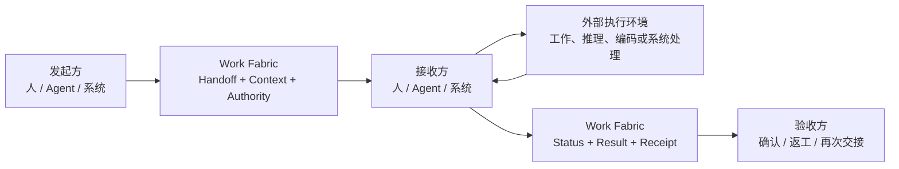

# Work Fabric

> **A protocol-driven collaboration interconnect for humans, agents, and work systems.**

Work Fabric 是面向人、AI Agent 与各类工作系统的协作对接和工作交接服务。它通过统一参与协议，让不同参与方能够发现彼此、接受委托、传递上下文、移交责任、同步状态、返回结果并完成验收。

Work Fabric 不执行参与方的专业工作。人的实际工作、Agent 的规划与推理、Codex 的代码实施，以及飞书、CRM、Git、知识库和运维平台的业务逻辑，始终发生在各自系统内部。

## 为什么需要 Work Fabric

企业的工作通常分散在文档、需求、代码、知识、沟通和运维系统中。AI Agent 即使具备足够的推理或工具能力，也仍然需要解决一组协作边界问题：

- 它代表谁参与，拥有哪些权限？
- 它如何获知一项工作正在等待接手？
- 人或另一个 Agent 如何把责任和上下文可靠地交给它？
- 执行过程发生在外部时，状态和阻塞如何透明化？
- 结果返回给谁，由谁验收，失败后如何退回或再次交接？
- 旧系统如何在不重建的情况下加入同一张协作网络？

Work Fabric 聚焦这些“协作对接”问题，使人、Agent 与系统可以在统一语义下互相替换、组合和协同。

## 核心思想

Work Fabric 的中心不是内部工作流引擎，而是两个稳定能力：

### Unified Participation Protocol

统一描述参与和交接所需的语义：

- Identity & Delegation
- Endpoint & Capability
- Work Reference & Intent
- Assignment & Handoff
- Context Exchange
- Status & Checkpoint
- Result, Receipt & Acceptance
- Event & Subscription

### Collaboration & Handoff Exchange

持久化框架真正拥有的协作事实：谁把什么交给了谁、接收方是否承担责任、附带了哪些上下文和授权、当前报告了什么状态、结果返回到哪里，以及是否通过验收。

全局事件、订阅、通知、Context 和关系视图都服务于这条交接主线。

## 职责边界

| Work Fabric 原生负责 | 执行主体或外部系统负责 |
|---|---|
| 参与者、端点、能力和委托关系 | 人的专业工作过程 |
| 外部工作项的统一引用 | Agent 的规划、推理和工具调用 |
| Collaboration Thread、Assignment 和 Handoff | Codex 的代码实施 |
| Context 的范围化传递 | 外部 Workflow 的内部执行 |
| 状态报告、结果引用和验收回执 | 飞书、CRM、Git 等系统的业务内容 |
| 协作事件、订阅、通知和追踪 | 部署、运行和运维处置本身 |

## 一次交接如何完成



标准 Handoff Package 至少包含：

```text
Work Reference    交接什么
From / To         谁交给谁
Intent            交接目的和期望结果
Context           必要输入和背景
Authority         授权范围和边界
Acceptance        结果验收条件
Status Channel    状态、问题和结果回传方式
Correlation       所属协作链和直接原因
```

## 架构概览

Work Fabric 由以下逻辑能力组成：

- **Participation Edge**：Human Channel Adapter、Agent Endpoint 和 System Connector。
- **Protocol & Contract**：统一领域语义、交互状态机、消息契约和传输绑定。
- **Handoff Core**：参与者目录、工作引用、协作线程、分派、交接、状态和回执。
- **Signal Network**：事件、订阅、通知、确认、游标和重放。
- **Context Exchange**：外部引用、必要快照、范围化 Context Bundle 和交接摘要。
- **Trust & Trace**：身份、委托、权限、因果、审计和责任历史。
- **Read Projections**：Inbox、项目状态、协作时间线和关系视图。

详细说明见[整体架构文档](docs/architecture.md)。可执行的协议规范、Canonical Schema、Handoff 状态机、Golden Fixtures 和参考序列见 [WFPP v1 Core Protocol](protocol/README.md)。

## 示例接入

- 飞书消息作为人类通知、审批、提问和人工接管通道。
- 飞书文档作为客户资料、需求和交付文档的内容来源。
- 本地 Agent Runtime 作为可注册能力、接收 Handoff 和返回结果的 Agent Endpoint。
- Codex 作为 Agent Runtime 暴露的代码实施能力，或作为独立 Agent Endpoint。
- Git、需求系统和部署平台通过 Connector 提供工作引用、状态事件和结果写回。

## 当前状态

项目已经完成 WFPP v1 Core Protocol Artifacts：协议正文、30 个公共 JSON Schema、机器可读 Handoff 生命周期、事件与订阅契约、Golden Fixtures、一致性 CLI 和三类参考序列。下一里程碑将以这些产物为唯一语义基线实现 Exchange Server 与独立 Binding：

1. Exchange Core 的权威状态、幂等、并发与 Outbox。
2. 独立 HTTP/JSON、SSE 与 Webhook Binding。
3. Agent Endpoint Gateway 与本地 Agent Runtime 参考接入。
4. 飞书通知/交互 Adapter 和文档 Connector。
5. 基础协作审计时间线与 Inbox Projection。

## 文档

- [整体架构](docs/architecture.md)
- [WFPP v1 Core Protocol 与 Schema 索引](protocol/README.md)
- [机器可读 Handoff 生命周期](protocol/spec/handoff-lifecycle.json)
- [一致性用例与 Exchange Contract](protocol/conformance/)
- [人、Agent 与系统参考序列](protocol/examples/)
- [协作对接与工作交接详细设计](docs/superpowers/specs/2026-07-13-collaboration-handoff-fabric-design.md)
- [Work Fabric Participation Protocol v1 设计](docs/superpowers/specs/2026-07-13-work-fabric-participation-protocol-v1-design.md)
- [Core Protocol Artifacts 实施计划](docs/superpowers/plans/2026-07-14-core-protocol-artifacts.md)
- [项目文档实施计划](docs/superpowers/plans/2026-07-13-project-documentation.md)
