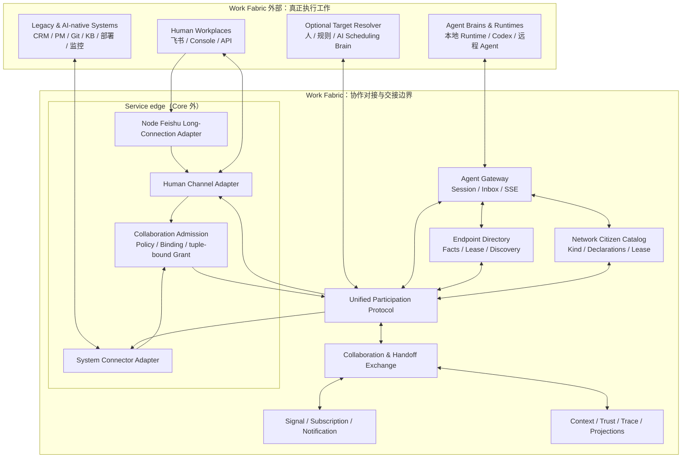
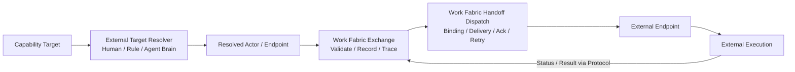
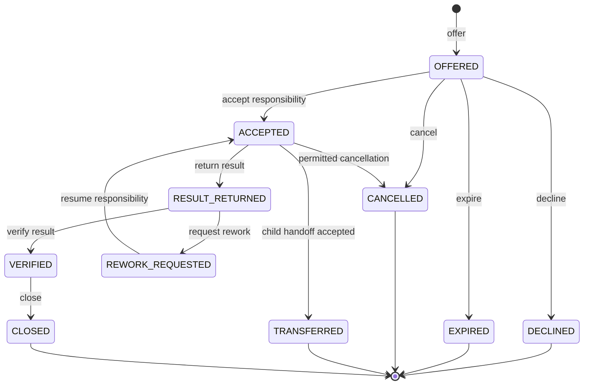
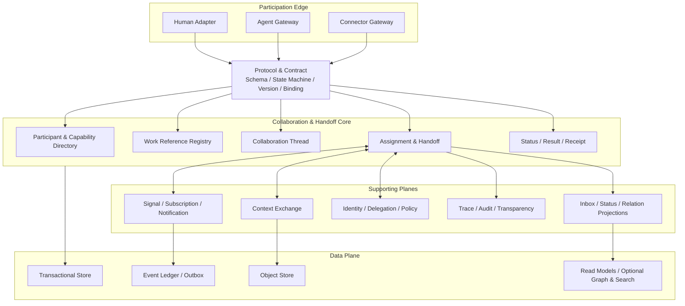
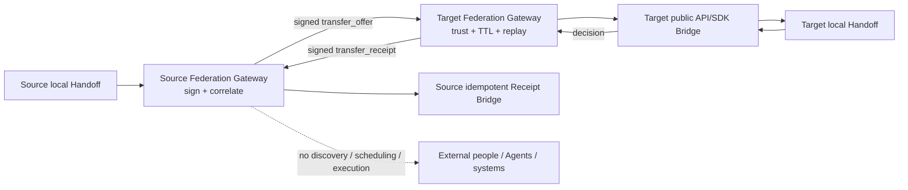
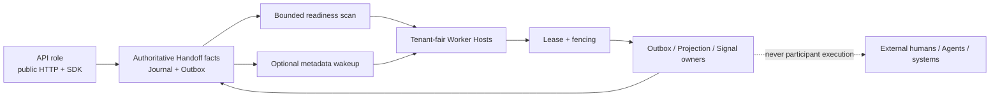
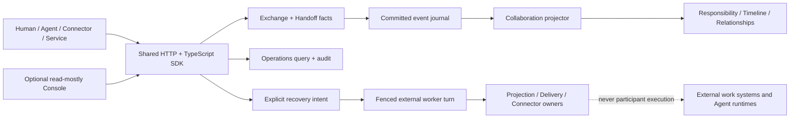

# Work Fabric 整体架构

本文是 Work Fabric 的 canonical 架构说明，面向协议设计者、系统实现者、Connector/Agent 开发者和技术决策者。更详细的设计推导与验收标准见[协作对接与工作交接详细设计](superpowers/specs/2026-07-13-collaboration-handoff-fabric-design.md)。

## 1. 定位与系统边界

> **A protocol-driven collaboration interconnect for humans, agents, and work systems.**

Work Fabric 是面向人、AI Agent 与工作系统的协议驱动协作互联与交接层。它让异构参与方以统一方式接受委托、传递上下文、移交责任、同步状态、返回结果并完成验收。

执行发生在 Work Fabric 之外：

- 人在自己的工作环境中完成专业工作。
- Agent Runtime 在自身环境中完成规划、推理和工具调用。
- Codex 在本地或远程工程环境中实施代码。
- 飞书、CRM、Git、知识库、部署和监控平台继续运行自身业务逻辑。

Work Fabric 只拥有这些执行主体之间的协作事实和交接状态，不拥有其内部执行过程。

Exchange Core Phase 1 保持 **transport-free**：它不依赖 HTTP Server、Broker Consumer、飞书调用或 Agent Runtime。阶段 3B/3C 在 Core 外提供 HTTP Service Binding 和统一 TypeScript SDK；阶段 4A/4B 增加 Endpoint/Agent 与 Connector 边界；阶段 6A/6B 增加数据库权威的集群机械所有权与可选 Wakeup；阶段 7 在 Core 外增加显式 Exchange 间的签名 Federation Profile。Core 仍只完成授权后的目标校验、责任移交和权威记录，所有外部 Runtime 与系统仍拥有决策和执行。

### Work Fabric 原生负责

- 统一参与协议和版本化契约。
- 参与者、端点、能力、身份映射和委托关系。
- 外部工作项的统一引用。
- Collaboration Thread、Assignment、Handoff 和 Receipt。
- Context 的范围化传递。
- 对外状态报告、结果引用和验收回执。
- 事件、订阅、通知、确认、重放和状态对账。
- 将已确定目标的 Handoff 可靠派发到 Endpoint，并区分送达、读取和责任接受。
- 责任历史、事件因果、证据和审计视图。

### Work Fabric 不负责

- Agent 推理、内部计划和工具调用。
- 人的专业工作过程。
- 代码实施、部署或运维处置。
- 替代外部工作系统成为业务内容主库。
- 强制所有参与方采用相同 Workflow 或传输技术。
- 通过一个内部自动化引擎包办所有业务流程。
- 根据能力、负载、成本或模型判断自动选择接收方。
- 安排参与方内部的任务拆解、模型调用、工具使用或执行顺序。

## 2. 架构原则

1. **协议优先**：稳定协作语义和交互状态机先于具体 API 与中间件。
2. **交接为中心**：系统核心问题是“谁把什么、带着哪些上下文和权限、以什么验收条件交给谁”。
3. **执行外置**：参与方自行决定如何完成工作，Work Fabric 只管理参与边界。
4. **人机同构、入口异构**：人、Agent 和系统共享交接语义，但可以通过不同渠道和传输方式接入。
5. **外部事实归原系统**：默认传递引用，只在离线、稳定性或审计需要时保存必要快照。
6. **事件关联协作语义**：事件必须关联 WorkReference、Actor、Thread、Handoff 和因果链。
7. **至少一次与业务幂等**：跨系统不假定 exactly-once，依靠幂等、Receipt、补偿和对账得到可靠结果。
8. **逻辑图与物理存储分离**：协作关系可以投影为图，但权威事务状态不绑定单一图数据库。
9. **最小授权**：交接携带与当前工作绑定的授权范围，不向 Agent 或 Adapter 发放租户级长期权限。
10. **自动化来自端点可替换性**：人类端点可以逐步替换为 Agent 端点，而协议、治理和交接链保持稳定。
11. **连接层不是大脑**：Work Fabric 提供 Endpoint 与 Capability 事实、受限候选池、机械认领、目标解析协议和可靠派发；复杂的排名、推荐、成本/负载决策与执行计划由外部人、规则或 Agent Brain 决定。
12. **模块职责闭环**：每个模块必须完整拥有并完成自身职责，只通过稳定协议或 SPI 与其他模块交换事实；不得跨层代偿另一个模块的业务语义、决策或执行。
13. **依赖面向契约**：Core、Runtime、Agent、Connector 和 Channel 模块不得依赖彼此的具体存储、进程或供应商实现。组合层可以把实现适配到窄接口，但不能把具体实现泄漏到消费模块。
14. **动态能力是运行事实**：配置只 Provision 可信身份与安全上限；模块通过带租约和 fencing 的 Network Citizen Session 声明当前能力。声明能力不授予调用 Authority。
15. **责任分类与 Actor 正交**：Actor type 表达谁参与，Citizen kind 表达模块对外闭环的责任。一个 Citizen 注册只有一个 kind，一个进程可以托管多个独立注册。

### 2.1 职责闭环与依赖方向

| 模块 | 必须在本模块闭环的职责 | 只向外交换 |
|---|---|---|
| Exchange Core / Fabric Runtime | 权威交接状态、责任迁移、事件与可靠投递 | WFPP 事实、Receipt、Delivery |
| Agent / Agent Runtime | 业务语义答复、推理、模型与工具执行、Agent 自身失败语义 | Status、Result、Artifact、Evidence |
| Connector | 外部系统事件与 WFPP 操作的双向映射、幂等和对账 | 归一化命令与外部系统回执 |
| Channel Adapter | 目标渠道格式、寻址、投递和渠道错误分类 | 已有内容的传输结果 |
| Console / Query | 状态呈现和只读观察 | 公共查询结果 |

允许的依赖方向是“消费稳定契约并注入实现”。禁止的依赖包括：

- Fabric 或 Channel Adapter 在 Agent 失败或字段缺失时自行创作业务答复；
- Channel Adapter 根据 `accepted`、`status_reported` 等生命周期事实推断业务语义；
- Agent 绕过 Handoff Result 直接调用某个具体消息渠道完成协作回复；
- Plugin 直接读取其他模块的数据库表、私有状态或进程内对象；
- 为方便单一集成而把供应商字段、模型结构或存储技术加入稳定 Core。

必要的跨模块读取必须抽象为最小 SPI，由组合层适配实现，并保持来源模块
对其数据和语义的所有权。模块可以传输、校验和呈现另一模块已经产生的
事实，但不能替它生产这些事实。

## 3. 系统上下文



### Human Workplaces

人继续通过飞书、Web Console 或开放 API 工作。Human Channel Adapter 将消息、交互卡片、审批、问题回复和人工接管映射到统一参与协议。

`service-node` 在 Service edge 显式组合 `@work-fabric/adapter-feishu-long-connection-node`。该 Node Adapter 是官方飞书 SDK 的唯一生产依赖边，只负责出站建连、事件重建、稳定健康状态和有界关停；事件随后进入既有 Human Channel/Connector durable ingress。它不在 Exchange Core、WFPP、Connector SPI/runtime 或插件包中，也不解释消息、选择目标或执行工作。Webhook 仍是独立可选入站 binding，卡片动作仍由 Webhook 接收。

### Agent Brains & Runtimes

Agent Endpoint 声明身份、能力、协议版本、可用性和回调方式。阶段 4A 的 Endpoint Directory 保存这些可验证事实和单活 fenced Session；Agent Gateway 只通过统一 TypeScript SDK 维护租约、发现收件分区并接收 Durable SSE。Runtime 自己持久化 Delivery、显式 Ack，再自行决定是否接受责任、如何执行、何时报告状态和返回结果。

`@work-fabric/agent-runtime-host` is one external Runtime Host implementation. Its Role Profile and Capability declarations are Runtime extension points; they do not make Exchange Core a model, tool, memory, scheduling, or execution engine.

Codex 可以作为 Agent Runtime 暴露的代码实施能力，也可以在具备独立身份、交接状态和回调能力时作为独立 Endpoint。无论采用哪种模式，代码执行过程都不进入 Work Fabric。

### Network Citizens

Network Citizen 是所有网络接入模块的统一责任分类与动态声明面。六类 Citizen
分别是 `decision-body`、`capability-provider`、`channel`、
`context-provider`、`governance-provider` 和 `observer`。它与 Human、
Agent、System 的 Actor type 正交；数据库、缓存、Broker、transport、SDK、
YAML 和进程内队列等基础设施不是 Citizen。

管理员 Provision 身份绑定、声明 namespace、最大风险和启停状态，外部
Runtime 再通过单活 fenced Session 提交当前 descriptor 与 declarations。
Catalog 依次披露列表、描述、声明摘要和完整 Contract，每层单独授权。能力
声明是发现事实，不是调用授权，也不会触发自动选择或执行。完整规范与接入
示例见 [Network Citizen 架构与接入](architecture/network-citizens.md)。

### Legacy & AI-native Systems

外部系统通过 Connector Adapter 接入。Connector 映射资源、事件、状态和动作结果，并负责外部状态对账。外部系统继续持有原始内容和权威业务事实。

阶段 4B 的飞书实现证明了这条连接边界：Webhook 或可选长连接只完成安全校验、归一化和 durable accept；异步 Connector Worker 通过公开 TypeScript SDK 提交显式操作；出站事件复用既有 Subscription/SignalDispatcher；文档只作为版本化外部引用。Connector receipt、mapping completion、Signal delivery 和 Handoff responsibility acceptance 是四个独立事实。

阶段 8 在 Core 外增加 Provider-backed 全局配置、可信多实例插件生命周期和持久化 Channel Route。内置飞书协作通道仅把明确 `@机器人` 的消息映射成面向已配置外部 Agent 的 Intake Handoff，并通过 canonical Subscription 把协议事件送回原会话或显式固定频道。YAML 只是首个 Configuration Provider；插件与消费方不依赖文件实现。该层不解释意图、不选择目标、不调用模型/工具，也不创建外部需求或执行工作。

阶段 9 在可信传输和协议 Authority 之间增加技术中立的 Collaboration Admission。它判断一个已经由 Connector 认证的外部参与方是否可进入协作网络，为允许的单一外部主体建立稳定 Actor/Endpoint 绑定，并签发短时、单主体、与 `ingress_id + command idempotency_key` 强绑定的 v2 representation grant。Feishu Adapter 在 Admission 前只用一个纯函数生成最终命令键；HTTP Identity 把已验证 tuple 放入冻结的可信 Principal 属性，Admission Authority 再与命令 envelope 的 `correlation_id + idempotency_key` 精确比对。相同 tuple 可以幂等重试，任一分量变化都不能创建 Handoff。Admission 不属于飞书插件，不依赖 YAML、SQLite、PostgreSQL、WFPP 或 Exchange Core；具体配置、目录和持久化均由 Adapter 在 `service-node` 组合根注入。

## 4. Unified Participation Protocol

统一参与协议是 Work Fabric 的核心产品。它统一协作语义，而不是强制统一传输方式。

Protocol v1 的规范角色、Canonical Message、状态机、Event、Subscription 和 Binding 决策见 [Work Fabric Participation Protocol v1 设计](superpowers/specs/2026-07-13-work-fabric-participation-protocol-v1-design.md)。已实现的语言无关规范、Schema 索引、机器可读生命周期、Golden Fixtures 和参考序列见 [WFPP v1 Core Protocol](../protocol/README.md)。

### 4.1 协议领域

| 协议领域 | 解决的问题 |
|---|---|
| Identity & Delegation | 谁在调用、代表谁、授权范围是什么 |
| Endpoint & Capability | 如何接入、能做什么、当前是否可用 |
| Work Reference & Intent | 交接的工作是什么、目的是什么 |
| Assignment & Handoff | 谁承担责任、如何接受、拒绝、退回或转交 |
| Context Exchange | 接收方需要什么信息、可以看到什么 |
| Status & Checkpoint | 接收方如何报告进度、等待、阻塞或失败 |
| Result, Receipt & Acceptance | 结果如何返回、谁收到、谁验收 |
| Event & Subscription | 变化如何传播、过滤、确认和重放 |
| Federation & Synchronization | 外部资源和状态如何映射、写回与对账 |

### 4.2 协议分层

```text
L3  Domain Semantics
    Actor / Endpoint / WorkReference / Handoff / Context / Result / Receipt

L2  Interaction Protocols
    Register / Offer / Accept / Report / Return / Verify / Rework / Transfer

L1  Message Contract
    Schema / Version / Idempotency / Correlation / Causation / Error / Cursor

L0  Transport Bindings
    HTTP / gRPC / WebSocket / Webhook / Broker / Local IPC / SDK
```

当前已实现 L0 的 HTTP 命令/查询绑定、复用 Durable Subscription 的 Cursor Pull/Ack 和 SSE 呈现，以及覆盖这些公共 Contract 的统一 TypeScript SDK。Phase 4A 的 Agent Gateway 是 SDK 上的外部 Runtime 连接库；Phase 4B 的飞书 Webhook/长连接和 SignalAdapter 是 Connector edge binding。它们都不是新的协议层，也不形成旁路状态。WebSocket 与其他 Binding 仍是独立后续模块，并且必须复用同一 WFPP 语义和交付位置。

不同传输绑定必须保持相同的领域语义和状态机。例如，飞书卡片点击和 Agent 的流式 `accept` 消息都可以表达 `RESPONSIBILITY_ACCEPTED`，但交互方式不同。

Core Protocol Artifacts 是后续实现的唯一机器可读语义基线。Exchange Server、HTTP/SSE/Webhook、A2A、MCP、飞书 Adapter 和 Agent Runtime SDK 必须依赖这些 Core Artifact，并通过 `npm run conformance`；它们不能在各自实现中复制或重定义 Handoff 状态机。

### 4.3 兼容性规则

- 所有 Schema 都具有命名空间和显式版本。
- 新增可选字段保持向后兼容；破坏性语义变更发布新主版本。
- Endpoint 在注册时协商协议和 Capability 版本。
- 扩展字段进入客户或插件命名空间，不污染稳定内核字段。
- SDK、Connector 和 Endpoint 必须通过契约与一致性测试后才能声明兼容版本。

## 5. Collaboration & Handoff Exchange

Exchange 是 Work Fabric 的事务核心，持久化框架真正拥有的协作事实。

### 5.1 核心职责

- 维护 Participant、Endpoint、Capability 和 Delegation。
- 将外部需求、任务、文档、代码和事件登记为 WorkReference。
- 创建和维护 CollaborationThread。
- 以 Handoff 保存权威责任与生命周期事实，并从中投影 Assignment、Status、Result 和 Receipt 视图。
- 根据 Receipt 明确当前责任，而不是根据消息送达推断责任。
- 维护 Handoff 之间的父子关系、Correlation 和 Causation。
- 在状态变化时原子写入 Outbox Event。

### 5.2 标准 Handoff Package

```text
handoff_id
thread_id
work_reference
from_actor / from_endpoint
to_actor / to_endpoint / requested_capability
intent
context_bundle
authority_scope
acceptance_criteria
status_channel
deadline / expiry
correlation_id / causation_id
protocol_version
extension_fields
```

| 字段 | 含义 |
|---|---|
| Work Reference | 交接什么 |
| From / To | 谁交给谁，或需要什么能力的接收方 |
| Intent | 为什么交接、期望什么结果 |
| Context Bundle | 完成当前工作所需的输入和背景 |
| Authority Scope | 允许读取、调用和写回的范围 |
| Acceptance Criteria | 怎样判断结果满足要求 |
| Status Channel | 状态、问题和结果回传方式 |
| Deadline / Expiry | 接收责任和返回结果的时间边界 |
| Correlation / Causation | 所属协作链及直接上游原因 |

### 5.3 Capability Discovery、Target Assignment、Handoff Dispatch 与 Execution Scheduling

四者必须保持独立：

- **Capability Discovery** 通过身份卡片、能力摘要、能力契约和受保护 Binding 渐进披露参与实体，不把内部 Module、Skill 实现或凭据暴露为协作事实。
- **Target Assignment** 决定 Handoff 应绑定到哪个 Actor 或 Endpoint。它支持 Direct Target、经过权限过滤的 Pool Claim，以及外部人工选择器、规则服务或 AI Scheduling Brain 提交的 Resolution。Pool Claim 只实现排他预留、Lease 与 fencing，不实现候选排名、推荐或智能选择。
- **Handoff Dispatch** 在目标确定后选择兼容 Binding，可靠投递 Handoff，维护 Delivery、Ack、重试、死信与恢复，并验证接收方是否有资格代表目标承担责任。这是 Work Fabric 的原生连接职责。
- **Execution Scheduling** 决定任务如何拆分、何时执行、使用哪些模型、工具或内部 Worker，完全属于接收方 Runtime、Workflow 或外部系统。

Capability Target 表达尚未绑定的能力需求。为保持兼容，未显式声明 Assignment Mode 时继续使用 `external_resolution`；只有显式选择 `eligible_pool_claim` 的 Handoff 才允许合法候选 Endpoint 自主认领。全网广播和无权限的“首个响应者胜出”始终禁止。

3A 已提供 `target_resolution_pending` / `target_unavailable` 状态、解析与不可用命令、`TargetEligibilityVerifier` SPI、独立 `TargetBinding`、公共事件和投影兼容；4A 已补齐 Endpoint Directory、未排序事实查询和基于 Directory 的显式目标资格校验。Candidate Claim 已实现显式 `eligible_pool_claim`、`claimable` / `claimed` 生命周期、权限与 Capability 过滤的候选视图、原子 Claim Lease、fencing、续租/释放/过期命令、HTTP/SDK、Agent Gateway 显式认领接入，以及部署宿主内有界、可多实例竞争的机械过期 Runner，详见[能力发现、候选认领与外部调度](capability-discovery-and-claim.md)。原始 Capability Requirement 永不被绑定结果覆盖；资格校验缺失或不可用时解析/认领 fail-closed 且不产生权威写入。具体 Resolver、候选排名和智能调度仍是外部参与方，不进入 Work Fabric。



## 6. 核心领域模型

| 对象 | 含义 |
|---|---|
| `Tenant` | 客户或组织的隔离边界 |
| `Principal` | 通过认证的调用身份 |
| `Actor` | 承担协作责任的人、Agent 或系统主体 |
| `Endpoint` | Actor 收发协议消息的具体入口 |
| `RuntimeInstance` | Agent Endpoint 背后的在线运行实例 |
| `Capability` | Actor 或 Endpoint 能承担的能力及约束 |
| `Delegation` | 一个主体代表另一主体行动的授权关系 |
| `WorkReference` | 指向外部工作对象的统一引用 |
| `CollaborationThread` | 围绕目标或 WorkReference 的持续协作脉络 |
| `Assignment` | Actor 对一项工作责任的承担关系 |
| `Handoff` | 责任、上下文和结果预期的移交 |
| `ContextBundle` | 当前 Handoff 允许接收方消费的上下文集合 |
| `StatusReport` | 参与方对外报告的进度、问题或阻塞 |
| `ArtifactReference` | 外部文档、代码、部署或其他结果引用 |
| `Evidence` | 支撑状态或验收结论的证据引用 |
| `Receipt` | 投递、接收、责任承担、结果接收或验收确认 |

`Principal`、`Actor` 和 `Endpoint` 必须分离。飞书机器人可以用自己的 Principal 调用系统，但代表某个 Human Actor；一个 Agent Runtime Principal 也可以代表多个独立 Agent Actor。

`Handoff` 是唯一可写的责任事实；`Assignment` 是从 Handoff 当前责任人派生的读模型。投影可以清空并由 Journal 重建，任何组件都不能绕过 Handoff 独立修改 Assignment。

Receipt 至少区分：

- `DELIVERED`
- `RECEIVED`
- `CLAIM_ACQUIRED`
- `RESPONSIBILITY_ACCEPTED`
- `RESULT_RECEIVED`
- `RESULT_VERIFIED`

消息送达或被读取不等于接收方已经承担责任，结果被收到也不等于已经通过验收。

## 7. Handoff 生命周期与责任迁移



`DRAFT` 不属于 Protocol v1 的互操作状态。客户端或 Exchange 实现可以保存本地草稿，但草稿不产生权威 Handoff、责任或领域事件。

责任迁移规则：

- `OFFERED` 被接受前，发起方仍承担责任。
- `ACCEPTED` 后，责任转移给接收方。
- `RESULT_RETURNED` 后，执行责任已经回传，验收责任转移给指定验收方。
- `REWORK_REQUESTED` 后验收方等待原接收方重新接受；重新接受后执行责任才回到原接收方。
- `TRANSFERRED` 不表示新接收方已经承担责任；只有子 Handoff 被接受后，责任才转移成功。
- 每次责任变化都产生独立 Receipt 和领域事件。

外部执行状态与 Handoff 生命周期分开。`StatusReport` 可以报告 `NOT_STARTED`、`IN_PROGRESS`、`WAITING`、`BLOCKED`、`COMPLETED` 或 `FAILED`，但它们只是参与方声明，不表示 Work Fabric 执行了工作。

## 8. Events、Subscriptions 与 Notifications

Signal Network 是 Handoff 的可靠传播机制，不是独立于工作语义的通用事件总线。

### 8.1 EventEnvelope

```text
event_id
event_type
schema_version
tenant_id
source_endpoint
actor_id
thread_id
handoff_id
work_reference
sequence
occurred_at
recorded_at
correlation_id
causation_id
visibility_scope
payload
```

### 8.2 语义区分

- **Event**：已经发生的协作事实。
- **Subscription**：哪些变化与某个参与方有关，以及如何投递。
- **Notification**：面向人、Agent 或系统的投递视图。
- **Command**：请求外部 Endpoint 采取动作。
- **Receipt**：送达、接收、责任承担或验收确认。

### 8.3 一致性与投递

- Handoff 状态和 Outbox Event 在同一事务中提交。
- 事件按 Tenant 和 Handoff 或 Thread 分区。
- 只保证单个 Handoff 或 Thread 内的顺序，不提供全局顺序。
- 外部投递采用 at-least-once；消费者使用 `event_id` 或业务幂等键去重。
- Subscription 按 Subscription × Partition 保存独立 Cursor，可以暂停、恢复和重放。
- “全局订阅”只表示跨逻辑 Partition 聚合消费，不提供单一全局 Cursor 或跨 Partition 顺序；恢复时分别推进每个 Partition 的位置。
- Notification 分别记录已投递、已读取和责任已接受。
- 永久失败进入死信队列并产生可订阅的失败事件。
- 公共 Protocol Event 不包含内部 `domain_data`、Partition position、Commit ID、幂等记录或其他存储 Cursor 元数据。

### 8.4 订阅条件

Subscription 可以组合过滤：

- Event Type 和 Schema Version。
- Tenant、WorkReference、Thread 或 Handoff。
- Actor、Endpoint、Role 或 Capability。
- Handoff Lifecycle 和 StatusReport。
- 标签、优先级、风险级别或资源关系。

## 9. Context Exchange

Context Exchange 在交接边界上传递完成当前工作所需的最小充分信息。

ContextItem 可以是：

- 飞书文档、需求、代码、知识或事件的外部引用。
- 经授权生成的必要内容快照。
- 长内容摘要或结构化提取。
- 上游决策、检查点、问题和交接说明。
- 临时访问令牌或受限工具能力引用。

每个 ContextItem 必须包含来源、版本、创建者、可见范围、敏感等级、有效期和完整性信息。

上下文处理遵循：

- 默认传引用，必要时保存快照。
- 按 Actor、Handoff、Delegation 和有效期裁剪。
- 大内容保留在来源系统或对象存储中。
- 已经接收的 Handoff 保留当时 Context View 的版本或哈希。
- Context 引用不可访问时返回显式错误，不静默降低信息完整性。

知识检索、向量搜索和摘要模型可以作为外部服务接入，Context Exchange 不绑定具体实现。

### 9.1 Agent 与 Capability Provider 的辅助交接

Agent 的结构化能力请求仍使用 Handoff，不成为 Host 内部工具调用。Agent
Runtime 通过 Catalog 渐进发现、完整 Contract、Schema digest 和独立
Authority 后，创建 `external_resolution` 的辅助 Handoff，并显式绑定所选
Provider Endpoint。原始 Handoff 的 responsible Actor 不改变。

Provider 通过普通 Endpoint Delivery/Ack/Accept 接收辅助 Handoff，在自己的
边界执行外部操作并返回类型化事实。Agent 对这些事实继续推理，最终由 Agent
为原始 Handoff 生成面向人的 Result。Provider 不写对话文案，Channel 不解释
Provider 状态，Fabric Core 不执行厂商操作。调用状态、Provider 状态、Agent
Runtime 状态分别持久化，可独立重试和恢复。

辅助 Handoff 的目标约束冻结 `selected_citizen_id` 与
`contract_digest`。默认 Directory evaluator 只解释这组标准约束；其他约束
词汇通过组合根注入，不耦合存储或 Provider。部署必须显式授予 Agent
`handoff.offer`；Runtime 的附加策略只允许 Agent 解析和查询自己发起的辅助
Handoff，不扩大到其他参与者的工作。目标绑定证据使用正式 WFPP Evidence
结构，事件的 `changed_fields` 去重后才进入 SSE，确保所有公共 Binding 得到
同一份可验证事实。

首个 Feishu 实现把动作和文档 Context 注册为两个 Citizen；飞书凭据、OpenAPI、
幂等、文档所有权和 revision 完全封装在 Provider，删除确认由独立 Governance
模块负责。该实现验证模块可以新增而无需修改 Exchange Core。

## 10. Identity、Delegation 与 Trust

- 所有写操作关联 Principal、Actor 和 Endpoint。
- Adapter 必须显式声明它代表哪个 Actor。
- Delegation 包含授权资源、允许动作、有效期和能否再次委托。
- Agent 接收 Handoff 时获得与当前 Handoff 绑定的最小权限。
- Context、Artifact 和 Event 的可见范围分别校验。
- 高风险动作可以通过面向 Human Actor 的 Handoff 完成审批。
- Credential 只保存引用或加密封装，由专用 Secret 服务管理。
- 租户隔离、身份验证和审计是所有协议 Binding 的共同要求。

## 11. 逻辑组件



### 11.1 Participation Edge

适配不同参与方的渠道、认证、传输和外部对象，同时保持统一协议语义。

### 11.2 Protocol & Contract

提供 Schema、领域状态机、消息信封、错误语义、版本协商、Transport Binding 和一致性测试。

### 11.3 Handoff Core

提供事务一致的 Participant、Thread、Assignment、Handoff、责任迁移和 Receipt。

### 11.4 Supporting Planes

Signal、Context、Trust、Trace 和 Projection 是 Handoff 的支撑能力，可以独立扩展，但不能重新定义核心交接语义。

## 12. 数据架构

| 数据组件 | 责任 |
|---|---|
| Transactional Store | Participant、Endpoint、WorkReference、Thread、Handoff、Receipt 和授权元数据 |
| Event Ledger / Outbox | 协作事件、可靠发布、投递历史和审计轨迹 |
| Object Store | 必要内容快照、大型 Context 和附件 |
| Read Projections | Inbox、项目状态、协作时间线和责任视图 |
| Optional Graph Projection | WorkReference、Handoff、Actor、Context 和 Result 关系遍历 |
| Optional Search / Vector Index | 全文、语义检索和 Context 辅助组装 |

Work Graph 是逻辑查询视图，不是架构中心，也不要求使用图数据库作为唯一主存储。

权威 Handoff 状态和 Outbox 使用本地事务保证一致；对象、索引和投影通过事件异步更新。

Phase 1 的 Memory Storage Adapter 只用于参考行为、集成测试和一致性验证，不具备生产持久性声明。当前 PostgreSQL Adapter 已通过既有 SPI 提供 authority、outbox、runtime state、delivery/lease 与 Context 元数据持久化；PostgreSQL 不进入 Core/SPI 依赖，其他符合相同行为 Profile 的存储实现可以等价替换。迁移、RLS 和运维边界见 [PostgreSQL 部署文档](postgresql-deployment.md)。

## 13. 可靠性与失败处理

| 场景 | 策略 |
|---|---|
| 重复 Event 或 Callback | 使用 `event_id`、Handoff Version 和业务幂等键去重 |
| Endpoint 临时离线 | 保留待投递记录，退避重试并暴露投递状态 |
| Agent 接受后失联 | Endpoint Lease 或 Heartbeat 过期，产生失联事件并允许重新交接或人工接管 |
| Context 不可访问 | 返回缺失项和明确错误，阻止不完整交接被接受 |
| 外部系统限流 | Connector 执行背压、批处理和限流感知重试 |
| 外部状态漂移 | 定期或事件触发对账，记录冲突并产生 Reconciliation Event |
| 并发修改 Handoff | 使用 Version 或条件写入，冲突时刷新重试 |
| 结果已提交但 Receipt 丢失 | 使用结果幂等键安全重放并查询最终状态 |
| 非法 Delegation | 拒绝操作、记录安全事件且不泄露受限 Context |
| 永久投递失败 | 进入死信队列并创建可订阅失败事件或人工处理 Handoff |

系统不尝试跨所有外部服务建立分布式事务。跨边界一致性依靠持久事件、幂等、Receipt、补偿和对账。

## 14. 可伸缩性与性能

- 核心写路径保持为短事务：授权校验、Handoff 状态更新、Receipt 和 Outbox。
- Event Fan-out、Notification、Projection、Index、Context 获取和 Connector 调用异步执行。
- 按 Tenant、Thread 或 Handoff 分区，避免全局有序和全局锁。
- 高频 Inbox 和项目总览使用物化读模型，不在线遍历完整协作图。
- 大内容外置，协议消息只携带引用、摘要和完整性信息。
- Signal、Notification、Connector 和 Projection Worker 独立横向扩容。
- 每个 Tenant 与 Endpoint 都具有 Rate Limit、Quota 和 Backpressure。
- 协议不绑定具体数据库、Broker 或搜索引擎，物理实现可以随部署 SLO 演进。

## 15. 扩展性与互操作

### Connector 扩展

Connector 使用五个明确边界：

1. Resource Mapping
2. Event Mapping
3. Status Mapping
4. Command/Result Mapping
5. Reconciliation Policy

阶段 4B 将这些边界落实为通用 SPI 和可独立扩容的 runtime：


Ingress 以 tenant、connector、source 和 source-specific dedupe identity 原子去重，并通过 lease、claim token 和 fencing 支持水平扩展和崩溃恢复。HTTP/WebSocket/SDK 细节不进入 SPI；Memory 与 PostgreSQL 可以实现同一 conformance profile。外部事件的任意内容不会直接成为命令，外部身份也不会自动成为 Actor。

### Agent 扩展

Agent Endpoint 使用 Capability Descriptor 声明输入、结果、限制、交互模式和协议版本。能力发现只负责协作接入，不要求 Work Fabric 理解 Agent 内部实现。

### Target Resolver 扩展

Target Resolver 是通过统一协议接入的可选外部模块。它订阅待解析的 Capability Target，查询经过授权的 Endpoint/Capability 事实，并提交明确的 Actor 或 Endpoint 解析结果及可选证据。Resolver 可以由人工、规则、优化算法或 AI Agent 实现；Exchange 只验证和记录结果，不调用或内置其决策逻辑。移除所有 Resolver 后，直接 Actor/Endpoint Target 仍必须正常工作。

### 业务类型扩展

客户可以增加自定义 WorkReference Type、Context Item、Status Metadata 和扩展事件，但不能修改 Handoff 的核心责任语义。

### 外部协议适配

已有 Agent、工具或企业消息协议通过 Binding/Adapter 映射到统一参与语义。Work Fabric 不重复实现它们已经解决的传输和工具调用能力，只补充协作责任、上下文交接、状态、回执和验收。

## 16. 可观测性与透明化

系统必须能够回答：

- 当前工作责任在谁手上。
- 最近一次 Handoff 是否已经投递、读取和接受。
- 当前对外 StatusReport 是什么，多久没有更新。
- 接收方获得了哪些 Context 与权限。
- Result、Artifact 和 Evidence 存放在哪里。
- 哪个上游 Event 或 Handoff 导致当前状态。
- 哪个 Endpoint、Connector 或验收人正在等待处理。

技术可观测性包括日志、指标和分布式追踪；业务透明化包括 Thread 时间线、责任历史、Context 版本、Receipt 和验收结论。两者使用同一个 Correlation 体系关联。

## 17. 部署演进

### 初始形态

采用“模块化事务核心 + 独立 Worker”：

- 一个模块化 Core Service 提供协议入口和事务状态。
- Signal Consumer、Notification Worker、Connector Worker 和 Projection Worker 独立进程运行。
- Transaction Store 与 Outbox 保证核心一致性。
- Object Store 和可选索引按需求启用。

初始实现不应过早拆成大量微服务。

### 规模化形态

随着吞吐、租户隔离和团队边界增长，可以沿既有协议与数据所有权拆分：

- Agent Gateway 与 Human Adapter 独立扩容。
- Signal 与 Subscription 服务按 Tenant 或 Topic 分区。
- Connector Worker 按目标系统和凭据域隔离。
- Read Projection、Graph 和 Search 独立扩展。
- Handoff Core 保持小而稳定，避免吸收外部执行职责。

## 18. 端到端项目示例

以“客户意向到交付运维”为例，实际业务仍发生在参与方与外部系统中，Work Fabric 连接阶段间交接：

1. 销售在飞书记录客户意向，Adapter 创建 WorkReference，并向需求人员发出 Handoff。
2. 需求人员接受责任，可将访谈整理工作交给 Agent；Agent 返回需求摘要和文档引用。
3. 需求基线通过 Handoff 交给方案、商务和法务，结果与状态保持透明。
4. 合同确认后，项目负责人将实施责任交给人、Agent Runtime 或系统 Endpoint。
5. 本地 Agent Runtime 接收代码工作并调用 Codex，代码执行在外部完成，Git 引用和测试证据通过 Result 返回。
6. 阶段结果交给客户或验收人员；返工和再次交接保留完整因果链。
7. 验收版本交给部署和运维系统，Connector 回传发布状态。
8. 运维告警通过 Subscription 创建面向人或 Agent 的新 Handoff，进入下一轮协作。

该示例验证的是跨参与方、跨阶段和跨系统的协作对接，而不是在 Work Fabric 内部实现销售、合同、研发、部署和运维流程。

## 19. 已实现的 Core、HTTP 与 SDK 边界

Phase 1 已建立统一参与和交接的 transport-free 最小闭环：

- WFPP Protocol、Schema、命令验证与公共 Event。
- Handoff 权威生命周期、幂等、乐观并发和父子原子责任转移。
- 技术中立的 Identity、Authority、Context、Persistence、Projection、Subscription 和 Signal SPI。
- 可重建 Handoff/Assignment 读模型、at-least-once Signal、Cursor Pull/Ack、重试和死信参考行为。
- Memory 参考 Adapters、复用型 Conformance Profiles 和端到端公共 Reference Suite。

阶段 3B 在上述 Core 之外完成 HTTP Service Binding：

- `POST /v1/commands` 原样承载 Canonical WFPP Command，并把 `OperationResult` 作为权威响应。
- Participant Query、Admin Query 与 Console 未来使用同一身份和 Authority 链；没有内部管理旁路。
- Subscription 资源使用公共 WFPP Schema，内部 Runtime 表示由边界 codec 映射，存储技术不进入 HTTP Contract。
- Cursor Pull/Ack 与 SSE 共用 Durable Subscription、Pending Delivery 和交付位置；SSE 不建立第二套事件账本。
- 健康检查、连接上限、请求/分页限制和优雅关停均在 Host 边界有界处理。
- Route 不接收 SQL Client 或具体存储 Adapter，不做 Target Resolution、调度、Decider 调用或外部工作执行。

阶段 3C 在 HTTP Contract 之上完成统一 TypeScript SDK：

- `WorkFabricClient` 为 Human、Agent、Connector 和 Operations 提供同一认证、表示与 Authority 链。
- Canonical Command 与 13 个 Handoff 便捷方法保持相同 Envelope、幂等、版本、关联和因果语义。
- Query、Operations、Subscription、Pull/Ack 与认证 SSE 不缓存或复制权威状态。
- Command、Pull 和 Ack 不自动重试；Query 与 SSE 只使用各自有界策略，SSE 不自动 Ack 或去重。
- SDK 运行时代码不依赖 Fastify、数据库 Adapter、Exchange Decider 或 Node 专用模块。

阶段 4A 完成 Endpoint 与外部 Agent Runtime 连接边界：

- Endpoint Directory 以技术中立 SPI 保存 Actor 绑定、Capability、Binding、注册版本和单活 fenced Session。
- Discovery 只返回确定分页、未评分的 Endpoint 事实；外部 Resolver 比较候选并通过 `resolve_target` 提交唯一明确目标。
- `DirectoryTargetEligibilityVerifier` 对外部提交的 Actor/Endpoint 做 fail-closed 资格校验，不选择、不推荐、不写入候选排序。
- Endpoint Inbox 从已提交 Handoff Event 重建路由事实，只保存受众、Partition/Handoff ID、版本、生命周期和位置。
- HTTP 与 `client.endpoints` 使用与其他参与方相同的身份、表示和 Authority 链，没有 Runtime 或 Admin 旁路。
- `@work-fabric/agent-gateway` 只依赖公开 SDK，负责租约续期、Inbox 刷新、多分区 SSE 汇聚和有界背压；它不自动 Ack、Accept 或执行。
- Memory Endpoint Adapter 用于本地参考；PostgreSQL Endpoint Directory/Inbox 通过同一 SPI 提供 RLS、CAS/fencing、索引和持久恢复。

阶段 4B 完成 Generic Connector 与飞书连接边界：

- `connector-spi` 定义技术中立 ingress/mapping/identity/resource/reconciliation ports，Core/SPI 不依赖飞书、HTTP 或 PostgreSQL。
- Memory 与 PostgreSQL ingress store 共享 durable accept、去重、claim、lease/fencing、retry、dead-letter、requeue 和租户隔离行为。
- Connector Worker 将受限 mapping outcome 交给 SDK command sink；Webhook 与可选长连接不在线执行协议命令。
- Node Feishu Long-Connection Adapter 只在 `service-node` 组合根下接入官方 SDK，并把 `im.message.receive_v1` 送入同一个 durable ingress；它不进入 Core。
- 飞书 callback 支持 raw-body 验签、时间窗口、加密体、verification、challenge、消息/卡片归一化和稳定幂等。
- 飞书用户可以通过兼容性的静态 `identities` 显式映射，或由 Collaboration Admission 策略建立独立、稳定的 Actor/Endpoint 绑定；Connector 签发的 action reference 经过认证、范围绑定、过期和 expected-version 约束。
- 飞书文档使用 revision-aware canonical reference，内容只按需、有界获取；outbound 通知复用既有 SignalDispatcher。
- Reconciliation 只保存 discrepancy；不静默修改任一侧。
- Worker 在公共 side effect 前续租并校验 fencing；PostgreSQL 使用可索引时间列、生命周期 retention deadline 和有界租户清理。
- 卡片动作绑定签发时的 Actor/Endpoint/Delegation 快照；文档 resolver 绑定 tenant/connector/credential scope，并在原文读取前再次授权。
- 真实 HTTP + SDK + Exchange + Subscription integration test 证明了卡片 Offer/Accept/状态回传闭环，且权威事件不含凭据。

详细 Endpoint 边界见 [Endpoint 与外部 Agent Runtime 接入](endpoint-agent-boundary.md)，飞书部署组合见 [Feishu Connector 示例](../examples/feishu-connector/README.md)，完整业务连接场景见 [飞书客户项目生命周期示例](feishu-customer-lifecycle-example.md)。生产身份 Adapter 和真正的本地 Agent Runtime 仍是部署或外部模块；所有连接模块都不改变 Core 的职责边界。

阶段 9 完成 Collaboration Admission 连接边界：

```text
Feishu transport trust -> durable ingress -> Admission -> representation grant
-> public TypeScript SDK -> HTTP Identity -> Authority -> Exchange Core -> Handoff
```

- transport trust 先验证来源、应用/租户绑定和有界事件；Admission 只消费可信主体事实，不替代 Webhook 验签、飞书 IAM、WAF 或 DDoS 防护。
- 策略按 tenant、connector、source system 和 external tenant 精确选取。固定优先级为 exact deny、exact allow、已验证的 active internal member、default deny，通道插件不得复制或调整该优先级。
- `all_internal_members` 是明确的布尔规则，只适用于经目录证据确认的 active human；群成员关系、群聊可加入性、消息文本和 Agent 推理都不是 Admission 证据。
- 允许的外部主体获得独立且稳定的 Actor/Endpoint。审计只保存 tenant-scoped fingerprint、稳定 reason code、policy revision 和 ingress correlation，不保存 raw subject、消息、目录原始响应、grant 或密钥。
- representation grant 只证明一次受界限的 Actor 表示，不授权操作。公共 SDK 仍进入 HTTP Identity，Admission Authority 仅允许配置的 Intake `workfabric.handoff.offer.v1`，Exchange Core 才记录 Handoff。
- Memory Adapter 只用于 demo/test；SQLite 是单进程、本地、重启可恢复的绑定和决策权威；PostgreSQL 通过事务、唯一约束、RLS 和部署注入的连接提供多进程/集群权威。Admission SPI/runtime 不知道具体数据库。
- 策略 deny 或目录状态变更会阻止新 Admission；已经签发的 representation grant 不维护集中会话，最坏撤销延迟由 `service.admission.grant_ttl_seconds` 限定。高风险撤销应同时轮换/移除验证密钥或停止 Connector。
- Admission 是协作连接和交接 Fabric 的入口策略，不是通用防火墙、内容审核、业务审批、目标调度、automation brain 或 Agent 执行器。

阶段 5 完成可操作性与可替换呈现层：

- `CollaborationProjector` 从 Journal 和 Handoff Read Model 派生 Responsibility、Timeline 与 Relationship；投影按 Tenant × Partition 显式报告 freshness，并可从权威事件精确重建。
- Operations Query 将 Projection、Delivery、Connector ingress、discrepancy 和 append-only audit 组合为安全、有界、签名游标页面；正文、凭据和内部存储记录不穿透查询边界。
- Recovery Service 只持久化幂等、带 expected version 的窄恢复意图；实际动作由 fenced Recovery Worker 调用专用 owner port，不能直接改写 Handoff。
- Semantic Telemetry SPI 只允许固定 operation/outcome/category、duration、count 和可选 trace correlation；OpenTelemetry 指标不携带高基数资源身份。
- `service-node` 是部署组合根；Memory、SQLite 与 PostgreSQL 继续实现同一技术中立 port。SQLite 明确是本地单进程持久化，PostgreSQL 是生产导向基线。
- Read-mostly Console 只导入公共 TypeScript SDK。认证 SSE 只触发查询失效且不自动 Ack；轮询是有界 fallback。Console 可关闭、可替换，不在 Handoff 必要路径上。

阶段 6A 完成集群分区的机械所有权层，同时保持“连接而非执行”边界：

- `cluster-spi` 只定义 Ready-work Catalog、可选 Wakeup 和有界 Partition Turn；不依赖 PostgreSQL、Broker 或 Node Service。
- 数据库 Journal、Outbox、Projection Checkpoint、Delivery Position 与 Lease 是权威；Wakeup 是可丢失、可重复、可合并的元数据加速提示。
- Tenant 公平有界队列避免热租户独占；`PartitionWorker` 在每个 side effect 与 checkpoint 前验证 lease/fencing，过期 Owner 无法推进。
- `outbox_wakeup`、`handoff_projection`、`collaboration_projection` 和 `signal_delivery` 只调用已有 Owner 逻辑，不增加参与方执行类型。
- Node 角色明确分为 `api`、`worker`、`all`；Worker 不暴露 HTTP，API 不启动集群 Host，所有生产端口由部署注入。
- PostgreSQL migration 008 提供 RLS 与稳定 keyset readiness；SQLite 继续是单进程本地形态并拒绝 cluster 配置。
- Operations 只公开低基数聚合快照，不暴露 Tenant/Partition/Owner/Fencing/Event 身份。

阶段 6B 在上述端口外增加可选 NATS JetStream Wakeup 加速：

- Broker 只保存严格、有界的元数据提示；Journal、Outbox、Checkpoint、Delivery Position、Catalog 和 Lease 仍在数据库中权威持久化。
- Tenant Subject 使用部署密钥的 HMAC token；Topology 由显式 plan/verify/apply 工具管理，任何路径都不自动 delete/purge。
- Publisher/Consumer 采用 PubAck、durable pull、显式 Ack/延迟 Retry、毒消息终止和单 outstanding pull；丢失、重复、过期均由既有轮询/检查点语义吸收。
- NATS 类型只存在于 `adapter-cluster-nats` 和部署工具，不进入 Core、Cluster SPI/Runtime、Service、HTTP、SDK 或 WFPP。
- Broker 故障只降低反应速度，不阻止 Handoff/协作投影和 Signal 投递；它不新增调度、推理或参与方执行职责。

阶段 7 完成跨 Authoritative Exchange 的签名交接连接：

- `federation-spi` 只定义 Signer、Trust Resolver、Replay Store、Bridge 与 request/receipt Transport，不依赖数据库、HTTP、Broker 或具体密钥服务。
- `federation-runtime` 对 65,536 字节 canonical 闭合 Envelope 执行 Ed25519、受众、TTL、canonical digest、重复成员/Unicode、消息序列、重放与 Receipt correlation 校验。
- Source 必须显式给出 Target Exchange；Profile 不发现、评分、推荐或自动选择 Peer。
- Target Bridge 用 Federation service identity 和 `transfer_id` 幂等键调用自己的公共 API/SDK，创建或关联本地 Handoff；Source Bridge 只在验证签名 Receipt 后应用本地记录。
- 相同请求重放返回 byte-identical Receipt；同一 Source × Message 的不同 digest fail closed；传输恢复只重发原始签名字节。
- Source 与 Target 的 Handoff、Journal、版本和 Authority 各自独立权威；没有共享数据库、跨 Exchange 状态覆盖、两阶段提交或全局顺序。
- Memory Replay Adapter 是本地参考，Node Crypto Adapter 实现显式 Peer/Target/Key Ed25519 信任；生产持久化、Transport 和密钥托管继续可插拔。







运维、恢复和审计见 [Operations 文档](operations.md)，SQLite 见 [本地部署文档](sqlite-deployment.md)，Console 见 [Console 文档](console.md)，集群所有权见 [Phase 6A 集群运行时](cluster-runtime.md)，NATS 加速见 [Phase 6B 部署文档](nats-wakeup-deployment.md)，Exchange 间交接见 [Federation 文档](federation.md)，可复现性能范围见 [Phase 5](performance-baseline.md)、[Phase 6A](performance-cluster-baseline.md) 与 [Phase 6B](performance-nats-wakeup-baseline.md) 基线。

## 20. 阶段路线与执行状态

| 阶段 | 范围 | 状态 |
|---|---|---|
| 1 | Exchange Core + Memory Reference | 已完成 |
| 2 | PostgreSQL Production Adapter Foundation | 已完成 |
| 3A | Target Resolution Protocol / Core | 已完成 |
| 3B | HTTP Service Binding | 已完成 |
| 3C | TypeScript SDK | 已完成 |
| 4A | Endpoint 与外部 Agent Runtime 连接边界 | 已完成 |
| 4B | Generic Connector + 飞书 Connector | 已完成 |
| 5 | 查询、运维、可观测性与 Read-mostly Console | 已完成 |
| 6A | 集群分区所有权与数据库恢复 | 已完成 |
| 6B | Broker-backed Signal/Wakeup 加速 | 已完成 |
| 7 | 跨 Exchange Federation Profile | 已完成 |
| 8 | Provider-backed 配置与协作通道插件运行时 | 已完成 |
| 9 | Collaboration Admission、稳定参与方绑定与短时表示 | 已完成 |
| 10 | Network Citizen 动态目录、租约、渐进披露与 Runtime 基础 | 已完成 |
| 11 | Agent 能力调用与 Feishu Capability/Context Provider | 已完成 |

阶段 1–11 已按顺序完成：3A–5 建立公共连接、Agent/Connector 边界与操作性；6A/6B 证明数据库权威的集群机械所有权与可选 Broker 提示；7 证明独立 Exchange 可通过签名 Offer/Receipt 对接而不共享权威；8 建立可替换配置与插件边界；9 保护外部参与方进入协作网络时的 Admission、稳定绑定与短时表示；10 建立模块公民分类、动态声明、租约目录和渐进披露基础；11 通过辅助 Handoff 完成 Agent 到独立 Capability Provider 的类型化调用闭环。具体厂商调用仍不进入 Fabric Core。后续 Binding、Adapter 或 Connector 必须继续保持连接/交接定位，不得把 Peer 选择、调度、推理或执行放入 Fabric。单独维护的阶段状态见 [Roadmap](roadmap.md)。
