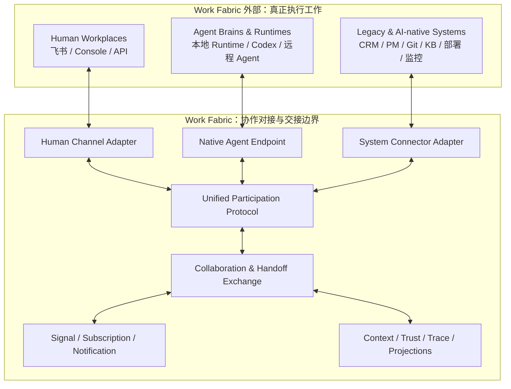
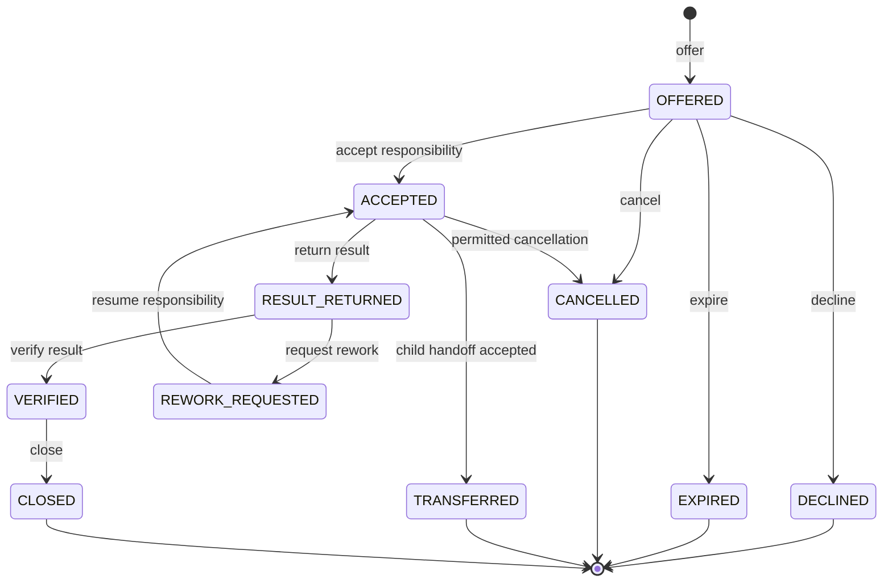
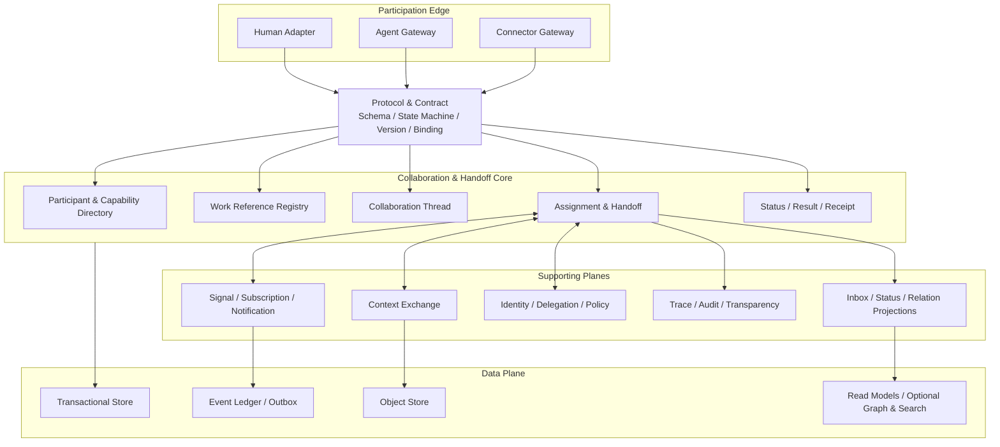

# Work Fabric 整体架构

本文是 Work Fabric 的 canonical 架构说明，面向协议设计者、系统实现者、Connector/Agent 开发者和技术决策者。更详细的设计推导与验收标准见[协作对接与工作交接详细设计](superpowers/specs/2026-07-13-collaboration-handoff-fabric-design.md)。

## 1. 定位与系统边界

> **A protocol-driven collaboration interconnect for humans, agents, and work systems.**

Work Fabric 是面向人、AI Agent 与工作系统的协议驱动协作互联与交接层。它让异构参与方以统一方式接受委托、传递上下文、移交责任、同步状态、返回结果并完成验收。

执行发生在 Work Fabric 之外：

- 人在自己的工作环境中完成专业工作。
- Agent Runtime 在自身环境中完成规划、推理和工具调用。
- Codex 在本地或远程工程环境中实施代码。
- 飞书、CRM、Git、知识库、部署和监控平台继续运行自身业务逻辑。

Work Fabric 只拥有这些执行主体之间的协作事实和交接状态，不拥有其内部执行过程。

Exchange Core Phase 1 是 **transport-free** 的参考实现：它没有 HTTP Server、Broker Consumer、飞书调用或 Agent Runtime。Binding 与 Adapter 把外部参与方接到统一命令和事件契约上，Core 只完成授权后的分派、状态移交和权威记录。

### Work Fabric 原生负责

- 统一参与协议和版本化契约。
- 参与者、端点、能力、身份映射和委托关系。
- 外部工作项的统一引用。
- Collaboration Thread、Assignment、Handoff 和 Receipt。
- Context 的范围化传递。
- 对外状态报告、结果引用和验收回执。
- 事件、订阅、通知、确认、重放和状态对账。
- 责任历史、事件因果、证据和审计视图。

### Work Fabric 不负责

- Agent 推理、内部计划和工具调用。
- 人的专业工作过程。
- 代码实施、部署或运维处置。
- 替代外部工作系统成为业务内容主库。
- 强制所有参与方采用相同 Workflow 或传输技术。
- 通过一个内部自动化引擎包办所有业务流程。

## 2. 架构原则

1. **协议优先**：稳定协作语义和交互状态机先于具体 API 与中间件。
2. **交接为中心**：系统核心问题是“谁把什么、带着哪些上下文和权限、以什么验收条件交给谁”。
3. **执行外置**：参与方自行决定如何完成工作，Work Fabric 只管理参与边界。
4. **人机同构、入口异构**：人、Agent 和系统共享交接语义，但可以通过不同渠道和传输方式接入。
5. **外部事实归原系统**：默认传递引用，只在离线、稳定性或审计需要时保存必要快照。
6. **事件关联协作语义**：事件必须关联 WorkReference、Actor、Thread、Handoff 和因果链。
7. **至少一次与业务幂等**：跨系统不假定 exactly-once，依靠幂等、Receipt、补偿和对账得到可靠结果。
8. **逻辑图与物理存储分离**：协作关系可以投影为图，但权威事务状态不绑定单一图数据库。
9. **最小授权**：交接携带与当前工作绑定的授权范围，不向 Agent 或 Adapter 发放租户级长期权限。
10. **自动化来自端点可替换性**：人类端点可以逐步替换为 Agent 端点，而协议、治理和交接链保持稳定。

## 3. 系统上下文



### Human Workplaces

人继续通过飞书、Web Console 或开放 API 工作。Human Channel Adapter 将消息、交互卡片、审批、问题回复和人工接管映射到统一参与协议。

### Agent Brains & Runtimes

Agent Endpoint 声明身份、能力、协议版本、可用性和回调方式。它接收 Handoff、读取受限 Context、回报状态并返回结果。

Codex 可以作为 Agent Runtime 暴露的代码实施能力，也可以在具备独立身份、交接状态和回调能力时作为独立 Endpoint。无论采用哪种模式，代码执行过程都不进入 Work Fabric。

### Legacy & AI-native Systems

外部系统通过 Connector Adapter 接入。Connector 映射资源、事件、状态和动作结果，并负责外部状态对账。外部系统继续持有原始内容和权威业务事实。

## 4. Unified Participation Protocol

统一参与协议是 Work Fabric 的核心产品。它统一协作语义，而不是强制统一传输方式。

Protocol v1 的规范角色、Canonical Message、状态机、Event、Subscription 和 Binding 决策见 [Work Fabric Participation Protocol v1 设计](superpowers/specs/2026-07-13-work-fabric-participation-protocol-v1-design.md)。已实现的语言无关规范、Schema 索引、机器可读生命周期、Golden Fixtures 和参考序列见 [WFPP v1 Core Protocol](../protocol/README.md)。

### 4.1 协议领域

| 协议领域 | 解决的问题 |
|---|---|
| Identity & Delegation | 谁在调用、代表谁、授权范围是什么 |
| Endpoint & Capability | 如何接入、能做什么、当前是否可用 |
| Work Reference & Intent | 交接的工作是什么、目的是什么 |
| Assignment & Handoff | 谁承担责任、如何接受、拒绝、退回或转交 |
| Context Exchange | 接收方需要什么信息、可以看到什么 |
| Status & Checkpoint | 接收方如何报告进度、等待、阻塞或失败 |
| Result, Receipt & Acceptance | 结果如何返回、谁收到、谁验收 |
| Event & Subscription | 变化如何传播、过滤、确认和重放 |
| Federation & Synchronization | 外部资源和状态如何映射、写回与对账 |

### 4.2 协议分层

```text
L3  Domain Semantics
    Actor / Endpoint / WorkReference / Handoff / Context / Result / Receipt

L2  Interaction Protocols
    Register / Offer / Accept / Report / Return / Verify / Rework / Transfer

L1  Message Contract
    Schema / Version / Idempotency / Correlation / Causation / Error / Cursor

L0  Transport Bindings
    HTTP / gRPC / WebSocket / Webhook / Broker / Local IPC / SDK
```

不同传输绑定必须保持相同的领域语义和状态机。例如，飞书卡片点击和 Agent 的流式 `accept` 消息都可以表达 `RESPONSIBILITY_ACCEPTED`，但交互方式不同。

Core Protocol Artifacts 是后续实现的唯一机器可读语义基线。Exchange Server、HTTP/SSE/Webhook、A2A、MCP、飞书 Adapter 和 Agent Runtime SDK 必须依赖这些 Core Artifact，并通过 `npm run conformance`；它们不能在各自实现中复制或重定义 Handoff 状态机。

### 4.3 兼容性规则

- 所有 Schema 都具有命名空间和显式版本。
- 新增可选字段保持向后兼容；破坏性语义变更发布新主版本。
- Endpoint 在注册时协商协议和 Capability 版本。
- 扩展字段进入客户或插件命名空间，不污染稳定内核字段。
- SDK、Connector 和 Endpoint 必须通过契约与一致性测试后才能声明兼容版本。

## 5. Collaboration & Handoff Exchange

Exchange 是 Work Fabric 的事务核心，持久化框架真正拥有的协作事实。

### 5.1 核心职责

- 维护 Participant、Endpoint、Capability 和 Delegation。
- 将外部需求、任务、文档、代码和事件登记为 WorkReference。
- 创建和维护 CollaborationThread。
- 以 Handoff 保存权威责任与生命周期事实，并从中投影 Assignment、Status、Result 和 Receipt 视图。
- 根据 Receipt 明确当前责任，而不是根据消息送达推断责任。
- 维护 Handoff 之间的父子关系、Correlation 和 Causation。
- 在状态变化时原子写入 Outbox Event。

### 5.2 标准 Handoff Package

```text
handoff_id
thread_id
work_reference
from_actor / from_endpoint
to_actor / to_endpoint / requested_capability
intent
context_bundle
authority_scope
acceptance_criteria
status_channel
deadline / expiry
correlation_id / causation_id
protocol_version
extension_fields
```

| 字段 | 含义 |
|---|---|
| Work Reference | 交接什么 |
| From / To | 谁交给谁，或需要什么能力的接收方 |
| Intent | 为什么交接、期望什么结果 |
| Context Bundle | 完成当前工作所需的输入和背景 |
| Authority Scope | 允许读取、调用和写回的范围 |
| Acceptance Criteria | 怎样判断结果满足要求 |
| Status Channel | 状态、问题和结果回传方式 |
| Deadline / Expiry | 接收责任和返回结果的时间边界 |
| Correlation / Causation | 所属协作链及直接上游原因 |

## 6. 核心领域模型

| 对象 | 含义 |
|---|---|
| `Tenant` | 客户或组织的隔离边界 |
| `Principal` | 通过认证的调用身份 |
| `Actor` | 承担协作责任的人、Agent 或系统主体 |
| `Endpoint` | Actor 收发协议消息的具体入口 |
| `RuntimeInstance` | Agent Endpoint 背后的在线运行实例 |
| `Capability` | Actor 或 Endpoint 能承担的能力及约束 |
| `Delegation` | 一个主体代表另一主体行动的授权关系 |
| `WorkReference` | 指向外部工作对象的统一引用 |
| `CollaborationThread` | 围绕目标或 WorkReference 的持续协作脉络 |
| `Assignment` | Actor 对一项工作责任的承担关系 |
| `Handoff` | 责任、上下文和结果预期的移交 |
| `ContextBundle` | 当前 Handoff 允许接收方消费的上下文集合 |
| `StatusReport` | 参与方对外报告的进度、问题或阻塞 |
| `ArtifactReference` | 外部文档、代码、部署或其他结果引用 |
| `Evidence` | 支撑状态或验收结论的证据引用 |
| `Receipt` | 投递、接收、责任承担、结果接收或验收确认 |

`Principal`、`Actor` 和 `Endpoint` 必须分离。飞书机器人可以用自己的 Principal 调用系统，但代表某个 Human Actor；一个 Agent Runtime Principal 也可以代表多个独立 Agent Actor。

`Handoff` 是唯一可写的责任事实；`Assignment` 是从 Handoff 当前责任人派生的读模型。投影可以清空并由 Journal 重建，任何组件都不能绕过 Handoff 独立修改 Assignment。

Receipt 至少区分：

- `DELIVERED`
- `RECEIVED`
- `RESPONSIBILITY_ACCEPTED`
- `RESULT_RECEIVED`
- `RESULT_VERIFIED`

消息送达或被读取不等于接收方已经承担责任，结果被收到也不等于已经通过验收。

## 7. Handoff 生命周期与责任迁移



`DRAFT` 不属于 Protocol v1 的互操作状态。客户端或 Exchange 实现可以保存本地草稿，但草稿不产生权威 Handoff、责任或领域事件。

责任迁移规则：

- `OFFERED` 被接受前，发起方仍承担责任。
- `ACCEPTED` 后，责任转移给接收方。
- `RESULT_RETURNED` 后，执行责任已经回传，验收责任转移给指定验收方。
- `REWORK_REQUESTED` 后验收方等待原接收方重新接受；重新接受后执行责任才回到原接收方。
- `TRANSFERRED` 不表示新接收方已经承担责任；只有子 Handoff 被接受后，责任才转移成功。
- 每次责任变化都产生独立 Receipt 和领域事件。

外部执行状态与 Handoff 生命周期分开。`StatusReport` 可以报告 `NOT_STARTED`、`IN_PROGRESS`、`WAITING`、`BLOCKED`、`COMPLETED` 或 `FAILED`，但它们只是参与方声明，不表示 Work Fabric 执行了工作。

## 8. Events、Subscriptions 与 Notifications

Signal Network 是 Handoff 的可靠传播机制，不是独立于工作语义的通用事件总线。

### 8.1 EventEnvelope

```text
event_id
event_type
schema_version
tenant_id
source_endpoint
actor_id
thread_id
handoff_id
work_reference
sequence
occurred_at
recorded_at
correlation_id
causation_id
visibility_scope
payload
```

### 8.2 语义区分

- **Event**：已经发生的协作事实。
- **Subscription**：哪些变化与某个参与方有关，以及如何投递。
- **Notification**：面向人、Agent 或系统的投递视图。
- **Command**：请求外部 Endpoint 采取动作。
- **Receipt**：送达、接收、责任承担或验收确认。

### 8.3 一致性与投递

- Handoff 状态和 Outbox Event 在同一事务中提交。
- 事件按 Tenant 和 Handoff 或 Thread 分区。
- 只保证单个 Handoff 或 Thread 内的顺序，不提供全局顺序。
- 外部投递采用 at-least-once；消费者使用 `event_id` 或业务幂等键去重。
- Subscription 按 Subscription × Partition 保存独立 Cursor，可以暂停、恢复和重放。
- “全局订阅”只表示跨逻辑 Partition 聚合消费，不提供单一全局 Cursor 或跨 Partition 顺序；恢复时分别推进每个 Partition 的位置。
- Notification 分别记录已投递、已读取和责任已接受。
- 永久失败进入死信队列并产生可订阅的失败事件。
- 公共 Protocol Event 不包含内部 `domain_data`、Partition position、Commit ID、幂等记录或其他存储 Cursor 元数据。

### 8.4 订阅条件

Subscription 可以组合过滤：

- Event Type 和 Schema Version。
- Tenant、WorkReference、Thread 或 Handoff。
- Actor、Endpoint、Role 或 Capability。
- Handoff Lifecycle 和 StatusReport。
- 标签、优先级、风险级别或资源关系。

## 9. Context Exchange

Context Exchange 在交接边界上传递完成当前工作所需的最小充分信息。

ContextItem 可以是：

- 飞书文档、需求、代码、知识或事件的外部引用。
- 经授权生成的必要内容快照。
- 长内容摘要或结构化提取。
- 上游决策、检查点、问题和交接说明。
- 临时访问令牌或受限工具能力引用。

每个 ContextItem 必须包含来源、版本、创建者、可见范围、敏感等级、有效期和完整性信息。

上下文处理遵循：

- 默认传引用，必要时保存快照。
- 按 Actor、Handoff、Delegation 和有效期裁剪。
- 大内容保留在来源系统或对象存储中。
- 已经接收的 Handoff 保留当时 Context View 的版本或哈希。
- Context 引用不可访问时返回显式错误，不静默降低信息完整性。

知识检索、向量搜索和摘要模型可以作为外部服务接入，Context Exchange 不绑定具体实现。

## 10. Identity、Delegation 与 Trust

- 所有写操作关联 Principal、Actor 和 Endpoint。
- Adapter 必须显式声明它代表哪个 Actor。
- Delegation 包含授权资源、允许动作、有效期和能否再次委托。
- Agent 接收 Handoff 时获得与当前 Handoff 绑定的最小权限。
- Context、Artifact 和 Event 的可见范围分别校验。
- 高风险动作可以通过面向 Human Actor 的 Handoff 完成审批。
- Credential 只保存引用或加密封装，由专用 Secret 服务管理。
- 租户隔离、身份验证和审计是所有协议 Binding 的共同要求。

## 11. 逻辑组件



### 11.1 Participation Edge

适配不同参与方的渠道、认证、传输和外部对象，同时保持统一协议语义。

### 11.2 Protocol & Contract

提供 Schema、领域状态机、消息信封、错误语义、版本协商、Transport Binding 和一致性测试。

### 11.3 Handoff Core

提供事务一致的 Participant、Thread、Assignment、Handoff、责任迁移和 Receipt。

### 11.4 Supporting Planes

Signal、Context、Trust、Trace 和 Projection 是 Handoff 的支撑能力，可以独立扩展，但不能重新定义核心交接语义。

## 12. 数据架构

| 数据组件 | 责任 |
|---|---|
| Transactional Store | Participant、Endpoint、WorkReference、Thread、Handoff、Receipt 和授权元数据 |
| Event Ledger / Outbox | 协作事件、可靠发布、投递历史和审计轨迹 |
| Object Store | 必要内容快照、大型 Context 和附件 |
| Read Projections | Inbox、项目状态、协作时间线和责任视图 |
| Optional Graph Projection | WorkReference、Handoff、Actor、Context 和 Result 关系遍历 |
| Optional Search / Vector Index | 全文、语义检索和 Context 辅助组装 |

Work Graph 是逻辑查询视图，不是架构中心，也不要求使用图数据库作为唯一主存储。

权威 Handoff 状态和 Outbox 使用本地事务保证一致；对象、索引和投影通过事件异步更新。

Phase 1 的 Memory Storage Adapter 只用于参考行为、集成测试和一致性验证，不具备生产持久性声明。当前 PostgreSQL Adapter 已通过既有 SPI 提供 authority、outbox、runtime state、delivery/lease 与 Context 元数据持久化；PostgreSQL 不进入 Core/SPI 依赖，其他符合相同行为 Profile 的存储实现可以等价替换。迁移、RLS 和运维边界见 [PostgreSQL 部署文档](postgresql-deployment.md)。

## 13. 可靠性与失败处理

| 场景 | 策略 |
|---|---|
| 重复 Event 或 Callback | 使用 `event_id`、Handoff Version 和业务幂等键去重 |
| Endpoint 临时离线 | 保留待投递记录，退避重试并暴露投递状态 |
| Agent 接受后失联 | Endpoint Lease 或 Heartbeat 过期，产生失联事件并允许重新交接或人工接管 |
| Context 不可访问 | 返回缺失项和明确错误，阻止不完整交接被接受 |
| 外部系统限流 | Connector 执行背压、批处理和限流感知重试 |
| 外部状态漂移 | 定期或事件触发对账，记录冲突并产生 Reconciliation Event |
| 并发修改 Handoff | 使用 Version 或条件写入，冲突时刷新重试 |
| 结果已提交但 Receipt 丢失 | 使用结果幂等键安全重放并查询最终状态 |
| 非法 Delegation | 拒绝操作、记录安全事件且不泄露受限 Context |
| 永久投递失败 | 进入死信队列并创建可订阅失败事件或人工处理 Handoff |

系统不尝试跨所有外部服务建立分布式事务。跨边界一致性依靠持久事件、幂等、Receipt、补偿和对账。

## 14. 可伸缩性与性能

- 核心写路径保持为短事务：授权校验、Handoff 状态更新、Receipt 和 Outbox。
- Event Fan-out、Notification、Projection、Index、Context 获取和 Connector 调用异步执行。
- 按 Tenant、Thread 或 Handoff 分区，避免全局有序和全局锁。
- 高频 Inbox 和项目总览使用物化读模型，不在线遍历完整协作图。
- 大内容外置，协议消息只携带引用、摘要和完整性信息。
- Signal、Notification、Connector 和 Projection Worker 独立横向扩容。
- 每个 Tenant 与 Endpoint 都具有 Rate Limit、Quota 和 Backpressure。
- 协议不绑定具体数据库、Broker 或搜索引擎，物理实现可以随部署 SLO 演进。

## 15. 扩展性与互操作

### Connector 扩展

Connector 使用五个明确边界：

1. Resource Mapping
2. Event Mapping
3. Status Mapping
4. Command/Result Mapping
5. Reconciliation Policy

### Agent 扩展

Agent Endpoint 使用 Capability Descriptor 声明输入、结果、限制、交互模式和协议版本。能力发现只负责协作接入，不要求 Work Fabric 理解 Agent 内部实现。

### 业务类型扩展

客户可以增加自定义 WorkReference Type、Context Item、Status Metadata 和扩展事件，但不能修改 Handoff 的核心责任语义。

### 外部协议适配

已有 Agent、工具或企业消息协议通过 Binding/Adapter 映射到统一参与语义。Work Fabric 不重复实现它们已经解决的传输和工具调用能力，只补充协作责任、上下文交接、状态、回执和验收。

## 16. 可观测性与透明化

系统必须能够回答：

- 当前工作责任在谁手上。
- 最近一次 Handoff 是否已经投递、读取和接受。
- 当前对外 StatusReport 是什么，多久没有更新。
- 接收方获得了哪些 Context 与权限。
- Result、Artifact 和 Evidence 存放在哪里。
- 哪个上游 Event 或 Handoff 导致当前状态。
- 哪个 Endpoint、Connector 或验收人正在等待处理。

技术可观测性包括日志、指标和分布式追踪；业务透明化包括 Thread 时间线、责任历史、Context 版本、Receipt 和验收结论。两者使用同一个 Correlation 体系关联。

## 17. 部署演进

### 初始形态

采用“模块化事务核心 + 独立 Worker”：

- 一个模块化 Core Service 提供协议入口和事务状态。
- Signal Consumer、Notification Worker、Connector Worker 和 Projection Worker 独立进程运行。
- Transaction Store 与 Outbox 保证核心一致性。
- Object Store 和可选索引按需求启用。

初始实现不应过早拆成大量微服务。

### 规模化形态

随着吞吐、租户隔离和团队边界增长，可以沿既有协议与数据所有权拆分：

- Agent Gateway 与 Human Adapter 独立扩容。
- Signal 与 Subscription 服务按 Tenant 或 Topic 分区。
- Connector Worker 按目标系统和凭据域隔离。
- Read Projection、Graph 和 Search 独立扩展。
- Handoff Core 保持小而稳定，避免吸收外部执行职责。

## 18. 端到端项目示例

以“客户意向到交付运维”为例，实际业务仍发生在参与方与外部系统中，Work Fabric 连接阶段间交接：

1. 销售在飞书记录客户意向，Adapter 创建 WorkReference，并向需求人员发出 Handoff。
2. 需求人员接受责任，可将访谈整理工作交给 Agent；Agent 返回需求摘要和文档引用。
3. 需求基线通过 Handoff 交给方案、商务和法务，结果与状态保持透明。
4. 合同确认后，项目负责人将实施责任交给人、Agent Runtime 或系统 Endpoint。
5. 本地 Agent Runtime 接收代码工作并调用 Codex，代码执行在外部完成，Git 引用和测试证据通过 Result 返回。
6. 阶段结果交给客户或验收人员；返工和再次交接保留完整因果链。
7. 验收版本交给部署和运维系统，Connector 回传发布状态。
8. 运维告警通过 Subscription 创建面向人或 Agent 的新 Handoff，进入下一轮协作。

该示例验证的是跨参与方、跨阶段和跨系统的协作对接，而不是在 Work Fabric 内部实现销售、合同、研发、部署和运维流程。

## 19. Phase 1 实施边界

Phase 1 已建立统一参与和交接的 transport-free 最小闭环：

- WFPP Protocol、Schema、命令验证与公共 Event。
- Handoff 权威生命周期、幂等、乐观并发和父子原子责任转移。
- 技术中立的 Identity、Authority、Context、Persistence、Projection、Subscription 和 Signal SPI。
- 可重建 Handoff/Assignment 读模型、at-least-once Signal、Cursor Pull/Ack、重试和死信参考行为。
- Memory 参考 Adapters、复用型 Conformance Profiles 和端到端公共 Reference Suite。

Transport Binding、飞书 Connector、Agent Endpoint Gateway 与本地 Agent Runtime 接入仍属于后续独立模块；PostgreSQL Production Adapter 与 Context Adapter 已作为 SPI 实现落地。它们增强参与方接入和运行能力，不会把外部执行职责吸收到 Work Fabric Core 内部。
