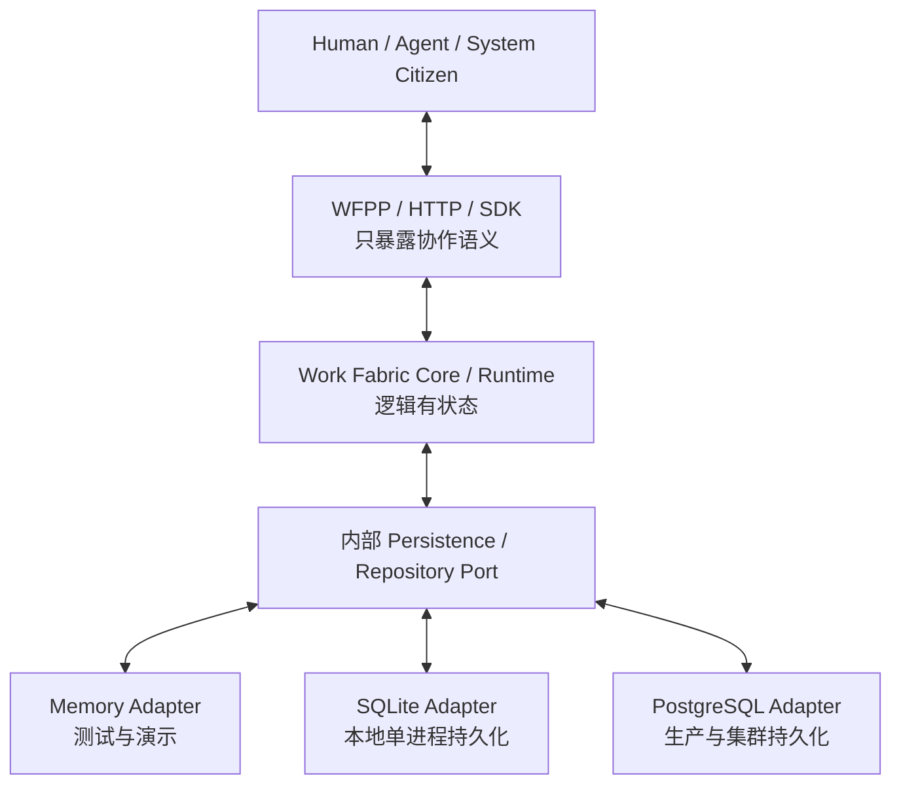

# 协作状态与数据所有权

本文定义 Work Fabric 的状态属性、数据所有权、内部持久化边界和外部模块
职责。它是 [Work Fabric 整体架构](../architecture.md) 的约束性补充。

## 1. 结论

Work Fabric 是**逻辑有状态**的协作网络。Handoff、责任迁移、参与方声明的
浅层状态、投递、回执、订阅位置和审计等协作事实属于 Fabric，必须能够
持久化、查询和重放。

Fabric 的 HTTP、Worker 和 Projection 进程应尽可能保持**计算实例无状态**。
实例通过内部持久化 Port 读取和提交权威协作事实，从而支持重启恢复、水平
扩容和故障转移。

SQLite、PostgreSQL、内存 Store、对象存储、缓存、Broker 和索引都是部署
内部实现，不是 Network Citizen，也不是对外能力。参与方可以观察 Fabric
承诺的协作语义，不能观察或依赖其存储介质。

## 2. 状态和资产的所有权

| 数据类别 | 权威所有者 | 例子 |
|---|---|---|
| 协作协议事实 | Work Fabric | Handoff 生命周期、当前责任、Correlation、Causation、Receipt、参与方声明的 `WAITING` 等浅层状态 |
| 可靠传播状态 | Work Fabric | Outbox、Subscription Cursor、Delivery、Ack、Retry、Dead Letter |
| 治理与审计事实 | Work Fabric | Authority 决策引用、Admission 记录、操作时间线、恢复记录 |
| Citizen 运行事实 | Work Fabric Directory | Provisioning、租约、Fencing、动态声明版本和当前可用性 |
| 决策与执行状态 | 对应 Decision Body 或 Capability Provider | Agent 任务历史、推理输入、能力执行步骤、Provider 幂等与外部副作用记录 |
| 外部领域资产 | 来源系统或对应 Provider | 飞书消息、文档、日程、CRM 需求、Git 提交、部署记录 |
| 派生读模型 | 构建该投影的 Fabric 模块 | Inbox、责任视图、时间线、Console 查询模型；可由权威事件重建 |

存储服务不因保存数据而获得数据所有权。所有权由领域语义决定，而不是由
数据库、文件或服务的物理位置决定。

## 3. Fabric 原生保存的最小协作状态

Fabric 可以持久化：

- Handoff、Collaboration Thread、Work Reference 和责任迁移；
- Status Report、Result Reference、Evidence Reference 和 Receipt；
- 目标绑定、Endpoint 投递、租约、确认、重试和恢复状态；
- Event、Outbox、Subscription、Cursor 和有界投递历史；
- 与协作相关的身份、委托、Authority 决策及其证据引用；
- 参与方通过 Status Report 声明的 `WAITING`、`BLOCKED` 等浅层状态及其
  有界外部引用；
- 为幂等、并发控制、审计和重放所必需的版本、摘要和时间戳。

Fabric 默认不保存：

- 飞书完整聊天历史或其他渠道的消息主库；
- 文档正文、日历资产、CRM 数据或代码仓库内容；
- Agent 的完整记忆、私有计划、推理过程或模型上下文；
- Capability Provider 的业务数据库和厂商原始响应全集；
- 为未来可能用途而复制的外部内容。

跨边界数据默认使用带来源、版本、可见范围和完整性信息的 Reference。只有
离线稳定性、验收证据或审计要求明确需要时，Fabric 才保存有界快照；快照
不能静默取代来源系统的权威资产。

## 4. 内部持久化边界

必须遵守：

1. Core、协议、SDK、Channel、Agent 和 Provider 不依赖具体数据库。
2. 具体 Adapter 只在部署组合根注入，不能进入公共协议或 Capability 描述。
3. 对外 API 不返回表名、SQL、数据库 Cursor、Adapter 名称或物理存储位置。
4. 替换存储实现不能改变 Handoff 状态机、Authority、幂等或投递语义。
5. 同一部署 Profile 不得在不告警的情况下从持久 Store 回退到 Memory。
6. 多实例部署必须共享权威持久化，并使用事务、CAS、Lease 或 Fencing 防止
   多实例同时拥有同一协作事实。

对外可以并且必须声明语义保证，例如持久化级别、顺序范围、at-least-once、
幂等条件、恢复能力、数据保留和一致性边界。这些是协议承诺，不是存储泄漏。

## 5. 等待外部输入时的职责

“向群里询问参与人并在收到回复后继续创建日程”同时包含业务决策和协作
延续，两者都属于接收任务的 Decision Body。Fabric 只传播和记录该模块
主动发布的协作事实，不能演变为等待协调器或业务流程引擎。

| 组件 | 应当拥有 | 不应当拥有 |
|---|---|---|
| Decision Body / Agent | 为什么询问、问题措辞、等待范围、截止时间、回复关联、哪些回答相关、何时恢复、最终邀请谁 | Fabric 的投递账本、Channel 凭据、日历资源状态 |
| Work Fabric | Handoff、Event、Subscription、Delivery、Receipt、Correlation、Agent 主动声明的 `WAITING` 状态和审计事实 | 等待条件、定时器、回复匹配、唤醒 Agent、参与人选择策略和 Agent 私有任务历史 |
| Channel | 发送问题、接收回复、可信来源和消息/会话/回复关系引用，并把事实发布到网络 | 判断回复属于哪个业务任务、谁应该参会、何时结束收集 |
| Message Provider | 按 Authority 提供成员、历史和消息事实 | 组织会议或解释回答 |
| Calendar Provider | 按明确参与人列表查询忙闲、创建日程、添加参与人并返回逐项结果 | 猜测参与人或主动发起询问 |

Agent 使用自己的 State Store 保存排期会话、询问消息引用、已收集答案、
等待截止时间和决策进度。需要询问时，Agent 发布一个 Message Capability
Handoff；Message Provider 自主接收并执行。外部回复到达时，Channel 发布
带可信会话和回复关系引用的新消息事实；Agent 通过自己的 Subscription 接收
候选输入并根据本地会话决定是否认领、关联和继续。

Fabric 不调用任何 Citizen，也不根据等待条件主动恢复 Agent。它只可靠传播
Offer/Event、执行 Authority 与协议校验，并记录由参与方提交的认领、状态、
结果和回执。Agent 重启后由自己的 State Store 和 Subscription Cursor 恢复，
而不是由 Fabric 读取 Agent 私有状态或启动其业务流程。

## 6. 不引入通用存储公民

当前 Network Citizen 分类不包含 `storage` 或 `state-provider`，也不提供
面向所有 Citizen 的通用 `put/get` 数据接口。这样可以避免 Fabric 提前承担
跨模块数据模型、生命周期、删除、加密、合规和所有权责任。

未来若接入 S3、企业文件库或对象存储，应根据它对网络承担的具体职责注册为
`capability-provider`，声明例如 `artifact.create`、`artifact.read` 或
`artifact.sign_download` 等有领域含义的 Contract。该 Provider 继续拥有
自己的资产规则，不能与 Fabric 内部协作状态持久化混用。

## 7. 当前实现审计

当前实现已经符合以下边界：

- Exchange Persistence、Runtime State、Operations、Admission、Context、
  Network Citizen Directory 等均通过技术中立 SPI/Port 与 Adapter 组合；
- Memory、SQLite 和 PostgreSQL 是内部 Adapter，不在 Citizen kind 中；
- Agent Runtime State 有独立 SPI 和 Memory/SQLite Adapter，归外部 Agent
  Runtime 使用，不进入 Exchange Core；
- Feishu Message、Document 和 Calendar 以能力 Citizen 暴露领域 Contract，
  不暴露各自数据库；
- Console 和公共 SDK 查询协作语义，不直接访问数据库。

当前 Protocol/Core 已具备这个边界所需的浅层语义：

- `StatusReport: WAITING` 记录 Agent 主动声明的当前协作状态；
- Handoff、Event、Subscription、Correlation 和 Causation 传播并关联协作
  事实；
- Delivery、Ack、Receipt 和审计记录可靠传播与责任变化。

因此不新增 `Wait`、`Resume`、业务 Session 或定时调度模块。日历多轮协作
需要迭代的是 Agent 自有任务会话、Channel/Message 提供的回复关系事实和
动态参与人 Authority 证据链；这些变化都在各自模块内闭环，不改变 Exchange
Core 的定位。
