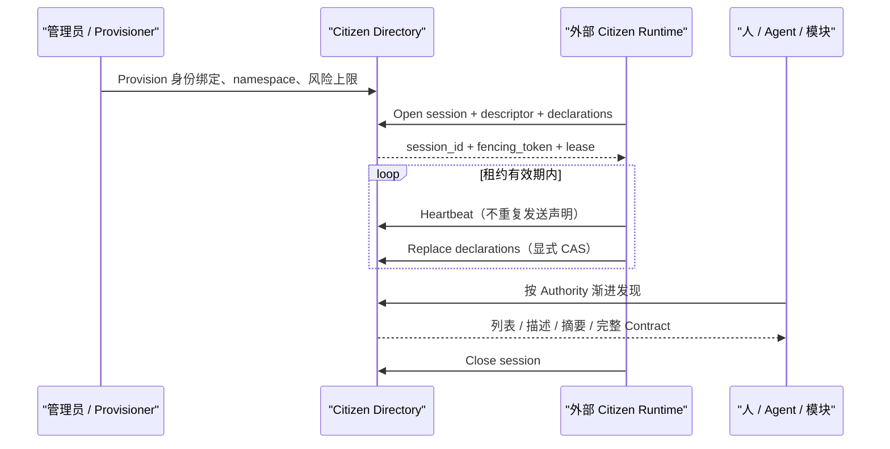

# Network Citizen 架构与接入

Network Citizen 是 Work Fabric 对“接入协作网络并对外承担某类责任的实体”
的统一表达。它解决模块如何声明身份、可用性和能力，以及其他参与方如何
按权限渐进发现这些事实；它不把模块的业务执行搬进 Fabric。

## 1. 两个正交维度

Actor type 回答“谁参与协作”：

```text
human | agent | system
```

Citizen kind 回答“这个网络实体对外承担什么责任”：

```text
decision-body | capability-provider | channel | context-provider |
governance-provider | observer
```

两者彼此正交。人和 Agent 都可以是 `decision-body`；一个由 `system`
Actor 代表的服务可以是 `capability-provider`、`context-provider` 或
`governance-provider`。一个进程可以托管多个 Citizen，但每个注册只能有
一个 `citizen_kind`，从而可以被独立授权、启停、租约、扩缩和审计。

| Citizen kind | 对外闭环职责 | 明确不负责 |
|---|---|---|
| `decision-body` | 理解意图、作出选择、委托、解释结果；可以是人、Agent 或外部调度大脑 | Fabric 的持久化与渠道投递 |
| `capability-provider` | 声明可执行 Contract，在自身边界执行并返回结构化结果 | 选择自己是否应被调用、生成对话文案 |
| `channel` | 外部通信系统的可信接入、表示、寻址、格式映射和投递 | 理解意图、推理或代替 Agent 生产答复 |
| `context-provider` | 按 Authority 返回有界、带来源和版本的上下文 | 接受消费方 Handoff 的业务责任 |
| `governance-provider` | Identity、Admission、Authority、委托、确认或策略证据 | 业务审批和专业判断 |
| `observer` | 只读观察、Console、审计导出、指标或事件集成 | 改写 Handoff 或代表其他参与者 |

数据库、缓存、Broker、HTTP/SSE/NATS transport、SDK、YAML 文件、迁移工具和
进程内队列是基础设施，不是 Citizen。只有一个模块以独立身份进入网络、公开
声明并承担网络责任时，才注册为 Citizen。

## 2. 项目级不变量

所有 Citizen 和接入模块必须遵守以下规则：

1. Actor type 与 Citizen kind 分开建模。
2. 一个 Citizen 注册只有一个 kind。
3. 配置只负责可信启用、身份绑定和安全上限；租约会话中的动态声明才是
   当前运行事实。YAML 是首个配置来源，不是能力目录。
4. 声明能力不等于获得调用 Authority。发现、读取完整 Contract、发起调用和
   执行外部副作用分别授权。
5. 动态变化使用 registration version、单活 session fencing token 和
   declaration CAS；旧 Runtime 不能覆盖新 Runtime。
6. 模块必须在自身职责中闭环，只通过协议或窄 SPI 交换事实。Channel 不替
   Agent 写答复，Agent 不持有飞书凭据，Provider 不替 decision body 做选择。
7. 描述和声明不得包含密钥、私网 URL、存储位置、可执行路径或厂商 SDK 对象。
8. Core 不依赖 YAML、HTTP、SQLite、PostgreSQL、Feishu、Agently、MCP 或
   任何具体模块实现。

## 3. 注册与动态会话



Provisioning 是运维安全边界，包含固定身份绑定、允许的声明命名空间、最大
风险和启停状态。Session 是运行时事实：单活、带租约和 fencing。声明只在
Open 或显式 Replace 时传输；Heartbeat 只更新序列、可用性和租约。

进程异常退出后会话自然过期；同一 Citizen 的新会话取得更大的 fencing
token，旧会话的心跳、替换和关闭请求全部失败。Schema URI 首次绑定 digest
后不可静默漂移。

## 4. 渐进式披露

Catalog 不是无权限的全量工具清单。每一层都使用独立 Authority action：

1. `GET /v1/citizens`：Citizen 列表和聚合可用性。
2. `GET /v1/citizens/{citizen_id}`：身份、协议、声明数量与 digest。
3. `GET /v1/citizens/{citizen_id}/declarations`：声明摘要。
4. `GET /v1/citizens/{citizen_id}/declarations/{declaration_id}`：完整
   Contract、风险、确认要求和 Schema 引用。

Discovery 只返回确定性分页的事实，不评分、不推荐、不自动选择、不自动
Claim 或 Accept。外部 decision body / Resolver 使用这些事实作出选择，再
通过 Handoff 和 Authority 请求目标 Provider。

## 5. HTTP Contract

所有请求使用与其他 Work Fabric API 相同的 Bearer 身份、`X-WF-Actor-ID`
和 `X-WF-Endpoint-ID` 表示链。

| 操作 | 方法与路径 |
|---|---|
| Provision / 更新 / 禁用 | `PUT /v1/admin/citizens/{citizen_id}` |
| 发现 Citizen | `GET /v1/citizens` |
| 读取 Citizen | `GET /v1/citizens/{citizen_id}` |
| 声明摘要 | `GET /v1/citizens/{citizen_id}/declarations` |
| 完整声明 | `GET /v1/citizens/{citizen_id}/declarations/{declaration_id}` |
| 打开会话 | `POST /v1/citizens/{citizen_id}/sessions` |
| 心跳 | `POST /v1/citizens/{citizen_id}/sessions/{session_id}/heartbeat` |
| 替换声明 | `PUT /v1/citizens/{citizen_id}/sessions/{session_id}/declarations` |
| 关闭会话 | `POST /v1/citizens/{citizen_id}/sessions/{session_id}/close` |

Provisioning 示例：

```json
{
  "citizen_id": "feishu-document-actions",
  "citizen_kind": "capability-provider",
  "principal_id": "principal-feishu-provider",
  "allowed_actor": {
    "actor_id": "actor-feishu-provider",
    "actor_type": "system"
  },
  "allowed_endpoint_id": "endpoint-feishu-provider",
  "allowed_declaration_namespaces": ["feishu"],
  "maximum_risk": "high",
  "administrative_state": "enabled",
  "registration_version": 1
}
```

打开会话的请求包含 `client_session_id`、完整 descriptor、当前 declarations、
期望 registration version 和可选租约秒数。响应中的 `session_id`、
`fencing_token`、`heartbeat_sequence` 与 `declaration_version` 必须用于后续
CAS 请求。写操作不应由客户端自动重试；如需重试必须复用相同幂等身份和内容。

## 6. TypeScript SDK

下面的代码覆盖 Provision、Open、Replace、Discovery 和 Close。`descriptor`
中的声明 digest 必须由 canonical JSON 计算，不能手写占位值。

```ts
import {
  BearerTokenProvider,
  WorkFabricClient,
} from "@work-fabric/sdk-typescript";
import {
  canonicalCitizenDigest,
  type CitizenDeclaration,
} from "@work-fabric/network-citizen-spi";

const citizenId = "feishu-document-actions";
const declarations: CitizenDeclaration[] = [{
  declaration_id: "feishu.document.create",
  declaration_kind: "capability",
  version: "1.0.0",
  name: "Create Feishu document",
  description: "Creates one simple document.",
  interaction_modes: ["asynchronous"],
  risk: "medium",
  confirmation: "none",
  constraints: {},
  extensions: {},
}];

const fabric = new WorkFabricClient({
  baseUrl: "http://127.0.0.1:8790",
  tenantId: "tenant-local",
  exchangeId: "exchange-local",
  representation: {
    actorId: "actor-feishu-provider",
    endpointId: "endpoint-feishu-provider",
  },
  authentication: new BearerTokenProvider(() => providerToken()),
});

await fabric.citizens.provision(citizenId, {
  citizen_id: citizenId,
  citizen_kind: "capability-provider",
  principal_id: "principal-feishu-provider",
  allowed_actor: {
    actor_id: "actor-feishu-provider",
    actor_type: "system",
  },
  allowed_endpoint_id: "endpoint-feishu-provider",
  allowed_declaration_namespaces: ["feishu"],
  maximum_risk: "high",
  administrative_state: "enabled",
  registration_version: 1,
});

const descriptor = {
  citizen_id: citizenId,
  citizen_kind: "capability-provider" as const,
  version: "1.0.0",
  identity: {
    principal_id: "principal-feishu-provider",
    actor: {
      actor_id: "actor-feishu-provider",
      actor_type: "system" as const,
    },
    endpoint_id: "endpoint-feishu-provider",
  },
  protocol: {
    versions: ["1"],
    bindings: ["workfabric+https"],
  },
  declarations: {
    count: declarations.length,
    digest: canonicalCitizenDigest(declarations),
  },
  availability: "available" as const,
  extensions: {},
};

let session = await fabric.citizens.openSession(citizenId, {
  client_session_id: "feishu-provider-process-01",
  descriptor,
  declarations,
  requested_lease_seconds: 60,
  expected_registration_version: 1,
});

const nextDeclarations = [...declarations];
session = await fabric.citizens.replaceDeclarations(
  citizenId,
  session.session_id,
  {
    fencing_token: session.fencing_token,
    expected_registration_version: 1,
    expected_declaration_version: session.declaration_version,
    declarations: nextDeclarations,
  },
);

const page = await fabric.citizens.list({
  citizen_kind: "capability-provider",
  declaration_id: "feishu.document.create",
  availability: ["available", "degraded"],
  executable_only: true,
  limit: 25,
});

await fabric.citizens.closeSession(citizenId, session.session_id, {
  fencing_token: session.fencing_token,
  heartbeat_sequence: session.heartbeat_sequence + 1,
  expected_registration_version: 1,
});
```

生产 Runtime 可以继承 `@work-fabric/network-citizen-runtime` 的
`LeasedNetworkCitizenRuntime`，也可以直接实现语言无关 HTTP Contract。
TypeScript 基类只是便利层，不是协议要求。

## 7. 存储与组合

- `memory-demo` 自动组合 Memory Store，仅用于测试和本地演示。
- `sqlite-local` 在 service-node 内复用同一 SQLite 数据库连接，适合单进程
  本地开发并支持重启恢复。
- 外部/生产 profile 通过 `NetworkCitizenStore` 注入具体持久化实现；未注入
  时不暴露 Citizen 路由，不会暗中退回 Memory。

Directory、HTTP、SDK 和 Runtime 只依赖稳定 Contract。替换 YAML、数据库、
HTTP binding 或具体 Provider 不改变 Exchange Core。

## 8. 与 Handoff 和能力调用的边界

Citizen Catalog 回答“网络里当前有哪些实体和声明”；Handoff 回答“责任如何
移交”；Capability invocation 回答“已获授权的 Provider 如何接收一个具体
执行请求”。三者不能合并成内部自动化引擎。

Catalog、租约、渐进披露、HTTP/SDK、Runtime 基类和技术中立的
`CapabilityInvocationPort` 均已完成。Agent 产生的结构化调用意图会转换为
标准辅助 Capability Handoff；所选 Citizen、Endpoint、版本、Contract
digest 和 Schema digest 对本次调用冻结。原始 Agent 不 Transfer 自己的
Handoff，只等待辅助 Handoff 的类型化终态后继续推理。

首个实现是独立 Feishu Capability Provider，动态声明
`feishu.message.send` 与 `feishu.document.create/read/update/append/delete`。
同一部署把 `feishu.document.context` 作为另一个 `context-provider` 发布。
Provider 内部拥有 OpenAPI、幂等执行、资源所有权、revision 校验与错误映射；
Agent、Core 和 Channel 看不到密钥或厂商响应。删除需由独立 Governance
确认服务提供并原子消费单次 proof。

`capability-provider` 返回事实，不生成对话答复；`decision-body` 解释事实并
独占最终文案；`channel` 只投递 canonical Result。一个进程可以共同托管这些
Runtime，但不会合并 Citizen 身份、Authority、状态或职责。

## 9. 新模块接入清单

每个进入网络的新模块必须在设计、实现和运维文档中明确：

1. 唯一 Citizen kind，以及与 Actor type 分离的 Principal/Actor/Endpoint。
2. Runtime 动态声明、版本、Schema URI/digest、风险和确认要求。
3. 发现、完整 Contract、调用、资源和副作用分别需要的 Authority。
4. 接受哪类 Handoff、何时承担责任、如何产生类型化终态。
5. 模块自己拥有的状态、幂等键、租约、fencing 与重启恢复。
6. 密钥边界，以及日志、事件、Result、Console 中禁止出现的数据。
7. 健康、draining、关闭、外部限流和 outcome-unknown 行为。
8. 结构化事件、审计引用和低基数可观测性，不记录业务内容或凭据。
9. 对应 conformance、失败路径、跨模块 E2E 和真实服务的 opt-in smoke test。
10. 模块内部闭环的职责，以及明确不承担的决策、语义或执行职责。
