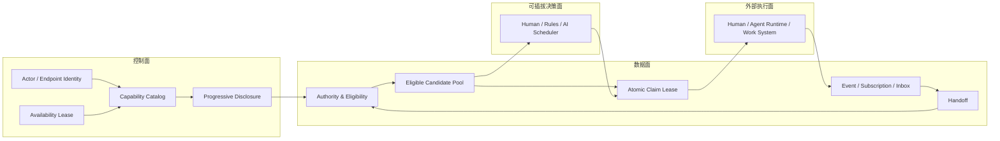

# 能力发现、候选认领与外部调度

本文定义 Work Fabric 中参与者能力声明、渐进式披露、候选池认领和外部调度的终态架构。它是
[整体架构](architecture.md)中 Endpoint、Capability 与 Handoff Target Resolution 的
canonical 补充说明。

## 1. 决策

Work Fabric 同时支持三种交接方式：

1. **Direct Target**：发起方明确指定 Actor 或 Endpoint。
2. **Eligible Pool Claim**：发起方声明 Capability 与 Authority 范围，符合条件的 Endpoint
   从受限候选池中原子认领。
3. **External Resolution**：外部的人、规则服务或 AI Scheduling Brain 读取候选事实，提交
   唯一明确目标。

三种方式共用同一个 Handoff、权限链、Context、事件、Receipt 与结果协议。Pool Claim
不是调度算法；它只是连接层提供的公平、原子、可恢复的责任预留机制。复杂的排名、推荐、
成本和负载决策仍属于外部 Resolver。

## 2. 术语和边界

| 概念 | 定义 |
|---|---|
| Module | 代码或部署组件；存储、事件总线等内部模块不是协作参与者 |
| Actor | 可以承担协作责任的人、Agent 或外部系统 |
| Endpoint | Actor 接入 Work Fabric 的具体协议端点 |
| Capability | Endpoint 对外承诺的稳定能力契约 |
| Skill / Implementation | Capability 背后的说明、模型、工具或执行实现；对 Fabric 不透明 |

只有能够接收或发起 Handoff 的 Actor/Endpoint 才声明协作身份与 Capability。内部技术模块
继续通过 Plugin SPI 声明技术能力，不能因此获得协作任务可见性或认领权限。

## 3. 控制面、数据面、执行面和决策面



Work Fabric 负责登记、过滤、原子绑定、租约、交接状态和审计，不负责参与方内部如何推理、
拆解、调用模型、使用工具或执行任务。

## 4. 渐进式能力披露

能力信息按最小必要原则分四级披露：

| 层级 | 内容 | 典型用途 |
|---|---|---|
| L0 Identity Card | Endpoint、Actor、类型、显示名、在线状态 | 判断网络中有哪些参与实体 |
| L1 Capability Summary | Capability ID、版本、名称、简述 | 低成本检索候选能力 |
| L2 Capability Contract | 输入输出媒体、Schema、交互模式、约束 | 判断协议兼容性和资格 |
| L3 Binding / Implementation Reference | Binding、文档或 Skill 引用、扩展元数据 | 已授权的实际连接与执行准备 |

L0/L1 不返回 Binding、Context、凭据、内部 Prompt 或实现细节。L0 使用
`workfabric.endpoint.identity.discover.v1`，L1 使用
`workfabric.endpoint.capability-summary.discover.v1`，读取单项 L2 Contract 使用
`workfabric.endpoint.capability.read.v1`，包含 Binding 的 L3 完整发现则使用权限更强的
`workfabric.endpoint.discover.v1`。低层授权不能通过切换查询参数升级到高层披露。
Capability 的实现可以变化，但相同主版本的稳定契约不得改变语义。

## 5. Eligible Pool

候选池不是持久化的全网广播队列，而是由以下事实确定、可重建的受限视图：

- Tenant；
- Capability ID 与版本约束；
- 输入输出媒体兼容性；
- Endpoint 行政状态、Session Lease 和 availability；
- Actor type、Role/Attribute、数据等级和地域策略；
- Handoff Authority Scope；
- Endpoint 并发和 Context 上限。

只有同时拥有 `view_offer` 和 `claim_handoff` 权限的 Endpoint 才能在 Inbox 中看到可认领
Handoff。候选池查询不得返回排名、推荐分数或被选中的目标。

## 6. Claim Lease

Claim 是责任接受前的短时排他预留，与 Endpoint Session Lease 和 Delivery Ack 相互独立。

```text
CLAIMABLE
  -> CLAIMED       claim
  -> CLAIMABLE     release / claim lease expired

CLAIMED
  -> CLAIMED       renew with increasing sequence
  -> ACCEPTED      accept responsibility
  -> CLAIMABLE     release / claim lease expired
```

生产级 Claim 必须具备：

- Journal optimistic concurrency，保证同一 Handoff 同时只有一个成功 Claim；
- 单调 `fencing_token`，旧持有者不能接受、续租或返回结果；
- `claim_id` 与幂等键，安全重试不产生第二份预留；
- 有界 Lease、递增 heartbeat sequence、显式 release；
- Lease 到期后由机械恢复器产生权威 `claim_expired` 事件；
- Claim 成功不等于接受责任，只有 `accepted` 才迁移责任；
- Claim 事件进入统一 Event/Subscription/Audit，不创建旁路队列状态。

## 7. 权限动作

权限按动作拆分，不能用单一 `allowed_roles` 替代：

```text
workfabric.endpoint.identity.discover.v1
workfabric.endpoint.capability-summary.discover.v1
workfabric.endpoint.discover.v1
workfabric.endpoint.capability.read.v1
workfabric.endpoint.claim-pool.read.v1
workfabric.handoff.claim.v1
workfabric.handoff.renew_claim.v1
workfabric.handoff.release_claim.v1
workfabric.handoff.expire_claim.v1
workfabric.handoff.accept.v1
workfabric.context.metadata.read.v1
workfabric.context.content.read.v1
workfabric.handoff.return_result.v1
```

看到脱敏 Offer 不代表能够读取 Context；Claim 成功也不自动发放超出 Handoff Authority Scope
的权限。所有动作继续经过 Principal → Actor/Endpoint representation → Authority Policy。

## 8. 外部 Resolver

外部 Resolver 可以使用相同的渐进式 Capability API 和候选事实，但选择算法不进入 Core。
Resolver 提交结果时，Work Fabric 必须重新执行资格校验，不能相信 Resolver 给出的候选列表。

Pool Claim 和 External Resolution 可以按 Handoff 明确选择，不能同时生效。现有 Capability
Target 默认保持 `external_resolution`，避免升级后无意开启抢占。

## 9. 实施路径与状态

| 阶段 | 内容 | 状态 | 兼容策略 |
|---|---|---|---|
| A | L0/L1/L2 渐进式 Capability 查询与 SDK | 已完成 | 保留现有完整 Endpoint 查询 |
| B | Capability Requirement 增加显式 assignment mode | 已完成 | 缺省为 `external_resolution` |
| C | Claim 状态、事件、命令、Lease、fencing 与存储语义 | 已完成 | Direct/Resolver 路径不变 |
| D | HTTP、TypeScript SDK、Endpoint Inbox 候选视图 | 已完成 | 新 Authority action，默认拒绝 |
| E | SQLite/PostgreSQL Claim 持久化、候选索引与机械过期 | 已完成 | 有界扫描、乐观并发与 fencing 共同保证多实例安全 |
| F | Agent Gateway Pool Claim 接入与端到端测试 | 已完成 | Runtime 仍显式 Claim、显式 Accept |
| G | 外部 Resolver 示例与生产基准 | 待实施 | 只提供事实，不内置评分 |

每个阶段都必须通过协议 Schema、Core 状态机、存储一致性、HTTP/SDK 和端到端测试后再标记
完成。不得通过 Connector、Channel 或 Agent Runtime 私有数据库实现候选或 Claim 旁路。

当前公共实现已经覆盖从 Capability 渐进披露、显式 Pool Offer、受权限与能力约束的候选查询，
到原子 Claim、续租、释放、过期命令和 fenced Accept 的完整协议链。Agent Gateway 只暴露
候选池查询和标准 Handoff Client，不自动认领或接受。Claim Lease 由部署宿主内的机械
恢复 Runner 按租户有界扫描，并使用当前 `claim_id + fencing_token + resource_version`
提交标准过期命令；它不解释工作内容、不选择候选。生产基准仍按上表独立推进，Agent
Runtime 或 Channel Adapter 不得私自补做认领与过期。
