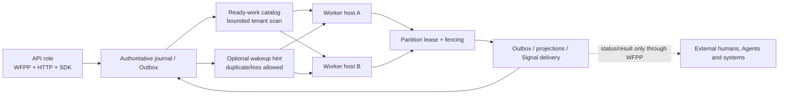

# Clustered partition runtime

Phase 6A adds horizontal coordination for Work Fabric's mechanical owners. It
does not execute participant work and does not add a target selector, workflow
scheduler, Agent Brain, model call or tool runner.

## Authority and acceleration

The database-backed journal, Outbox, projection checkpoints, delivery
positions and leases are authoritative. A wakeup says only that a bounded
partition turn may be useful. It carries tenant, partition, work kind,
observed position and time; it never carries business content, credentials or
an instruction to perform work.



Polling recovers a lost hint. Queue coalescing and owner checkpoints make a
duplicate hint harmless. Phase 6B provides an optional NATS JetStream Adapter
to reduce discovery latency without becoming a second source of truth. NATS
is injected only through the existing technology-neutral Publisher/Consumer
ports; the Host and database scan remain unchanged.

## Mechanical work kinds

| Kind | Bounded owner action |
|---|---|
| `outbox_wakeup` | Claim committed Outbox rows and publish metadata wakeups |
| `handoff_projection` | Advance the rebuildable Handoff read model |
| `collaboration_projection` | Advance responsibility, timeline and relationship views |
| `signal_delivery` | Advance Subscription delivery from committed events |

No work kind accepts a participant prompt, plan, tool call or business
workflow step. Adding one would violate the cluster boundary gate.

## Roles and composition

`service-node` supports three deployment roles:

- `api`: exposes HTTP and never starts a Cluster Host;
- `worker`: starts the Cluster Host and refuses to expose HTTP;
- `all`: co-locates both for a small PostgreSQL deployment.

Worker and `all` roles require an explicit `cluster` block. PostgreSQL storage,
`PartitionWorkCatalog`, wakeup publisher/consumer, tenant-scoped Outbox store,
tenant-scoped lease store and Signal Dispatcher are deployment-injected ports.
The service does not discover database or Broker credentials.

```json
{
  "storage_profile": "postgres",
  "role": "worker",
  "tenant_id": "tenant_01",
  "exchange_id": "exchange_01",
  "cluster": {
    "worker_owner_id": "worker_east_01",
    "tenant_ids": ["tenant_01"],
    "max_concurrent_turns": 8,
    "max_ready_items": 1000,
    "catalog_page_size": 200,
    "turn_item_limit": 100,
    "lease_seconds": 30,
    "drain_timeout_seconds": 30,
    "poll_interval_ms": 1000,
    "max_tenants_per_host": 100
  }
}
```

All values are mandatory and validated against global bounds: concurrency
1–1,024; ready items 1–100,000 and not less than concurrency; catalog page
1–1,000; turn items 1–10,000; lease 10–300 seconds; drain 1–300 seconds;
polling 100–60,000 ms; tenants per host 1–10,000. Tenant IDs must be explicit,
unique and no more numerous than `max_tenants_per_host`. The deployment owns
the tenant assignment source; it must not derive it from unauthenticated input.

## Ownership and failure recovery

Each work identity is `tenant × partition × work kind`. Before a turn, a
worker acquires its lease and fencing token. It verifies ownership before
external publication, projection checkpoint movement and delivery settlement.
Heartbeat or takeover loss aborts the turn; a stale owner cannot advance
state. Every turn and every ready queue is bounded.

Shutdown stops intake, clears queued hints and waits only for already active
turns up to `drain_timeout_seconds`. Unfinished authoritative work remains
discoverable by the next catalog scan.

The operations endpoint `GET /v1/operations/cluster` and TypeScript SDK
`operations.getClusterSnapshot()` expose only aggregate state, ready/in-flight
counts, completed turns, lease losses and dropped hints. Tenant, partition,
owner, fencing token and event identities are not metric labels.

## Storage profiles

PostgreSQL is the Phase 6A production baseline because migration 008 supplies
RLS-protected derived readiness, stable keyset indexes and lease/Outbox
coordination. The public cluster SPI is technology neutral: another adapter may
replace PostgreSQL if it passes the same capability and conformance profile.

`sqlite-local` is explicitly rejected when cluster ownership is configured.
SQLite remains useful for restart-safe single-process evaluation; it is not a
multi-host coordination mechanism.

## Verification

```sh
npm run check:cluster-boundaries
npm run check:sensitive-observability
npm run benchmark:cluster -- --partitions 100 --tenants 4 --concurrency 8 --samples 3
npm run verify:exchange
npm run verify:postgres
npm run verify:nats:release
```

The Phase 6A round-trip uses the real HTTP/TypeScript SDK lifecycle, two
competing hosts, a lost wakeup, a duplicate wakeup, an external Signal probe
and forced stale-owner takeover. It requires the verified Handoff, both
projections and five unique delivered event IDs to agree.

The Phase 6B fallback proof makes publish and pull unavailable, runs two Hosts
from the authoritative catalog, then recovers the transport and injects stale
duplicate hints. Handoff/collaboration projection and Signal positions advance
once. Deployment topology, credentials, key rotation and outage handling are
documented in [NATS Wakeup deployment](nats-wakeup-deployment.md).
