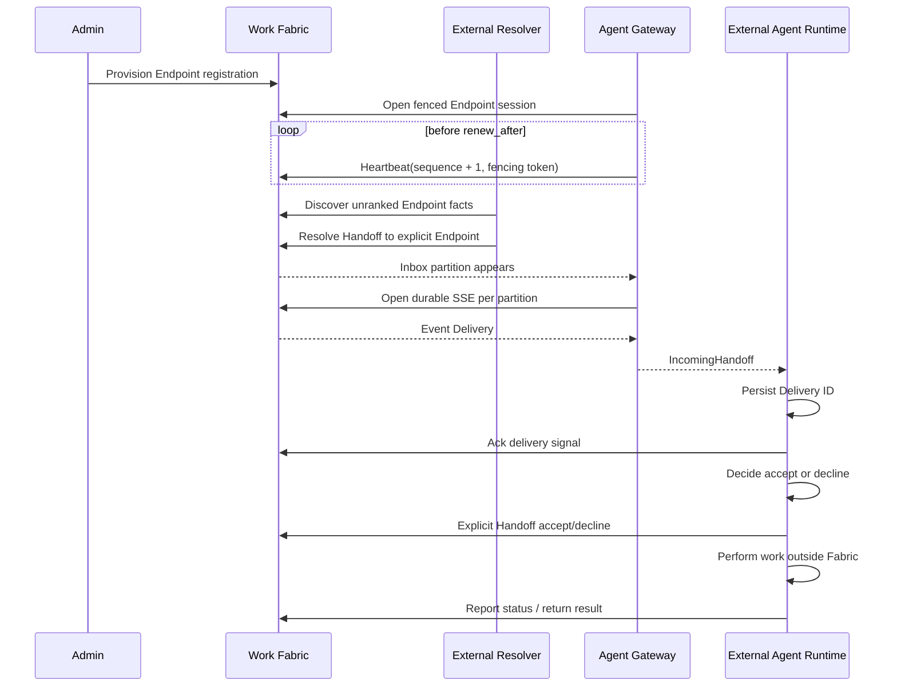
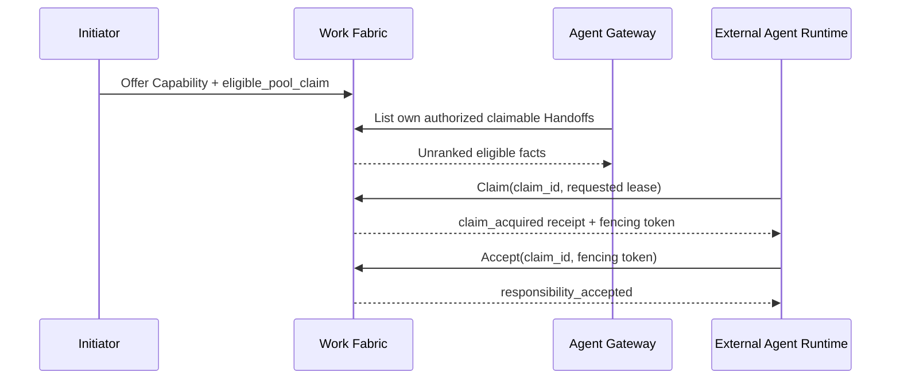

# Endpoint 与外部 Agent Runtime 接入

Phase 4A 提供 Work Fabric 的原生 Agent 连接边界。它把一个外部 Agent Runtime 表示为可注册、可发现、带租约且可接收 Handoff 信号的 Endpoint，但不把 Runtime、模型、工具、Codex、目标选择器或执行回调嵌入 Work Fabric。

## 职责边界

| Work Fabric 负责 | 外部参与方负责 |
|---|---|
| Endpoint 注册、Actor 绑定与版本 | Runtime 进程和凭据生命周期 |
| Capability 与可用性事实 | 能力真实性与实际执行 |
| 单活 Session、租约、心跳和 fencing | 规划、推理、模型与工具选择 |
| 渐进式、未排序、未评分的 Endpoint/Capability 发现 | 候选比较与明确目标选择 |
| Handoff 路由事实、候选池与分区发现 | 是否认领、是否接受责任 |
| 原子 Claim Lease、fencing 与审计 | 排名、推荐和智能调度 |
| Durable SSE、重放与显式 Ack | 本地去重、持久化和恢复策略 |
| Handoff 状态、结果、回执和审计 | 专业工作及外部产物 |

Endpoint Directory 不是调度器；Agent Gateway 不是 Agent Brain。Resolver 可以是人、规则服务或 AI 调度大脑，但必须作为外部参与方读取事实，再通过标准 `resolve_target` 命令提交唯一明确的 Actor 或 Endpoint。

当发起方显式选择 `eligible_pool_claim` 时，不需要 Resolver 先选出唯一目标。符合 Authority
与 Capability Contract 的 Endpoint 可以读取自己的候选池并显式 Claim。Claim 只是短时
排他预留；Runtime 必须再携带当前 Claim ID 与 fencing token 调用 Accept，责任才会迁移。
Gateway 不自动执行 Claim 或 Accept。

## 参考链路



候选池路径如下：



这里存在两个完全不同的确认：

- `acknowledgeSignal("acknowledged")` 只确认 Delivery 已被外部 Runtime 持久接收，可以推进该 Subscription × Partition 的交付位置。
- `handoffs.accept(...)` 表示 Actor 明确接受 Handoff 责任，会改变权威生命周期。

Ack 不能推断 Accept，Accept 也不能替代 Ack。Gateway 不自动调用其中任何一个。

## Daily Assistant Runtime Host

`@work-fabric/agent-runtime-host` and the Agently adapter are an external Runtime Host reference implementation, not an execution feature of Work Fabric Core. They load the authorized Handoff Package through the public SDK, durably record Delivery and Run state locally, explicitly acknowledge and accept, invoke a worker outside the Fabric, and return Status/Result through the same public contract. The `daily-assistant` Role Profile and Capability declarations are Runtime extension points; they do not change Core's target-resolution or execution boundary. See [Agently Daily Assistant Runtime](guides/agently-agent-runtime.md) for operation and verification.

## 模块

- `@work-fabric/endpoint-directory`：技术中立的注册、Session、发现与显式目标资格服务。
- `@work-fabric/adapter-endpoint-memory`：本地评估和一致性测试用 Directory/Inbox 实现。
- `@work-fabric/adapter-storage-postgres`：持久 Directory/Inbox 实现，使用 RLS、索引和 CAS/fencing。
- `@work-fabric/transport-http`：经认证、表示校验和 Authority 授权后的 Endpoint HTTP 资源。
- `@work-fabric/sdk-typescript`：`client.endpoints` 与已有 Handoff、Query、Subscription API。
- `@work-fabric/agent-gateway`：只依赖公开 SDK 的外部连接库，维护租约并汇聚多个分区流。

Memory Adapter 适合开发、本地演示和测试，不是生产持久化。需要重启恢复、多副本和租户隔离时使用 PostgreSQL Adapter；公共 SPI 和 HTTP/SDK Contract 不因存储方案变化。

## HTTP 与 SDK 资源

```text
PUT    /v1/admin/endpoints/{endpoint_id}
GET    /v1/endpoints/{endpoint_id}
GET    /v1/endpoints?disclosure=identity|summary|full&capability_id=...
GET    /v1/endpoints/{endpoint_id}/capabilities/{capability_id}
POST   /v1/endpoints/{endpoint_id}/sessions
POST   /v1/endpoints/{endpoint_id}/sessions/{session_id}/heartbeat
POST   /v1/endpoints/{endpoint_id}/sessions/{session_id}/close
GET    /v1/endpoints/{endpoint_id}/inbox/partitions?cursor=...&limit=...
GET    /v1/endpoints/{endpoint_id}/claimable-handoffs?cursor=...&limit=...
```

对应 SDK 统一位于 `client.endpoints`：`provision`、`get`、渐进式 Discovery、`getCapability`、`openSession`、`heartbeat`、`closeSession`、`listInboxPartitions` 和 `listClaimableHandoffs`。Claim、续租、释放和带 fence 的 Accept 统一位于 `client.handoffs`。所有请求继续使用与 Human、Connector、Console 相同的认证、Actor/Endpoint 表示和 Authority 链。

Gateway Session 提供 `claimableHandoffs()` 便捷查询，并继续暴露标准 `handoffs` Client。
生产调用方从 `claim_acquired` Receipt 读取实际 fencing token 和资源版本，再显式 Accept；
不能硬编码 fence，也不能把 Claim 成功当成责任已转移。

Provision 是管理动作；Session open/heartbeat/close 只能由注册绑定的 Actor/Endpoint 表示执行。一个 Endpoint 同时只有一个有效 Session。新 Session 会提高 `fencing_token`，旧 Session 的后续写入返回冲突；心跳还要求严格递增 `heartbeat_sequence`。

## Agent Gateway 配置边界

Gateway 要求一个归属于同一 Agent Actor/Endpoint、状态为 `active`、模式为 `sse` 且语义过滤数组全部为空的 Subscription。空过滤不代表越权订阅；服务端仍按 Tenant 和 Event participant audience 授权每个 Event。

| 配置 | 约束 |
|---|---|
| `endpoint_id` | 1–128 字符，并与 Subscription Endpoint 相同 |
| `inbox_refresh_ms` | 1–300000 |
| `max_active_partitions` | 1–128 |
| `incoming_queue_capacity` | 1–1024 |
| `heartbeat_retry_count` | 0–5 |
| `heartbeat_backoff_ms` | 1–30000 |
| `graceful_close_timeout_ms` | 1–60000 |

Gateway 只会对网络错误或超时有界重放完全相同的 Session open/heartbeat/close 请求。它不会重试 Handoff 命令。启动时若同 ID Subscription 的 owner、Endpoint、mode、state 或 filter 不一致，会以 `subscription_mismatch` 失败，绝不覆盖既有资源。

本地错误码包括：

- `invalid_config`：Gateway 配置或 Subscription 形态非法；
- `subscription_mismatch`：已有 Subscription 与预期身份/连接语义不一致；
- `partition_limit_exceeded`：活跃收件分区超过配置上限；
- `connection_failed`：Delivery 无法关联 Handoff 或连接流异常。

服务端 Endpoint 冲突包括 `version_conflict`、`idempotency_conflict`、`immutable_binding`、`session_fenced` 和 `stale_sequence`。`not_found` 也用于隐藏无权访问的 Endpoint；依赖不可用统一暴露为有界 `temporarily_unavailable`，不会返回内部异常或候选信息。

## 多分区与背压

Handoff Journal 按逻辑 Partition 保存。Endpoint Inbox 是从已提交事件重建的路由投影，只包含 Tenant、Actor/Endpoint audience、Partition/Handoff ID、版本、生命周期和位置，不复制 Context、Prompt、结果正文、凭据或执行状态。

每个 Subscription × Partition 拥有独立 opaque cursor、Pending Delivery 和 Ack 位置：

- 不承诺跨 Partition 全局顺序；
- Gateway 定期刷新活跃 Partition，并为每个分区打开一个 SSE；
- `max_active_partitions` 限制同时连接的分区数；
- `incoming_queue_capacity` 满时生产者等待，不丢弃、不自动 Ack；
- Runtime 必须先持久化 Delivery ID，再显式 Ack，并按至少一次语义做本地幂等。

## 运行示例

参考实现位于 `examples/local-agent-runtime`。管理员必须先注册匹配的 Endpoint，然后设置：

```bash
export WF_BASE_URL=http://127.0.0.1:8080
export WF_TENANT_ID=tenant_01
export WF_EXCHANGE_ID=exchange_01
export WF_ACTOR_ID=actor_agent
export WF_ENDPOINT_ID=endpoint_agent
export WF_SUBSCRIPTION_ID=subscription_agent_runtime
export WF_CLIENT_SESSION_ID=runtime_process_01
export WF_ACCESS_TOKEN=replace-me
export WF_DECISION=accept  # 必须显式为 accept 或 decline
```

示例把 Delivery ID 追加到本地日志后才 Ack，并把接受/拒绝决策放在 Gateway 之外。生产 Runtime 应替换为事务性本地 Inbox、稳定幂等键和自身的 Agent/Codex 执行逻辑，且不得记录 access token、fencing token 或完整敏感 Context。

## 当前限制与下一阶段

飞书 Connector、Console、Daily Assistant Runtime 与集群运行能力已经作为独立模块接入，
但 Agent Brain、候选排名、内置调度、Codex 执行、A2A/MCP 和参与方内部 Workflow 仍不属于
Fabric Core。Claim Lease 的部署级机械过期 Runner 与生产压测仍是下一步；其实现必须调用
标准 fenced `expire_claim` 交互并写入统一 Journal，不能直接修改投影或候选池。
