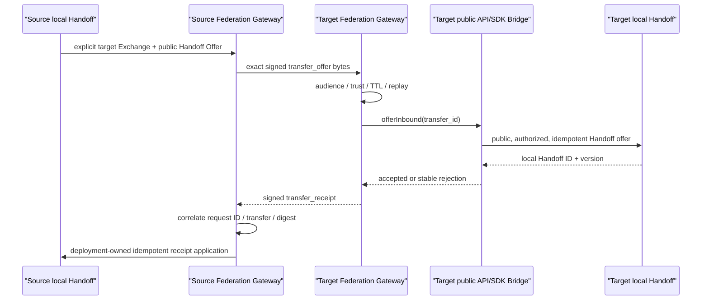

# Cross-Exchange Federation

Phase 7 提供 `workfabric.federation.v1`：两个独立 Work Fabric Exchange 之间的
Ed25519 签名、可重放、请求/回执式交接连接。它解决“已明确要交给哪个 Exchange
以后，怎样可靠、安全地对接”，不解决“应该选哪个 Exchange”或“工作如何执行”。

## 组成

| 包 | 职责 |
|---|---|
| `@work-fabric/federation-spi` | Signer、Trust Resolver、Replay Store、Bridge、Transport 与 Profile 类型 |
| `@work-fabric/federation-runtime` | canonical 闭合 Codec、digest、重复成员/Unicode、TTL/受众/签名校验、Gateway 与回执关联 |
| `@work-fabric/adapter-federation-memory` | 有界 Replay Store 参考实现，适用于测试与本地单进程 |
| `@work-fabric/adapter-federation-node-crypto` | Node Ed25519 Signer 与显式 Peer/Target/Key 信任表 |
| `@work-fabric/exchange-conformance` | 可复用的 Federation Profile 一致性验证 |

Federation Runtime 不进入 Exchange Core、Cluster Runtime、HTTP Binding 或公共
TypeScript SDK。部署在 Exchange 外围组合 Gateway、Bridge 与 Transport，因此
可以独立替换网络、密钥托管和持久化技术。



Source 和 Target 的 Handoff ID、Journal、版本与 Authority 始终属于各自 Exchange。
签名 Receipt 是远端声明，不是复制来的本地事实，也不能绕过公共命令直接改写
Core。Receipt 表示目标 Exchange 已接收并建立本地交接记录；目标 Actor 是否承担
责任仍由目标 Exchange 内的 Handoff Accept 明确表达。

## 组合要求

部署必须显式注入：

1. `local_exchange_id`；
2. 当前 Ed25519 private `KeyObject` 与 `key_id`；
3. 按 Source、Target、Key ID 配置的 Peer public keys；
4. 持久、原子且有界的 `FederationReplayStore`；
5. 只调用公共 API/SDK 的幂等 `FederationTransferBridge`；
6. 具有明确超时、大小限制、TLS/mTLS 与限流的 request/response Transport；
7. 1–300 秒消息 TTL 和 0–60 秒时钟偏差策略。

```ts
const gateway = new FederationGateway({
  local_exchange_id: "exchange_a",
  codec: new FederationEnvelopeCodec({
    local_exchange_id: "exchange_a",
    signer: new NodeEd25519FederationSigner("key-2026-07", privateKey),
    trust: new NodeEd25519FederationTrustResolver(peerKeys),
    clock,
    max_clock_skew_seconds: 30,
  }),
  replay_store: replayStore,
  bridge,
  clock,
  ids,
  message_ttl_seconds: 300,
});
```

Memory Replay Store 只有进程内参考语义，不是生产持久化承诺。生产适配器必须让
`begin` 对同一 Source × Message 原子地区分 new/pending/completed/conflict，保存
精确 Receipt 字节；并发 `complete` 必须由首个结果胜出并返回同一稳定字节。实现
还必须覆盖允许的最大时钟偏差窗口，并设置容量、TTL、租户/Peer 隔离和明确的
运维告警。

## Bridge 规则

`offerInbound` 接收到的是已完成签名、受众、TTL、重放和 digest 验证的 Offer，
但 Bridge 仍必须：

- 用 Federation 专用 service identity 调用目标 Exchange 的公共 API/SDK；
- 运行目标 Exchange 自己的 Schema、Identity、Authority 和目标资格校验；
- 以 `transfer_id` 为幂等键创建或关联本地 Handoff；
- 只返回本地 Handoff ID/版本或稳定拒绝码，不返回正文、凭据或内部游标。

`applyOutboundReceipt` 同样必须以 `transfer_id` 幂等，并通过 Source 部署允许的
公共命令、审计或 Federation 记录端口关联本地源 Handoff。v1 不赋予 Gateway
修改任意 Handoff 的权限，也不把远端 Receipt 解释成目标 Actor 已接受责任。

## 重试与故障

- Transport 返回 `retryable_failure` 时，调用方只能重发 `PreparedFederationTransfer.request`
  中的原始字节；重新签名或更换 Message ID 会形成新的协议请求。
- Target 完成后丢失 Receipt 时，原始 Offer 重放会返回 byte-identical 缓存 Receipt，
  不会再次调用已完成的 Bridge。
- 进程在 Bridge 完成、Receipt 落 Replay Store 前崩溃时，pending 请求会再次调用
  Bridge；因此 Bridge 的 `transfer_id` 幂等是硬要求。
- 签名、受众、TTL、类型、digest、Receipt correlation 或 conflicting replay 任一
  失败都必须 fail closed，不能进入 Bridge。
- 有效 rejection 是最终协议结果，不是 Transport 故障。

## 密钥轮换

轮换顺序：

1. 双方 Trust Map 先加入新 public key/key ID；
2. Source/Target signer 切换到新 private key；
3. 至少等待最大消息 TTL 与部署允许的最后重试窗口；
4. 删除旧 Trust Entry，并安全销毁旧 private key。

不得从消息、未知 Peer 或首次连接自动建立信任。Private key 由 Secret/HSM/KMS
边界注入；仓库、配置样例、日志和错误中都不能出现 key bytes。

## 可观测性与验证

只允许聚合记录 accepted、rejected、replayed、retryable transport failure 与延迟。
Peer、Exchange、Transfer、Message、Handoff、Tenant、URL、Signature、Offer 正文和
Credential 不得成为 metric label。

```bash
npm run check:federation-boundaries
npm run conformance
npm run verify
```

自动测试覆盖真实 Ed25519、篡改、错误受众、过期/未来时间、密钥轮换、精确重试、
丢失 Receipt、冲突重放、有效拒绝，以及两套真实 HTTP/TypeScript SDK/Exchange
各自只持有本地 Handoff 的端到端证明。

HTTP Federation Binding、Peer Directory、自动目标选择、跨 Exchange 查询、全局
排序、两阶段提交、状态复制和参与方执行均不属于 v1 Profile。它们若需要实现，
必须作为独立 Adapter/模块，并继续服从连接层边界。
