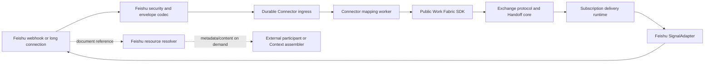

# Work Fabric Feishu Connector Design

## 1. Goal and boundary

Phase 4B proves that an existing collaboration system can join Work Fabric
without moving its execution, content ownership, or user experience into the
Exchange. Feishu is the first concrete Connector because it combines human
messaging, interactive acknowledgements, notifications, and document
references in one external system.

The Connector owns boundary adaptation:

- durably accept a bounded Feishu callback before the callback deadline;
- verify its origin and deduplicate external delivery;
- map explicit external events to Work Fabric references or public commands;
- deliver committed Work Fabric events as Feishu messages or cards;
- map an authenticated human card action to an explicit protocol command;
- resolve Feishu document metadata or content on demand while preserving an
  immutable external reference in Work Fabric;
- expose delivery, mapping, retry, dead-letter, and reconciliation state.

It does not execute the work, infer a workflow from arbitrary conversation,
choose an assignee, reason as an Agent, mirror a knowledge base, or make
Feishu state authoritative for a Handoff. People, Agents, Codex, Feishu, and
other services remain external and equal participants connected through the
same public protocol and SDK.

## 2. Architectural decision

Implement a generic Connector ingress/runtime below a Feishu-specific edge.
Do not place Feishu branches in `exchange-core`, `exchange-runtime`, or the
general HTTP command routes.



This separates four meanings that must not be collapsed:

1. **Transport acceptance** means Work Fabric has durably received a callback.
2. **Mapping completion** means a policy converted it to a reference or public
   SDK operation.
3. **Signal delivery** means Feishu accepted an outbound API request.
4. **Responsibility acknowledgement** means an Actor explicitly accepted or
   declined a Handoff through WFPP.

None implies another.

## 3. Package and dependency layout

```text
packages/
  connector-spi/                 generic ingress, mapping and resource ports
  connector-runtime/             bounded worker, retry and reconciliation loop
  adapter-connector-memory/      executable reference stores
  adapter-storage-postgres/      production Connector ingress persistence
  connector-feishu/              Feishu codec, mapper, API client and SignalAdapter
  transport-http/                thin Feishu webhook route composition
  sdk-typescript/                existing public Work Fabric command/read client
  exchange-conformance/          reusable Connector store profiles
```

Dependency direction is:

```text
transport-http -> connector-feishu -> connector-runtime -> connector-spi
adapter-* -> connector-spi
connector-feishu -> exchange-spi (SignalAdapter only)
service composition -> connector-runtime + sdk-typescript
```

`exchange-core`, `protocol-runtime`, and `exchange-spi` do not import any
Connector implementation or Feishu dependency. `connector-spi` uses stable
Work Fabric scalar and JSON types only; it does not expose HTTP, PostgreSQL,
Feishu SDK, or secret-store types.

## 4. Generic Connector ingress contract

### 4.1 Accepted envelope

Every event source converts its verified input to a `ConnectorIngressEnvelope`:

- `tenant_id` and `connector_id`: trusted Work Fabric ownership scope;
- `source_system` and `external_tenant_id`: external origin scope;
- `external_event_id`: diagnostic external identity;
- `dedupe_key`: source-specific stable idempotency identity;
- `event_type` and optional `partition_key`;
- `occurred_at` and `received_at`;
- a bounded JSON `payload` required for later mapping;
- `trace_context` containing only allowed correlation fields.

The ingress store is an operational buffer, not an authoritative work or
content store. Payload size and nesting are bounded before persistence,
credentials are rejected, tenant-at-rest encryption is a deployment concern,
and completed payloads have a configured retention period.

Acceptance is atomic on
`tenant_id + connector_id + source_system + dedupe_key`. It returns either the
new durable `ingress_id` or the existing record. Duplicate delivery must not
enqueue a second mapping operation.

### 4.2 Lifecycle and concurrency

Records move through:

```text
pending -> processing -> completed
                    \-> retry_wait -> processing
                    \-> dead_letter
```

Workers claim eligible records with an owner, opaque claim token, fencing
token, and lease expiry. Completion, retry, and dead-letter transitions require
the current claim token and fencing token. A stale worker can therefore perform
no state transition after lease recovery.

Ordering is deterministic within a claim query but is not a global business
ordering guarantee. Stores may partition by tenant, connector, or external
partition key and workers may scale horizontally. The public Work Fabric
command remains responsible for Handoff version and idempotency checks.

Retries use a caller-supplied `available_at`; the generic store does not embed
a channel-specific backoff policy. Errors persist only stable codes and bounded,
sanitized details. Dead letters remain visible and can be explicitly requeued
with a new audit reason.

## 5. Mapping boundary

A Connector mapper receives a claimed envelope and returns one of:

- `ignored`: known event with no Work Fabric meaning;
- `reference_observed`: a canonical external `WorkReference` or Context item;
- `command`: an explicit public SDK operation and idempotency identity;
- `reconciliation_observation`: an external receipt/status observation;
- `rejected`: structurally valid external event that violates mapping policy.

The worker passes only the returned public operation to an injected
`ConnectorCommandSink`. The production composition implements that sink with
the TypeScript SDK; the generic runtime therefore does not import the SDK,
Core repositories, or state-machine internals. Its command identity is derived
from the connector scope and external dedupe key so a crash between SDK success
and ingress completion is replay-safe.

Arbitrary chat content is not a command. The initial Feishu policy accepts only
explicitly configured message templates, card actions generated by this
Connector, and recognized document references. A customer may inject another
mapping policy, including an AI classifier, but that classifier is an external
decision component and its result is still validated as an explicit command.

## 6. Identity and authority

Callback fields are assertions from Feishu, not Work Fabric Actor records.
`external_tenant_id + open_id` is resolved through an injected
`ConnectorIdentityResolver` to an existing Actor/Endpoint/Delegation. An
unmapped user receives no authority and is never silently provisioned.

The webhook route derives `tenant_id` and `connector_id` from trusted route
configuration, not from the callback body. The public SDK then applies the
same authorization, expected-version, and delegation rules used by UI, Agent,
and direct service clients.

Interactive cards contain a signed or server-correlated opaque action token;
they do not trust client-provided `handoff_id`, Actor, expected version, or
command name in isolation. Tokens are single-purpose, time-bounded, scoped to
the connector/tenant/user, and resolve to one allowed action such as accept,
decline, verification receipt, rework request, status report, or result
submission.

## 7. Feishu ingress

### 7.1 Webhook security

The HTTP route needs the exact raw request bytes. It enforces:

- configured request and decompressed-body limits;
- timestamp skew and replay-window limits;
- `X-Lark-Signature` verification using the configured Encrypt Key;
- encrypted-body decryption when enabled;
- Verification Token validation after decryption;
- URL verification challenge handling without enqueueing a work event;
- constant-time comparison for secrets and signatures;
- no raw callback, secret, token, message content, or decrypted payload in logs.

Secrets are loaded through an injected credential provider. Configuration and
stored facts contain only opaque credential references.

The route responds successfully only after atomic durable acceptance. Mapping
is asynchronous so the response remains inside Feishu's three-second callback
window. A storage failure returns a retryable transport failure rather than
pretending the event was accepted.

### 7.2 Deduplication

For `im.message.receive_v1`, the `message_id` is the dedupe key because Feishu
documents that event delivery may repeat and identifies the message as the
stable object. Card callbacks use their callback/event identity plus the opaque
action token. The generic envelope still retains `event_id` for traceability.

### 7.3 Long connection

The official Node SDK long-connection source is optional. It verifies and
normalizes callbacks through the same codec and calls the same ingress acceptor
as HTTP. It contains no mapping logic. Multiple SDK connections may receive
events non-broadcast/randomly, so durable deduplication remains mandatory.

## 8. Feishu outbound delivery

`FeishuSignalAdapter` implements the existing `SignalAdapter` contract and is
used by `SignalDispatcher`; it does not create a second notification runtime.
Its destination configuration contains recipient type/id, rendering policy,
and an opaque credential reference, never `app_secret` or access tokens.

The adapter maps a public `ProtocolEvent` to a bounded text message or
interactive card. The Feishu request `uuid` is a deterministic digest of the
tenant, subscription, and Work Fabric Event ID, shortened to the documented
limit, so transport replay within Feishu's idempotency window is safe.

Results are classified as:

- `accepted`: Feishu returned a valid message identifier;
- `retryable_failure`: timeout, network error, rate limit, expired access token
  after one safe refresh, or server failure;
- `permanent_failure`: invalid destination, authorization denial after refresh,
  unsupported event/rendering, or bounded validation failure.

Tenant access tokens are cached behind an injected token provider with
single-flight refresh and expiry skew. API response bodies are sanitized before
they enter delivery attempts or logs.

## 9. Document references and Context

The canonical reference form is:

```text
feishu://docx/{document_id}?revision={revision_id}
```

Work Fabric may retain the URI, title, external tenant, revision, media type,
digest, visibility, and access requirements. Feishu remains the content owner.
Raw document content is fetched on demand through `ConnectorResourceResolver`
for an authorized participant or Context assembler and is not copied into the
Handoff event ledger.

Wiki URLs are first resolved to their backing document identity because a wiki
token is not guaranteed to equal a Docx document ID. A reference without a
known revision is explicitly mutable and must be resolved/frozen before a
policy requiring immutable Context accepts the Handoff.

Document mirroring, search indexing, embeddings, and collaborative editing are
separate optional modules.

## 10. Reconciliation and observability

The Connector records an external receipt or status observation separately
from authoritative Work Fabric facts. A reconciliation policy compares them
and produces a visible discrepancy record with tenant, connector, external
object, observed state, expected fact, timestamps, and suggested follow-up.

Phase 4B never silently overwrites either side. An operator or external Agent
may use the public SDK to create a follow-up Handoff or submit an explicit
status/result correction. A later protocol revision may standardize a public
Reconciliation Event; Phase 4B does not invent one inside the connector.

Metrics include accept latency, callback rejection reason, duplicate count,
pending age, claim recovery, mapping outcomes, retry/dead-letter count, token
refresh, outbound API latency, and reconciliation discrepancy age. Labels do
not include tenant-controlled content, user identifiers, document titles, or
unbounded external IDs.

## 11. Failure semantics

| Failure | Required outcome |
|---|---|
| Invalid signature/token/timestamp | Reject before persistence; security audit without payload |
| Duplicate callback | Return the existing acceptance; no second mapping |
| Store unavailable | Retryable HTTP failure; do not acknowledge acceptance |
| Crash after claim | Lease expiry and fenced reclaim |
| Crash after SDK success | Same connector idempotency key safely replays |
| Unknown external user | Mapping rejection/dead letter; no Actor creation |
| Stale card action | Public expected-version conflict; visible action result |
| Feishu 429/5xx/network error | Existing SignalDispatcher retry policy |
| Invalid recipient/permission | Permanent delivery failure and visible dead letter |
| Document unavailable | Explicit Context/resource availability failure |
| External status drift | Discrepancy observation; no silent overwrite |

## 12. Security and performance limits

Every implementation has configurable positive bounds for body bytes, JSON
depth, string length, trace fields, claim batch, attempts, lease duration,
retry delay, retention, concurrent requests, token cache entries, message/card
size, document bytes, and response timeout.

Fast callback acceptance performs only security checks, normalization, and one
atomic store write. Mapping, SDK calls, Feishu API calls, resource fetches, and
reconciliation are asynchronous. The store is indexed for eligible claim scans
by tenant/connector/state/available time and for atomic deduplication. No path
requires global ordering or a global lock.

## 13. Delivery increments

1. Generic Connector SPI, Memory store, conformance, and worker lifecycle.
2. PostgreSQL durable ingress, leases, retention, and isolation.
3. Feishu webhook codec, credential boundary, message/card normalization, and
   HTTP ingress composition.
4. Identity/action/resource mapping through the public TypeScript SDK.
5. Feishu OpenAPI client, token provider, outbound SignalAdapter, and cards.
6. Optional long-connection source, reconciliation, end-to-end examples, and
   operational documentation.

Each increment is independently committed and leaves the complete repository
verification green.

## 14. Acceptance criteria

Phase 4B is complete when tests prove:

- duplicate Feishu delivery creates one ingress record and one logical SDK
  command;
- a webhook is acknowledged only after durable acceptance and the route is not
  coupled to mapping latency;
- invalid signatures, tokens, stale timestamps, oversized bodies, unknown
  identities, stale actions, and secret-shaped configuration fail safely;
- claim leases recover after crashes and stale workers are fenced;
- Memory and PostgreSQL stores pass the same behavioral profile with tenant
  isolation;
- a committed Work Fabric event is rendered and delivered through the existing
  subscription/Signal pipeline with stable Feishu idempotency;
- a generated card acknowledgement becomes one explicit, authorized SDK
  command and never implies acceptance from delivery alone;
- document references round-trip with revision metadata while content and
  credentials stay outside authoritative Core facts;
- retry, dead-letter, discrepancy, and health state are inspectable;
- dependency guards, type checks, package tests, and WFPP conformance all pass.

## 15. Explicit non-goals

Phase 4B does not add an automation engine, Agent brain, target scheduler,
workflow designer, Feishu replacement, general chat bot, NLP command parser,
document mirror, search/vector index, Console UI, A2A/MCP binding, or
cross-system distributed transaction.

## 16. Feishu contract references

- [Event webhook encryption and signature](https://open.feishu.cn/document/server-docs/event-subscription-guide/event-subscription-configure-/encrypt-key-encryption-configuration-case?lang=zh-CN)
- [Event webhook and long-connection configuration](https://open.feishu.cn/document/server-docs/event-subscription-guide/event-subscription-configure-/request-url-configuration-case)
- [Received message event](https://open.feishu.cn/document/server-docs/im-v1/message/events/receive?lang=zh-CN)
- [Send message API](https://open.feishu.cn/document/server-docs/im-v1/message/create)
- [Card callback protocol](https://open.feishu.cn/document/feishu-cards/card-callback-communication?lang=zh-CN)
- [Docx metadata](https://open.feishu.cn/document/server-docs/docs/docs/docx-v1/document/get?lang=zh-CN)
- [Docx raw content](https://open.feishu.cn/document/server-docs/docs/docs/docx-v1/document/raw_content?lang=zh-CN)
- [Tenant access token](https://open.feishu.cn/document/server-docs/api-call-guide/calling-process/get-access-token)
