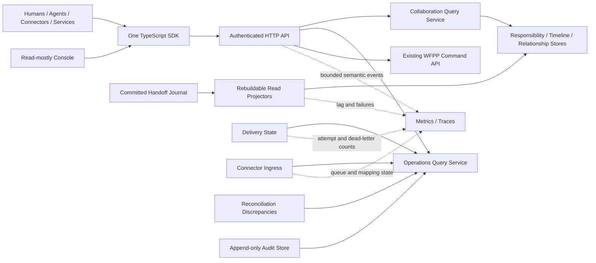

# Work Fabric Phase 5 Operability Design

## 1. Goal and architectural boundary

Phase 5 makes the collaboration connection layer understandable and operable
without turning it into a workflow engine, scheduler, Agent brain, execution
runtime, or system of record for external work.

The first questions Phase 5 must answer are collaboration questions:

- what work has been handed off;
- who currently owns responsibility;
- whether the recipient accepted it;
- what result or verification stage it has reached;
- what happened, in causal order;
- which delivery or Connector problem prevents another participant from seeing
  the committed fact.

All professional work remains external. Phase 5 observes committed protocol and
operational facts, builds replaceable read models, exposes them through the
same authenticated HTTP/TypeScript SDK path, and provides a read-mostly Console
over that SDK. It creates no alternate authority path and no hidden automation.

## 2. Decision and alternatives

### 2.1 Selected: projection-first, SDK-first, Console-last

Phase 5 is delivered as three ordered increments:

1. **5A Collaboration visibility** — cursor-paged responsibility, timeline and
   relationship projections, then public HTTP and TypeScript SDK queries.
2. **5B Operational visibility** — audit, delivery/dead-letter, Connector
   ingress/reconciliation views, metrics, tracing and bounded diagnostics.
3. **5C Operable distribution** — read-mostly Console, Node service
   composition, deployment documentation and reproducible performance
   baselines.

This order preserves Work Fabric's product boundary: query contracts are useful
to humans, Agents, Connectors and customer services even when the Console is
disabled.

### 2.2 Rejected: Console-first vertical slice

A Console-first build would create fast visual feedback, but it would shape
backend contracts around one UI and tempt the browser to accumulate state or
privileged actions. It is retained only as the 5C consumer of already complete
SDK contracts.

### 2.3 Rejected: telemetry-first operations platform

Metrics and traces are essential for operators, but starting there would not
answer the project's defining collaboration questions. Telemetry therefore
follows the collaboration read model and uses the same stable operation names.

### 2.4 Rejected: one materialized mega-view

Responsibility, causal timeline, delivery mechanics and Connector ingress have
different retention, privacy, rebuild and scaling characteristics. Joining
them into a single stored document would couple independent partitions and
make high-volume operational updates rewrite collaboration state. Phase 5
keeps them separate and composes responses only at the query boundary.

## 3. Logical architecture



The arrows into query services are reads. The only domain writes continue to
enter through the existing WFPP Command API. Explicit operational recovery,
such as requeueing a dead letter, is a separately authorized HTTP operation
against the owning operational store and produces an audit record. It never
edits a Handoff or bypasses protocol validation.

## 4. Package and dependency layout

```text
packages/
  operations-spi/               stable read, audit and telemetry contracts
  operations-runtime/           projectors, query composition and semantics
  adapter-operations-memory/    executable reference stores
  adapter-storage-postgres/     durable projection/audit implementation
  operations-observability/     OpenTelemetry-compatible instrumentation
  adapter-storage-sqlite/       complete single-process local persistence
  transport-http/               authenticated query/recovery routes
  sdk-typescript/               equal participant and operations clients
  service-node/                 explicit local/PostgreSQL composition root
  console-web/                  replaceable browser SDK client
```

Dependency direction is:

```text
console-web -> sdk-typescript -> HTTP contract
transport-http -> operations-runtime -> operations-spi -> exchange-spi
operations-observability -> operations-spi
adapter-* -> operations-spi
service-node -> adapters + runtimes + transport-http
```

`exchange-core`, WFPP schemas and the Handoff state machine do not import any
Phase 5 package. Console code does not import Core, Runtime, database or
Connector packages. Storage implementation names do not appear in SPI, HTTP or
SDK types.

## 5. Collaboration projections

### 5.1 Responsibility view

A `ResponsibilityView` is a deliberately safe projection of one Handoff:

- tenant, partition, thread and Handoff identity;
- stream version and lifecycle state;
- initiator, recipient, current responsible Actor and verifier;
- effective target binding facts, without credentials;
- bounded Work Reference and priority;
- accept/result deadlines;
- latest status summary;
- parent/child Handoff identity;
- created and last-updated timestamps.

It does not copy arbitrary Context content, result bodies, credentials,
delegation secrets or external documents. An authorized caller can continue to
query the existing Handoff resource when it needs the full protocol view.

The store supports deterministic cursor pagination ordered by
`updated_at DESC, handoff_id ASC`, with filters for partition, thread,
responsible Actor, lifecycle, priority and deadline window. Cursor contents are
opaque, versioned, bounded and bind all filters so a cursor cannot be replayed
against a broader query.

Projector writes are monotonic by stream version, idempotent at the same
version, partition-resettable and safe to replay. Responsibility is a view,
never another owner of lifecycle state.

### 5.2 Timeline view

The timeline is derived from committed public `ProtocolEvent` facts and ordered
by partition position. Each item contains:

- event, Handoff, thread, partition and stream identities;
- event type, occurred time and partition position;
- public subject/source and resource version;
- correlation and causation identifiers when present;
- public change/receipt information already allowed by WFPP.

The view never republishes private domain journal data. Pagination is forward
by an opaque cursor backed by partition position. Handoff and thread filters
are always tenant scoped. SSE remains the live transport; the timeline is the
durable historical query and does not create another event log.

### 5.3 Relationship view

Phase 5 stores only explicit protocol relationships: thread membership,
parent-to-child transfer and the current target/Actor relationship. It does not
infer organizational graphs, dependencies, similarity or recommendations.
Those are replaceable downstream graph/search modules.

## 6. Operational views and recovery actions

Operations queries compose bounded facts from their owning stores:

- projection checkpoint, lag and poison failures;
- subscription delivery position, active delivery, attempts and dead letters;
- Connector ingress state, attempt, lease, safe failure and retention facts;
- reconciliation discrepancies;
- dependency readiness and worker heartbeat summaries;
- security/operation audit records.

The API exposes no raw Connector payload, credential reference, claim token,
fencing secret, authorization evidence or unbounded exception detail.

Recovery actions are intentionally narrow:

- requeue a Connector ingress dead letter;
- retry/requeue an eligible delivery dead letter using a new delivery attempt;
- request a projection rebuild for an explicit tenant/partition/projector;
- acknowledge or annotate a reconciliation discrepancy without changing the
  external or Handoff state.

Each action requires its own Authority action/resource, an idempotency key, an
expected operational version where applicable, a bounded reason and an audit
record. The action reports accepted/conflict/not-found; workers perform the
actual recovery asynchronously. No bulk wildcard mutation is added in Phase 5.

## 7. Structured audit

Audit is distinct from the Handoff event journal. The journal proves domain
state; audit proves who attempted or observed a protected operation and what
the authorization/operation outcome was.

An `AuditRecord` contains bounded, non-secret fields:

- tenant, audit ID, occurred time and request/trace correlation;
- Principal, represented Actor/Endpoint and delegation identity when present;
- stable operation name and resource kind/ID;
- authorization decision and normalized operation outcome;
- safe reason code and optional target service category.

It excludes bearer tokens, authentication evidence, request/response bodies,
Context, result content, Feishu payloads and exception stacks. Audit append is
idempotent by tenant plus audit ID, immutable after first write, cursor-paged,
and governed by explicit retention. Domain writes do not fail after commit just
because an asynchronous audit exporter is unavailable; the local durable audit
buffer and its health become visible instead.

## 8. Metrics and tracing

Instrumentation uses OpenTelemetry semantics behind a narrow Phase 5 adapter.
No-op instrumentation is valid for tests and embedded use.

Metrics use bounded-cardinality labels only, such as operation name, outcome,
event category, connector type and lifecycle state. Tenant IDs, Handoff IDs,
Actor IDs, external IDs, event IDs and exception messages are forbidden metric
labels.

Traces may carry authorized correlation identifiers under deployment policy,
but never credentials or content. Required spans cover HTTP authentication and
authorization, command/query dispatch, projection batches, delivery attempts,
Connector mapping and recovery actions. Required measurements include latency,
request outcome, projection lag, delivery lag, ingress depth by state, retry and
dead-letter counts, SSE connection pressure and worker lease loss.

## 9. HTTP and TypeScript SDK

New query resources are versioned under `/v1`:

- `GET /v1/responsibilities`
- `GET /v1/timeline`
- `GET /v1/relationships`
- `GET /v1/operations/audit`
- `GET /v1/operations/projections`
- `GET /v1/operations/deliveries`
- `GET /v1/operations/connectors/ingress`
- `GET /v1/operations/connectors/discrepancies`

Recovery actions use subordinate action resources under `/v1/operations/...`
and require canonical idempotency headers. Existing `/v1/admin/...` endpoints
remain compatible during Phase 5 and become thin aliases over the new bounded
query service before any later deprecation.

The root SDK gains `client.collaboration` and expands `client.operations`.
Human applications, Agents and Console use the same methods. Capability comes
from authenticated identity and Authority Policy, not from a different SDK.
All decoders validate discriminants, bounds and pagination metadata instead of
casting unknown JSON.

## 10. Console boundary

The Console is a static TypeScript browser application that receives the Work
Fabric origin and authentication integration at deployment time. It uses only
`@work-fabric/sdk-typescript`.

Initial views are:

- responsibility inbox and filters;
- Handoff detail with causal timeline and explicit relationships;
- delivery, projection and Connector health;
- dead-letter/reconciliation inspection;
- narrowly authorized recovery forms.

The Console stores only presentation preferences and short-lived navigation
state. It does not persist protocol state, directly access PostgreSQL, embed an
Agent, run background workflows, infer assignments or become required for any
Handoff. Live refresh uses existing authenticated SSE plus query invalidation;
polling is a bounded fallback. WebSocket is not introduced.

## 11. Deployment composition

`service-node` is the explicit composition root. Library packages remain
independently usable.

Three profiles are documented and tested:

- `memory-demo`: in-memory adapters for a zero-infrastructure demonstration;
  restart durability is explicitly absent;
- `sqlite-local`: one local SQLite file implementing Exchange, Context,
  Endpoint, Connector and Phase 5 operations persistence for restart-safe
  single-process use;
- `postgres`: existing PostgreSQL adapters plus durable Phase 5 stores for a
  production-oriented single-region baseline.

Configuration names capabilities (`persistence_profile`, `signal_profile`,
`telemetry_profile`) instead of leaking concrete technology into domain
contracts. The SQLite adapter uses the same technology-neutral ports and passes
the applicable Exchange, Context, Endpoint, Connector and operations
conformance profiles. Its manifest explicitly advertises single-process writer
and local-file durability; it does not claim PostgreSQL RLS, horizontal worker
claims, read replicas or clustered lease behavior. Phase 5 never silently mixes
durable SQLite Core state with volatile Memory side stores.

The service supports graceful shutdown, readiness, worker enablement, bounded
pool/batch settings, static Console serving as an optional deployment feature,
and separate process roles for API, projector, delivery and Connector workers.

## 12. Performance and scale acceptance

Phase 5 does not promise arbitrary throughput. It adds a reproducible benchmark
harness and records hardware/runtime/configuration with results for:

- command-to-responsibility-view latency;
- timeline pagination latency;
- projector catch-up throughput and lag recovery;
- delivery and Connector backlog query latency;
- audit append/query latency;
- HTTP/SDK concurrent read latency;
- Console asset size and initial render budget.

Benchmarks use generated non-sensitive data, warmup, multiple samples and
percentiles. Regression thresholds are broad enough for CI stability and are
separate from published environment measurements. Read projections can move to
replicas; authority/CAS writes remain on the primary. Phase 6 owns broker
acceleration and clustered partition execution.

## 13. Security, tenancy and failure behavior

- Every query derives tenant from the authenticated Principal, never a browser
  supplied tenant field.
- Authority checks bind operation and narrow resource before any fact is read.
- Cross-tenant data returned by an adapter causes fail-closed empty/error
  behavior and a safe audit signal.
- Limits cover pages, filters, cursors, diagnostics, exported audit batches,
  telemetry queues and Console refresh concurrency.
- Projector poison events stop only the affected partition and remain visible.
- Query projection lag is explicit in metadata; a stale projection is never
  presented as authoritative freshness.
- Cursor and audit data are versioned so schema evolution remains additive.
- Operational failures never rewrite or fabricate a Handoff state.

## 14. Verification strategy

Every behavior is implemented test-first. Reusable conformance profiles cover
Memory, SQLite and PostgreSQL projection/audit stores. Required end-to-end
proofs are:

1. a Human or Agent offers, accepts and reports work through HTTP/SDK;
2. responsibility, timeline and relationship queries converge from committed
   events and rebuild to identical results;
3. a delivery and a Connector failure become visible without exposing payload
   or credentials;
4. an authorized recovery action is idempotent and audited while an
   unauthorized one changes nothing;
5. the Console obtains the same results only through the SDK;
6. restart tests preserve PostgreSQL views, audit and recovery requests;
7. bounded telemetry and benchmark smoke tests run without high-cardinality
   labels or content-bearing attributes.

## 15. Completion boundary

Phase 5 is complete when 5A, 5B and 5C contracts, reference implementations,
SQLite local persistence, PostgreSQL persistence, HTTP/SDK exposure, Console,
service composition, documentation and verification gates are present.

Phase 5 does not include scheduling intelligence, Agent reasoning, execution,
automatic target ranking, arbitrary workflow definitions, knowledge indexing,
A2A/MCP bindings, high-throughput broker acceleration, multi-region consensus
or cross-Exchange federation. Those remain external modules or later roadmap
phases.
