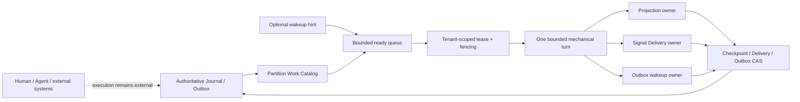

# Work Fabric Phase 6A Clustered Partition Runtime Design

## 1. Goal

Phase 6A lets multiple Work Fabric runtime processes discover and execute
bounded partition maintenance turns safely under load. It scales the
connection and handoff fabric without moving participant work, Agent
reasoning, target selection or business scheduling into Work Fabric.

The runtime coordinates only Work Fabric-owned mechanical work:

- publish durable Outbox wakeups;
- advance Handoff and collaboration projections;
- deliver committed protocol events to active Push/SSE destinations;
- expose bounded cluster state and load protection.

The immutable Journal, Handoff streams, projection checkpoints, Delivery
positions and recovery records remain authoritative. A queue, process-local
ready list or future Broker is never a second source of truth.

## 2. Confirmed approach

Phase 6A uses database-backed partition leases plus an optional wakeup port.
PostgreSQL is the first clustered Adapter, but public cluster contracts do not
name PostgreSQL. SQLite continues to advertise single-process operation and
must reject clustered composition.

Rejected alternatives are:

1. Broker-owned consumer offsets as authoritative Work Fabric positions. This
   would create two recovery truths and couple correctness to one Broker.
2. A central coordinator assigning every partition. This creates a scaling
   bottleneck and invites business scheduling into the connection layer.
3. Content- or Agent-aware prioritization. Work Fabric may apply static
   operational fairness, but it does not interpret the work or select an
   executor.

## 3. Architectural boundary



The cluster runtime decides only whether an observed backlog item may receive
one bounded maintenance turn. It does not decide:

- which human or Agent should accept a Handoff;
- what work should be performed next;
- whether an Agent should call a model or tool;
- how customer workflow steps are ordered;
- how a Resolver ranks capability candidates.

## 4. Package boundaries

### `@work-fabric/cluster-spi`

Technology-neutral contracts and capability manifests:

- `PartitionWorkCatalog` — tenant-scoped keyset scan of ready work;
- `PartitionWorkItem` — Tenant, Partition, work kind and observed high-water;
- `PartitionWakeupPublisher` / `PartitionWakeupConsumer` — lossy, duplicate-
  tolerant acceleration hints;
- `PartitionTurnHandler` — one bounded owner turn;
- `PartitionTurnContext` — lease identity, fencing token, abort signal and
  ownership assertion;
- cluster capability profiles and safe limits.

This package imports domain record types only where identity is required. It
does not import a database, Broker, HTTP framework or Node process host.

### `@work-fabric/cluster-runtime`

Deterministic coordination algorithms:

- tenant round-robin ready queue;
- duplicate coalescing by Tenant × Partition × work kind;
- bounded polling and wakeup ingestion;
- lease acquire/renew/release lifecycle;
- one-turn worker runner;
- graceful drain and overload state;
- semantic cluster observations using the existing low-cardinality telemetry
  port.

The package contains no participant executor and no infinite business
workflow loop.

### Existing runtime owners

Existing packages remain responsible for their facts:

- `exchange-runtime` owns Handoff projection and Signal delivery;
- `operations-runtime` owns collaboration projection;
- `exchange-spi` continues to own durable Outbox and `WorkerLeaseStore`;
- `adapter-storage-postgres` implements the production work catalog and lease
  persistence;
- `service-node` composes roles and process lifecycle.

No projection or delivery state machine is copied into the cluster runtime.

## 5. Stable contracts

### 5.1 Work identity

```ts
export type PartitionWorkKind =
  | "outbox_wakeup"
  | "handoff_projection"
  | "collaboration_projection"
  | "signal_delivery";

export interface PartitionWorkItem {
  readonly tenant_id: string;
  readonly partition_id: string;
  readonly kind: PartitionWorkKind;
  readonly observed_position: number;
  readonly available_at: string;
}
```

`observed_position` is a diagnostic high-water hint. A handler always re-reads
authoritative storage after acquiring the lease. An older or duplicated work
item is therefore harmless.

### 5.2 Catalog

```ts
export interface PartitionWorkPage {
  readonly items: readonly PartitionWorkItem[];
  readonly next_cursor: string | null;
}

export interface PartitionWorkCatalog {
  readonly manifest: ClusterCapabilityManifest;
  scanReady(input: {
    readonly tenant_id: string;
    readonly kinds: readonly PartitionWorkKind[];
    readonly available_at_or_before: string;
    readonly cursor?: string;
    readonly limit: number;
  }): Promise<PartitionWorkPage>;
}
```

Pages are tenant-scoped, keyset ordered and bounded to 1–1,000 items. Public
callers cannot request an unbounded list. PostgreSQL queries enter through one
tenant RLS session and never require a bypass-RLS global scan.

Tenant enumeration is deployment-owned configuration. The cluster runtime
accepts an explicit bounded tenant set; it does not discover all tenants from
storage or place Tenant IDs in metric labels.

### 5.3 Wakeup hints

```ts
export interface PartitionWakeup {
  readonly wakeup_id: string;
  readonly exchange_id: string;
  readonly tenant_id: string;
  readonly partition_id: string;
  readonly kind: PartitionWorkKind;
  readonly observed_position: number;
  readonly occurred_at: string;
}

export interface WakeupDelivery {
  readonly wakeup: PartitionWakeup;
  acknowledge(): Promise<void>;
  retry(): Promise<void>;
}
```

Wakeups contain no Context, Handoff payload, result, credential, Actor identity
or external-system content. A lost wakeup is recovered by catalog polling. A
duplicate wakeup is coalesced in memory and rechecked against storage. Phase
6A ships an in-process conformance Adapter; Phase 6B supplies NATS JetStream.

### 5.4 Turn context

```ts
export interface PartitionTurnContext {
  readonly item: PartitionWorkItem;
  readonly owner: string;
  readonly fencing_token: number;
  readonly signal: AbortSignal;
  assertOwnership(): Promise<void>;
}

export interface PartitionTurnHandler {
  readonly kind: PartitionWorkKind;
  run(context: PartitionTurnContext, limit: number): Promise<{
    readonly outcome: "idle" | "advanced" | "waiting" | "blocked";
    readonly processed: number;
  }>;
}
```

`assertOwnership()` renews the same owner/token lease and throws a stable
`partition_lease_lost` error if the lease has expired or been fenced. Handlers
call it before the first mutation, before an external side effect and before
the final checkpoint/position update.

## 6. Partition discovery

The PostgreSQL catalog derives ready work from existing indexed facts:

- `outbox_wakeup`: unpublished Outbox rows whose retry time is due;
- `handoff_projection`: Journal high-water exceeds the Handoff projector
  checkpoint;
- `collaboration_projection`: Journal high-water exceeds the collaboration
  projector checkpoint;
- `signal_delivery`: at least one active Push/SSE Subscription has a Delivery
  position behind the partition Journal high-water and no retry delay in the
  future.

The Adapter may use derived readiness tables or indexed SQL views. Their
contents are acceleration state only and can be rebuilt. Catalog results are
ordered by `available_at`, `partition_id`, then work kind; the public opaque
cursor is signed and filter-bound.

Phase 6A does not scan complete journals, Delivery histories or tenant tables
to form a page. Explain plans for representative data must use bounded index
or keyset access before the production Adapter advertises the catalog profile.

## 7. Lease and fencing algorithm

For each selected item the runner:

1. Constructs `partition:<kind>:<partition_id>` inside the tenant-scoped lease
   store.
2. Acquires the lease for the configured 10–300 second duration.
3. If acquisition loses, drops the local item without retry spin; polling or a
   later wakeup may rediscover it.
4. Creates an abortable `PartitionTurnContext` with the returned monotonic
   fencing token.
5. Renews ownership before the handler turn and at a configured heartbeat no
   greater than one third of the lease duration.
6. Runs exactly one handler call with a bounded item limit.
7. Stops the turn if renewal fails. Existing CAS/fencing at checkpoints,
   Delivery positions and Outbox settlement prevents stale advancement.
8. Releases the lease only after the turn and heartbeat have stopped.

An external Signal request can complete after a lease is lost. At-least-once
delivery therefore still permits a duplicate, but the stale worker cannot
advance the authoritative Delivery position. Stable Event and Destination IDs
allow the external Adapter to deduplicate when supported.

## 8. Fairness and load protection

All limits are explicit configuration validated at startup:

- `max_concurrent_turns`: 1–1,024;
- `max_ready_items`: at least concurrency and at most 100,000;
- `catalog_page_size`: 1–1,000;
- `turn_item_limit`: 1–10,000;
- `lease_seconds`: 10–300;
- `drain_timeout_seconds`: 1–300;
- `poll_interval_ms`: 100–60,000;
- `max_tenants_per_host`: 1–10,000.

The ready queue is deterministic tenant round-robin. Each tenant contributes
at most one item per round until capacity is reached. Items for the same
Tenant × Partition × kind are coalesced to the greatest observed position.
There is no priority derived from Handoff priority, Actor type, content or
Agent capability.

When the queue is full, new hints are dropped and a bounded overload counter
is recorded; catalog polling later recovers them. The host never allocates an
unbounded Promise set, timer set or hint buffer. Polling uses one in-flight
scan per tenant and jitter to avoid synchronized cluster bursts.

## 9. Handler behavior

### Outbox wakeup handler

Claims a bounded Outbox batch using the existing row lease/fencing fields,
publishes metadata-only `handoff_projection`, `collaboration_projection` and
`signal_delivery` wakeups for the row's Partition, then calls `markPublished`
only with the row's owner/token. A publication failure records a bounded next
retry time. The `outbox_wakeup` kind is catalog input for this handler and is
not recursively republished. The handler does not send participant work or a
protocol payload through the acceleration bus.

### Projection handlers

Invoke the existing Handoff and collaboration projectors for one partition and
one limit. Ownership is asserted before read-model mutation and checkpoint
CAS. Poison events remain visible; a blocked partition does not block another
tenant or partition.

### Signal delivery handler

Invokes the existing `SignalDispatcher` for one partition. The dispatcher
asserts ownership before `SignalAdapter.deliver` and before Delivery position
advance. Subscription-specific failures stay isolated. Push delivery never
means Handoff acceptance.

## 10. Process composition

`service-node` gains explicit roles:

- `api` — existing HTTP/SDK service only;
- `worker` — clustered partition host only;
- `all` — API plus worker host for small deployments.

The production clustered profile requires injected:

- tenant list/source;
- `PartitionWorkCatalog`;
- tenant-scoped `WorkerLeaseStore` factory;
- handlers and future wakeup Adapter;
- unique worker owner ID;
- bounded cluster configuration.

No credentials, tenant list, Broker address or database pool are discovered
from source code or Console configuration. SQLite accepts `all` only in
single-process local mode and rejects more than one worker owner.

Shutdown stops hint intake and catalog polling, aborts queued work, waits up to
the drain timeout for active turns, and leaves any unfinished lease to expire.
It never force-releases a lease while its handler may still be running.

## 11. Observability and security

The semantic telemetry vocabulary adds fixed operations:

- `cluster_catalog_scan`;
- `cluster_lease_acquire`;
- `cluster_lease_lost`;
- `cluster_turn`;
- `cluster_queue_overload`;
- `cluster_drain`.

Metric labels remain only operation, outcome and category. Tenant, Partition,
worker owner, fencing token, Event and Subscription do not become metric or
trace attributes. A separately supplied bounded correlation ID may be used on
traces through the existing sanitizer.

Protected operations views expose aggregate queue depth, in-flight turns,
lease losses, dropped hints and drain state. They do not expose lease tokens,
database errors, Broker credentials or participant content.

Authority and Identity are unchanged. Cluster workers are trusted deployment
roles operating existing owner ports; they do not acquire participant
authority or submit lifecycle commands.

## 12. Failure behavior

| Failure | Required result |
|---|---|
| Wakeup lost | Catalog polling rediscovers work |
| Wakeup duplicated/reordered | Coalescing and authoritative reread make it harmless |
| Two workers race | One lease wins; loser does not run the turn |
| Lease expires mid-turn | Stale worker aborts and cannot advance owner state |
| Worker crashes after external send | Duplicate may occur; Delivery position is not skipped |
| Catalog unavailable | Existing facts remain durable; bounded retry with readiness degradation |
| Hot tenant | Round-robin prevents starvation of other configured tenants |
| Queue full | Hint drops are observable; polling recovers work |
| Poison projection event | Partition reports blocked; other partitions continue |
| Shutdown timeout | Process exits after leaving leases to expire naturally |

## 13. Verification strategy

### Contract and conformance

- cluster SPI shape, bounds and capability manifests;
- catalog ordering, cursor binding and tenant isolation;
- wakeup duplicate/loss/retry behavior;
- monotonic lease fencing and recovery;
- handlers re-read authoritative positions.

### Deterministic runtime tests

- two hosts race for one partition and exactly one handler begins;
- expired owner is fenced and a new owner takes over;
- heartbeat loss aborts a turn;
- tenant round-robin prevents a hot tenant from starving a quiet tenant;
- queue capacity drops hints without losing catalog-discoverable work;
- graceful drain stops new work and waits only for the configured bound;
- fake time drives retry, polling and lease expiry without sleeps.

### Adapter and integration tests

- PostgreSQL RLS catalog isolation and keyset SQL;
- PostgreSQL concurrent claim using two sessions;
- SQLite clustered-composition rejection;
- real HTTP/SDK lifecycle followed by two worker hosts advancing projection
  and Signal delivery without duplicated authoritative transitions;
- process restart while a partition lease is active;
- sensitive telemetry and dependency-boundary gates.

### Performance baseline

Record environment and configuration with p50/p95/p99 for catalog scan,
lease acquisition, turn latency, backlog catch-up and fairness under at least
1, 8 and 32 concurrent turns. The harness has explicit upper bounds and makes
no universal production SLA claim.

## 14. Delivery increments

1. Cluster SPI, capability profiles and conformance fixtures.
2. Deterministic queue, coalescing, lease guard and one-turn host.
3. Outbox wakeup, projection and Signal handler adapters.
4. PostgreSQL catalog, indexes, RLS and concurrent integration proof.
5. Node role composition, aggregate operational visibility and shutdown.
6. Cluster fault-injection suite, performance baseline and deployment docs.

Each increment is independently committed and keeps `npm run verify` plus
WFPP conformance green.

## 15. Completion criteria

Phase 6A is complete when:

- two runtime hosts safely share configured tenants and partitions;
- a crashed or fenced worker cannot skip or overwrite authoritative progress;
- Projection and Signal backlogs recover after lost wakeups;
- ready queues, scans, turns and shutdown are bounded;
- hot-tenant tests prove deterministic fairness;
- PostgreSQL catalog queries are keyset/index based and RLS isolated;
- SQLite remains a valid single-process local profile and rejects clustered
  claims;
- all telemetry and operational views remain metadata-only and low-cardinality;
- Core, protocol and public SDK contracts do not depend on a Broker;
- no Agent execution, Resolver ranking or workflow scheduling abstraction is
  introduced;
- full repository verification and WFPP conformance pass.

## 16. Relationship to later phases

Phase 6B implements `PartitionWakeupPublisher` and
`PartitionWakeupConsumer` with NATS JetStream, live failure tests and a
deployment example. NATS remains optional acceleration.

Phase 7 defines signed cross-Exchange Handoff transfer and reconciliation. It
does not reuse cluster wakeups as federation messages and does not introduce a
distributed database transaction.
