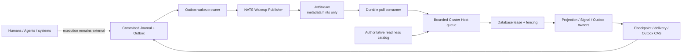

# Work Fabric Phase 6B NATS Wakeup Acceleration Design

## 1. Goal

Phase 6B adds a production NATS JetStream transport for Phase 6A partition
wakeup hints. It reduces ready-work discovery latency across Worker Hosts while
preserving the database-backed Journal, Outbox, projection checkpoints,
delivery positions, readiness catalog and worker leases as the only
authoritative recovery state.

The Broker carries internal metadata only. It does not carry Handoff content,
Context, Result, Artifact, Evidence, credentials, prompts, model requests or
participant work. It does not become a new public WFPP Signal binding in this
phase.

Phase 6B does not add target selection, business prioritization, workflow
scheduling, Agent reasoning, model/tool execution or any participant executor.

## 2. Confirmed approach and rejected alternatives

The selected approach is a technology-specific
`@work-fabric/adapter-cluster-nats` package implementing the existing
technology-neutral `PartitionWakeupPublisher` and `PartitionWakeupConsumer`
ports. It uses a pre-provisioned JetStream stream and durable pull consumer
with explicit acknowledgements.

This approach was selected over:

1. **Core NATS pub/sub.** Core NATS is lower-latency but at-most-once and has no
   explicit Ack/Retry settlement. Database polling would still preserve
   correctness, but the Adapter could not honor the existing Wakeup delivery
   contract during short Worker restarts.
2. **A new generic Broker abstraction above `cluster-spi`.** The existing
   publisher/consumer ports already isolate the Broker. A second abstraction
   would duplicate Ack/Retry semantics without enabling a new Work Fabric
   behavior.
3. **Broker offsets as authoritative runtime progress.** This would create a
   second recovery truth, couple correctness to JetStream and make Broker
   retention or consumer resets capable of losing Work Fabric work.
4. **Kafka or a multi-Broker implementation in the same phase.** This would
   expand deployment and test scope before the first production transport has
   proven the SPI. A future Adapter can implement the same ports independently.

JetStream pull consumers give the client bounded demand and flow control;
explicit Ack provides at-least-once delivery, and `MaxAckPending` bounds
outstanding deliveries. These are the exact semantics required by the existing
Cluster Host. See the official [JetStream consumer
documentation](https://docs.nats.io/nats-concepts/jetstream/consumers).

## 3. Authority and data flow



The publisher is called only after an Outbox row exists. A successful
JetStream PubAck means the hint was stored, not that any projection or delivery
advanced. The consumer acknowledges only after the Cluster Host has accepted,
coalesced or deliberately dropped the hint into its bounded local queue.

Dropping a hint because the queue is full is safe: the next database catalog
scan rediscovers the work. A duplicated or redelivered hint is safe: queue
coalescing and owner checkpoints re-read authoritative state. A stale hint is
safe: the owner obtains a database lease and finds no work.

Broker unavailability changes latency, never correctness:

- publish failure returns `retryable_failure`, leaving the Outbox row pending;
- consumer failure is retried by the existing bounded Host ingest loop;
- database catalog polling continues at `poll_interval_ms`;
- after Broker recovery, pending Outbox rows may publish stale hints, which are
  harmless;
- the API role and WFPP command path do not depend on Broker health.

## 4. Package and dependency boundaries

### 4.1 `@work-fabric/cluster-spi`

The existing public publisher/consumer contracts remain stable. Phase 6B adds
a focused `WAKEUP_TRANSPORT_REQUIRED_CAPABILITIES` list for Adapter
conformance. It does not add a NATS name, subject, stream or consumer type to
the SPI.

Required Wakeup transport capabilities are:

- `tenant_isolation`;
- `bounded_delivery`;
- `explicit_settlement`;
- `duplicate_wakeup_tolerance`;
- `lost_wakeup_poll_recovery`;
- `payload_size_limit`;
- `deep_clone`.

The existing `workfabric.cluster.v1` capability manifest remains the public
profile. A Wakeup-only Adapter advertises the Wakeup capabilities it actually
implements; it does not falsely claim to implement a work catalog.

### 4.2 `@work-fabric/exchange-conformance`

Add `verifyWakeupTransportProfile(factory)` independent from
`verifyClusterProfile()`. It verifies strict validation, immutable reads,
explicit exactly-once settlement, duplicate tolerance, Retry redelivery,
AbortSignal behavior, bounded payloads and capability advertisement. The
Memory and NATS Adapters both run the profile.

### 4.3 `@work-fabric/adapter-cluster-nats`

This is the only production package importing `nats`. It contains six focused
units:

- `wakeup-codec.ts` — strict canonical JSON encode/decode and size enforcement;
- `subject-codec.ts` — tenant-scoped opaque NATS subject construction;
- `nats-wakeup-publisher.ts` — JetStream publish/PubAck classification;
- `nats-wakeup-consumer.ts` — bounded pull, poison termination and Ack/Retry;
- `topology.ts` — desired stream/consumer configuration and drift validation;
- `index.ts` — public factory and exported technology-specific configuration.

The initial dependency is locked to `nats` 3.1.0 and supports NATS Server 2.10
or newer. Server
2.10 is the floor because the consumer uses multiple filter subjects for an
explicit bounded tenant assignment. Runtime code accepts an injected NATS
connection and never reads URLs, credentials, JWTs, NKeys or TLS material from
ambient environment variables.

### 4.4 `service-node`

No NATS dependency enters `service-node`. Its existing
`NodeClusterWorkerDependencies` already accepts technology-neutral wakeup
publisher/consumer ports. Deployment code creates the NATS Adapter and injects
it. Host drain aborts the outstanding bounded pull; deployment drains the NATS
connection after `service.close()`.

### 4.5 Tooling and documentation

Add a separate topology CLI using deployment-supplied NATS credentials. It can
plan, verify and explicitly apply the stream/consumer resources. Worker runtime
credentials need only publish to allowed Wakeup subjects and consume/bind the
configured durable consumer; they do not need JetStream management authority.

## 5. Canonical Wakeup encoding

The NATS payload is UTF-8 JSON with an exact closed shape:

```json
{
  "schema": "workfabric.partition-wakeup.v1",
  "wakeup_id": "wakeup_01",
  "exchange_id": "exchange_01",
  "tenant_id": "tenant_01",
  "partition_id": "partition_01",
  "kind": "handoff_projection",
  "observed_position": 42,
  "occurred_at": "2026-07-16T00:00:00.000Z"
}
```

All identifiers and timestamps use existing `cluster-spi` validation. Unknown
or missing fields fail decoding. `observed_position` must be
a positive safe integer. Encoded payload size is at most 4,096 bytes; the
topology installs the same `max_msg_size`. The payload never contains an
arbitrary extension object.

Malformed, oversized or subject-mismatched messages are poison hints. The
consumer terminates them and emits one low-cardinality failure observation.
It does not expose raw payloads or Broker error text and does not loop forever
over poison data. Database polling recovers any legitimate work that the
message was intended to hint.

## 6. Subject and tenant isolation

The subject shape is:

```text
<prefix>.<key-id>.<tenant-token>.<work-kind-token>
```

Defaults use prefix `workfabric.cluster.wakeup.v1`. Prefix, stream, consumer,
key ID and work-kind tokens must be valid literal NATS subject tokens and are
bounded to 1–64 characters each.

`tenant-token` is the base64url HMAC-SHA256 digest of the canonical Tenant ID
under a deployment-injected 32-byte-or-larger subject key. It prevents raw
Tenant IDs from entering NATS subjects, logs, ACLs or monitoring dimensions.
The consumer recomputes the token for its explicit `allowed_tenant_ids` and
rejects a body whose Tenant ID does not match the subject token.

Each homogeneous Worker group has one durable consumer name and one explicit
bounded Tenant set. The topology installs exact `filter_subjects` for every
Tenant × work-kind pair. Hosts sharing the same Tenant assignment and consumer
name load-balance hints. Different tenant groups use different consumer names.

Configuration bounds are:

- allowed tenants: 1–250;
- work kinds: exactly the four Phase 6A mechanical kinds;
- resulting filter subjects: 4–1,000;
- subject key: 32–128 bytes;
- prefix/key/stream/consumer identifiers: 1–64 characters.

Subject-key rotation uses a new `key-id`, new consumer filters and a rolling
deployment. A temporary hint gap is safe because database polling remains
active. The Adapter does not implement dual-key business state or store the
key.

## 7. JetStream topology

The stream is deployment-owned and configured with:

- `LimitsPolicy` retention;
- file storage;
- subjects `<prefix>.*.*.*`;
- `max_msg_size = 4096`;
- bounded `max_age`, default 15 minutes, allowed 1 minute–24 hours;
- bounded `max_bytes`, default 256 MiB, allowed 1 MiB–10 GiB;
- duplicate window 120 seconds;
- discard old;
- replicas 1–5, deployment default 3 for production and 1 for local tests.

The durable pull consumer is configured with:

- exact `filter_subjects` for the assigned Tenant set;
- explicit Ack;
- deliver new;
- instant replay;
- `ack_wait`, default 30 seconds, allowed 5–300 seconds;
- `max_deliver`, default 5, allowed 1–20;
- `max_ack_pending`, default 1,024, allowed 1–10,000;
- `max_waiting`, default 32, allowed 1–256;
- consumer replicas inherited from the stream;
- file-backed consumer state.

Old hints beyond `max_age` may disappear without repair because the database
catalog is the recovery path. `Nats-Msg-Id` equals `wakeup_id`, enabling
JetStream duplicate suppression inside its configured duplicate window;
duplicates beyond the window remain valid and are coalesced by Work Fabric.
The official NATS documentation explicitly treats JetStream publish and
consumer acknowledgement as at-least-once, so application-level duplicate
tolerance remains mandatory: [JetStream concepts](https://docs.nats.io/nats-concepts/jetstream).

The topology CLI defaults to plan/verify. `--apply` is mandatory for mutation.
It creates missing resources and applies compatible changes, but fails closed
on an existing resource with a different subject namespace, retention policy
or storage type. It never deletes a stream or consumer and never prints server
URLs or credentials.

## 8. Runtime contracts

The public factory is technology-specific while its result is the existing
technology-neutral pair:

```ts
export interface NatsWakeupRuntimeOptions {
  readonly connection: NatsConnection;
  readonly stream: string;
  readonly consumer: string;
  readonly subject_prefix: string;
  readonly subject_key_id: string;
  readonly subject_key: Uint8Array;
  readonly allowed_tenant_ids: readonly string[];
  readonly pull_expires_ms: number;
  readonly retry_delay_ms: number;
  readonly max_poison_per_pull: number;
}

export interface NatsWakeupAdapter
  extends PartitionWakeupPublisher, PartitionWakeupConsumer {
  close(): Promise<void>;
}

export function createNatsWakeupAdapter(
  options: NatsWakeupRuntimeOptions,
): Promise<NatsWakeupAdapter>;
```

Bounds are:

- pull expiry: 100–30,000 ms, default 1,000 ms;
- Retry delay: 100–60,000 ms, default 1,000 ms;
- poison messages terminated per `next()` call: 1–100, default 10.

Only one pull is outstanding per Adapter instance. It includes a server-side
expiry so requests do not accumulate. `next(signal)` returns `null` on an
empty/expired pull, aborts promptly during drain and leaves any server request
bounded by `pull_expires_ms`.

`WakeupDelivery.acknowledge()` positively acknowledges once.
`WakeupDelivery.retry()` negatively acknowledges once with the configured
delay. A second or mixed settlement throws a stable local error without sending
another Broker command.

Publisher classification is:

- valid PubAck: `accepted`;
- timeout, disconnect, no responder or JetStream availability error:
  `retryable_failure`;
- invalid local Wakeup or configuration: throw before network I/O.

Consumer connection/JetStream errors reject `next()` with a stable Adapter
error. The existing Cluster Host catches them, waits its bounded poll interval
and continues database polling. No raw NATS exception, server URL, subject key,
payload or credential enters HTTP responses or semantic telemetry.

## 9. Provisioning and security

Management and runtime authority are separated:

- topology credentials may inspect/create/update the named stream and consumer;
- publisher credentials may publish only to the configured prefix/key ID and
  assigned Tenant tokens;
- consumer credentials may bind/fetch/Ack only the configured stream and
  durable consumer;
- no runtime credential can delete or purge JetStream resources;
- TLS and NKey/JWT authentication are deployment requirements for production;
  the repository does not persist those secrets.

The stream namespace, consumer name and Tenant assignment are deployment
configuration, never request input. Changing a Worker group Tenant assignment
requires topology verification before starting the group. The Adapter compares
the received subject, allowed Tenant set and decoded body before returning a
WakeupDelivery.

Broker health is a degradable dependency for Worker latency. Deployment health
may report it as degraded, but API readiness remains based on authoritative
dependencies. Operators monitor publish retry rate, pull failures, poison
termination count, redeliveries and catalog-to-turn latency using fixed
low-cardinality operation/outcome/category labels only.

## 10. Testing and completion evidence

### 10.1 Unit and conformance tests

- strict codec round-trip and 4,096-byte rejection;
- content/credential field rejection;
- deterministic HMAC subject token and body/subject mismatch rejection;
- PubAck, timeout and unavailable classification;
- explicit Ack, delayed Retry and double-settlement rejection;
- AbortSignal and pull-expiry behavior;
- bounded poison termination;
- Wakeup transport conformance for Memory and NATS fake transports;
- topology exact-match, compatible update and incompatible-drift rejection;
- boundary gate proving only the NATS Adapter and topology tool import `nats`.

### 10.2 Live NATS proof

An integration suite runs against `NATS_TEST_URL` and a unique stream/consumer:

- provision the topology;
- publish a Wakeup and receive/ack it;
- Retry and observe redelivery;
- publish the same `wakeup_id` twice and tolerate one or two deliveries;
- run two consumers bound to one durable and prove one settled delivery;
- disconnect the Broker while database catalog polling advances a partition;
- reconnect and prove stale hints do not duplicate owner progress;
- delete only the uniquely named test resources in cleanup.

When `NATS_TEST_URL` is absent, live tests explicitly skip; fake-transport,
conformance and boundary tests remain mandatory. Release verification also runs
against an official NATS Server 2.12.x binary in a temporary directory so the
Phase cannot be declared complete solely from skipped live tests.

### 10.3 Performance evidence

`benchmark:wakeup` requires `NATS_TEST_URL` and accepts bounded publishers,
consumers, messages, payload bytes and samples. It reports publish PubAck and
consume-to-Ack p50/p95/p99, duplicate ratio, redelivery count and throughput.
It does not claim participant execution throughput. The existing
`benchmark:cluster` remains the database/host coordination baseline.

### 10.4 Full gates

Phase 6B completes only when:

```sh
npm run verify:exchange
npm run verify:postgres
npm run verify:nats
npm run check:cluster-boundaries
npm run check:sensitive-observability
npm run benchmark:cluster -- --partitions 100 --tenants 4 --concurrency 8 --samples 3
npm run benchmark:wakeup -- --messages 1000 --publishers 4 --consumers 4 --samples 3
npm run verify
git diff --check
```

pass, WFPP remains 120/120, the two-Host HTTP/SDK round-trip remains green,
and the temporary official NATS verification run contains no skipped live
tests.

## 11. Documentation and roadmap outcome

Update the cluster runtime, PostgreSQL deployment, README, architecture and
Roadmap to mark Phase 6B complete only after the live proof and baseline exist.
The documentation must continue to state:

- Broker hints are optional and non-authoritative;
- database polling must remain enabled;
- Broker outage affects latency, not accepted Handoff truth;
- public WFPP Event/Subscription/Signal semantics are unchanged;
- public APIs and SDKs do not expose NATS;
- execution and scheduling remain outside Work Fabric.

After Phase 6B, Phase 7 Federation is the next independent design phase. It
must not reuse JetStream consumer state as cross-Exchange authority.
