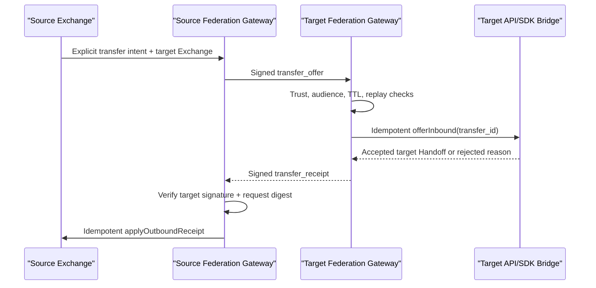

# Phase 7 Cross-Exchange Federation Profile Design

## 1. Decision

Phase 7 defines a signed, replay-safe request/receipt profile for transferring
Handoff responsibility between two independently authoritative Work Fabric
Exchanges. It adds the trust and delivery bridge that ordinary Signal delivery
and Phase 6 wakeups deliberately do not provide.

Federation remains connection infrastructure. The source explicitly chooses a
target Exchange. The target Exchange's deployment-owned Bridge uses its public
API/SDK to create or correlate a local Handoff. Work Fabric does not discover or
rank peers, choose a target, schedule a workflow, invoke a model/tool, or execute
participant work.

## 2. Authority model

Each Exchange remains authoritative only for its local Handoff and federation
records. There is no distributed transaction and no shared database. A signed
remote statement is a verifiable peer claim, not permission to overwrite local
state.

The source transition is applied only after a valid signed Receipt from the
explicit target Exchange. The target Bridge operation and source Receipt
application are idempotent by `transfer_id`. A crash may repeat either operation
but cannot create a second logical transfer.



## 3. Wire profile

The UTF-8 JSON envelope has an exact closed shape and is at most 65,536 bytes:

```json
{
  "profile": "workfabric.federation.v1",
  "message_id": "fedmsg_01",
  "transfer_id": "fedtransfer_01",
  "message_type": "transfer_offer",
  "source_exchange_id": "exchange_a",
  "target_exchange_id": "exchange_b",
  "sequence": 1,
  "issued_at": "2026-07-16T00:00:00.000Z",
  "expires_at": "2026-07-16T00:05:00.000Z",
  "key_id": "key1",
  "payload": {},
  "signature": "base64url-ed25519-signature"
}
```

Supported v1 message types are `transfer_offer` and `transfer_receipt`.
Signatures cover RFC-style deterministic canonical JSON of every envelope field
except `signature`. The runtime accepts only canonical base64url signatures,
positive safe sequence numbers, TTL 1–300 seconds, configured clock skew 0–60
seconds and bounded identifiers.

The Offer payload is exact:

- `source_handoff_id`, `source_thread_id`, `source_resource_version`;
- `handoff_offer`, the existing public Handoff Offer payload as bounded JSON;
- `handoff_offer_sha256`, the canonical payload digest.

The Federation layer checks shape, size and digest. The target Bridge must run
the existing public protocol/Authority validation before creating a local
Handoff. Federation never accepts internal `domain_data`, storage cursors,
credentials or arbitrary unsigned extensions.

The Receipt payload is exact:

- `request_message_id` and matching `handoff_offer_sha256`;
- `decision`: `accepted` or `rejected`;
- accepted: `target_handoff_id` and positive `target_resource_version`;
- rejected: stable `reason_code` and null target fields;
- `recorded_at`.

Receipt sequence is 2 for v1. Unknown message types or fields fail closed.

## 4. Package boundaries

- `federation-spi`: technology-neutral Signer, Trust Resolver, Replay Store,
  Bridge and request/receipt Transport ports plus profile types;
- `federation-runtime`: strict codec, canonical digest, Gateway receive/send,
  audience/TTL/replay/Receipt correlation and stable errors;
- `adapter-federation-memory`: executable replay-store reference;
- `adapter-federation-node-crypto`: Ed25519 signer and explicit peer trust map.

Core, HTTP, SDK and Cluster Runtime do not import Federation Runtime. A
deployment composes a Bridge whose only business-side capability is submitting
the existing public commands with an explicit federation service identity and
Authority policy.

## 5. Idempotency, replay and failure

Replay identity is `source_exchange_id × message_id`. The Store records the
canonical request digest and, for an Offer, the exact signed Receipt bytes.

- same identity + same digest + completed outcome: return byte-identical cached
  Receipt without invoking the Bridge;
- same identity + different digest: fail `federation_replay_conflict`;
- same identity + pending outcome after a crash: re-run the idempotent Bridge
  with the same `transfer_id`, then complete the record;
- expired or wrong-audience message: reject before Bridge invocation.

Transport failure is retryable and the caller must resend the exact signed
Offer bytes. Creating a new message ID for a retry is invalid. A valid rejection
Receipt is final protocol data, not a transport failure.

## 6. Trust and key rotation

Trust is explicit per peer Exchange and key ID. The resolver verifies both the
signature and that the peer is allowed to address the local Exchange. There is
no ambient web-of-trust, peer discovery or trust-on-first-use.

Ed25519 private keys remain deployment-injected. Rotation adds a new key ID to
the peer trust map, rolls signers, then removes the old key only after the
maximum message TTL and retry window. Key bytes, signatures, Offer content,
Handoff IDs and peer IDs never enter metric labels.

Transport security (HTTPS/mTLS, DNS, rate limiting, request authentication and
network policy) belongs to the deployment binding. Message signatures remain
mandatory even with mTLS.

## 7. Reconciliation

V1 reconciliation is deterministic re-delivery of the original signed Offer.
The target returns the cached signed Receipt, allowing the source to repair a
lost Receipt without a state dump. Full bidirectional state replication is
intentionally excluded: local Handoff facts continue to move through public
commands and public protocol events.

Operational diagnostics may expose only aggregate accepted/rejected/replayed,
retryable transport failures and latency. Peer, transfer, message, Handoff,
Tenant, URL, signature, content and credential values are never labels.

## 8. Verification and completion

Phase 7 is complete when:

- schemas and strict runtime codec agree;
- Ed25519 verification, tamper, wrong audience, expiry and key rotation tests
  pass;
- duplicate retry returns a byte-identical Receipt and a conflicting replay is
  rejected;
- two in-process authoritative Exchange Bridges complete an Offer/Receipt flow
  while each owns only its local record;
- transport failure/retry and lost-Receipt reconciliation pass;
- dependency and sensitive-observability gates keep execution and technology
  coupling outside Core;
- repository verification and WFPP 120/120 remain green.

HTTP federation binding, peer directory product, automatic target selection,
cross-Exchange queries, global ordering, two-phase commit and participant
execution are not part of this Profile. They can be separate adapters/modules
without changing the signed v1 contract.
