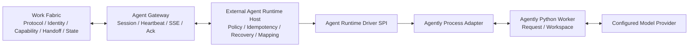

# Agently Agent Runtime Adapter Design

## Objective

Connect an external Agently-based Agent Runtime to Work Fabric as a normal
Agent Actor/Endpoint without moving planning, model execution, tools, memory,
or workflow automation into the Work Fabric service.

The first release must form a durable, restart-safe loop:

```text
targeted Handoff
  -> durable external receipt
  -> signal Ack
  -> deterministic responsibility decision
  -> Handoff accept
  -> Agently execution
  -> status reports
  -> result submission
```

Agently is the first Runtime implementation, not a dependency of the
technology-neutral host or any Work Fabric core package.

## Architectural boundary



Work Fabric remains a connection and responsibility-transfer system. It does
not start an Agently execution, select a model, decide which action to call, or
infer that an Agent accepted responsibility. The Runtime Host is a separately
deployed participant and uses only public HTTP/SSE/WFPP interfaces through the
TypeScript SDK and Agent Gateway.

## Considered approaches

### Thin Agently example

Extend `examples/local-agent-runtime` and invoke Agently directly.

This is fast but does not provide a reusable Runtime contract, durable command
ledger, restart recovery, or a safe process boundary. It is not selected.

### Generic Runtime Host with a pluggable Driver

Add a technology-neutral Node host, runtime state ports, and Driver SPI.
Implement Agently as an external Python process adapter.

This reuses the existing Agent Gateway and keeps Runtime frameworks
replaceable. This is the selected approach.

### Agently service plugin

Install Agently inside `service-node` as a Work Fabric plugin.

This would mix the Agent Brain and model/tool lifecycle into the collaboration
connection service. It violates the project boundary and is rejected.

## Modules

### `@work-fabric/agent-runtime-spi`

Defines framework-neutral contracts:

- `AgentExecutionTask`;
- `AgentExecutionProgress`;
- `AgentExecutionResult`;
- `AgentRuntimeDriver`;
- `AgentRuntimeDriverFactory`;
- `AgentRuntimeStateStore`;
- capability manifests and required adapter capabilities.

It contains no Agently, process, HTTP, SQLite, model-provider, or Work Fabric
service composition code.

### `@work-fabric/agent-runtime-host`

An external Node library and executable composition surface that:

- owns one Agent Gateway session;
- persists every Delivery before acknowledging it;
- applies a deterministic responsibility policy;
- loads the immutable Handoff package through public Query APIs;
- accepts or declines through public Handoff commands;
- runs a bounded number of Driver executions;
- maps progress and results into WFPP status/result payloads;
- aborts execution when the Handoff becomes terminal;
- recovers incomplete runs from the Runtime state store;
- never reads a Work Fabric database directly.

### `@work-fabric/adapter-agent-runtime-memory`

Provides a deterministic state-store adapter for unit and conformance tests.
It is not a production durability option.

### `@work-fabric/adapter-agent-runtime-sqlite`

Provides the local durable Runtime state store. It uses its own database and
does not share tables or transactions with Work Fabric.

### `@work-fabric/adapter-agent-runtime-agently`

Implements `AgentRuntimeDriverFactory` and `AgentRuntimeDriver` by launching the
Agently Python worker. It owns:

- child-process lifecycle;
- bounded protocol framing;
- execution timeout;
- cancellation and forced termination;
- conversion between neutral task/result records and the Python protocol;
- stable local error codes.

### `runtimes/agently-worker`

An independent Python 3.10+ package managed with `uv`. It:

- uses Agently async request APIs;
- creates an isolated Workspace for each Handoff;
- builds a structured request from the supplied task;
- returns structured summary, artifacts, and evidence;
- sends progress and terminal records through the worker protocol;
- sends framework and application logs to stderr;
- does not connect to Work Fabric.

### Example and documentation

- `examples/config/agent-runtime-agently.yaml`;
- `examples/agently-agent-runtime` launcher;
- `docs/guides/agently-agent-runtime.md`;
- updates to the Agent boundary and roadmap documents.

## Runtime Driver contract

The host passes an immutable `AgentExecutionTask` containing:

- stable `execution_id`, `handoff_id`, and attempt;
- work reference;
- intent content parts;
- the authorized Context reference and any content explicitly materialized by
  a configured external Context Provider;
- complete acceptance criteria;
- deadlines and priority;
- advertised capability ID;
- a Runtime-owned Workspace reference;
- bounded extensions for trace correlation.

The task does not contain Work Fabric access tokens, model credentials,
fencing tokens, or database handles.

The Driver exposes:

```text
execute(task, observer, signal) -> AgentExecutionResult
health() -> DriverHealth
close() -> void
```

Progress is advisory and bounded. It contains a stable phase, optional
progress fraction, safe message content, and safe blocked-on resource
references. Driver progress cannot mutate a Handoff by itself; only the Host
maps accepted progress to `reportStatus`.

The result contains protocol-compatible summary content, artifact references,
and evidence content. It does not contain a Handoff expected version or
idempotency key; those remain Host responsibilities.

## Handoff package loading

The Endpoint Inbox projection intentionally carries only routing facts and a
Handoff snapshot. The Host obtains execution inputs through public APIs:

1. read the authorized Handoff read model with `getHandoff`;
2. decode the complete, versioned Package from the read model's `state`;
3. list the Handoff events to validate provenance, sequence, and current
   stream version without assuming the public event projection exposes the
   original Package;
4. extract Intent, Context reference, acceptance criteria, authority scope,
   priority, and deadlines from the snapshot Package;
5. verify that the event stream and current snapshot identify the same
   Handoff, lifecycle, and target.

No Runtime package is allowed to import a Work Fabric persistence adapter or
query Work Fabric SQLite/PostgreSQL directly.

The current public surface validates and preserves a Context reference but
does not expose Context Repository content to an external Runtime. The first
implementation therefore consumes Handoff Intent and other content actually
present in the public Package, and carries the Context reference as metadata.
A future Context Provider may materialize referenced content after enforcing
tenant, Actor, Endpoint, visibility, version, digest, and AuthorityScope. That
Provider is an external extension and does not authorize a database shortcut.

## Responsibility policy

The first implementation supports only deterministic policy:

```yaml
acceptance:
  mode: accept_all_targeted
  allowed_capability_ids:
    - software.implementation
```

The Host starts a run only when:

- the current lifecycle is `offered`;
- the explicit target matches its Actor and Endpoint;
- the requested capability is allowed and advertised by the active Endpoint
  session;
- the Handoff is not past `accept_by`;
- there is no existing logical run for the Handoff.

Everything else is acknowledged as a signal but does not start an execution.
Unsupported targeted work is explicitly declined when protocol state permits.

The model and Agently never decide whether responsibility is accepted. A future
manual or intelligent decision service may implement a separate policy port
outside Work Fabric and outside the Driver.

## Delivery, command, and execution lifecycle

### Durable receive and Ack

Every incoming Delivery is inserted into the Runtime state store before
`acknowledgeSignal("acknowledged")` is sent. Signal Ack only advances external
delivery position and does not imply Handoff acceptance.

Duplicate Deliveries converge on the same stored record and are acknowledged
without starting a second run.

### Accept and execute

For one eligible offer:

1. create the logical Runtime run;
2. issue a stable, ledgered Accept command;
3. re-read the accepted Handoff;
4. submit an `in_progress` status;
5. execute the selected Runtime Driver;
6. coalesce bounded progress updates;
7. re-read the Handoff before each lifecycle command;
8. submit a Result only if the Handoff is still accepted and the Driver
   completed successfully.

Command idempotency keys are derived once, persisted, and replayed unchanged.
The Host never generates a new idempotency key merely because a network
response was lost.

### Failure

Driver validation, timeout, process, model, or output failures produce a
bounded `failed` status with a stable public reason. They do not synthesize a
successful Result.

Retry is conservative:

- transport ambiguity replays the same command or execution identity;
- a Driver failure is not automatically rerun unless the configured retry
  policy explicitly permits the classified error;
- model output validation failure is handled inside the Agently request's
  configured bounded retry limit;
- exhausted attempts remain externally visible as failed.

### Cancellation and terminal state

Deliveries for `cancelled`, `expired`, `transferred`, `declined`, `closed`, or
already completed Handoffs update the local run and abort an active Driver.
The process adapter sends graceful termination, waits for a configured grace
period, then force-terminates if required.

The Host ignores its own subsequent status/result events as execution triggers
while still acknowledging their Delivery records.

## Runtime persistence

The state-store contract covers:

- received Delivery ledger and Ack outcome;
- one logical run per Handoff;
- run attempt and execution state;
- selected Driver and configuration revision;
- stable command ledger;
- progress checkpoint;
- terminal result digest or failure code;
- recovery lease/fencing for one active local host.

The SQLite adapter uses forward-only migrations and uniqueness constraints for
Delivery ID, Handoff logical run, execution ID, and command idempotency key.
It stores no Work Fabric bearer token, model API key, raw fencing token, or
unbounded model transcript.

Agently Workspace content lives below a separate configured root:

```text
var/agently-workspaces/<tenant-hash>/<handoff-hash>/
```

The mapping is persisted locally but raw sensitive identifiers are not used as
directory names.

## Agently execution

The first Driver uses one asynchronous structured Agently request. It does not
use TriggerFlow merely to wrap one model call.

Inputs are rendered into distinct sections:

- immutable work intent;
- authorized Intent and other inline Package content;
- optional Context content materialized by a configured external Provider
  (none in the first implementation);
- acceptance criteria;
- output contract;
- non-negotiable restrictions.

The Worker asks Agently for a structured result and validates it before
emission. A minimal successful result may contain a text summary and empty
artifact/evidence arrays. If an acceptance criterion requires evidence the
Worker must return matching structured evidence or report failure; it must not
invent an external artifact reference.

Workspace is enabled for durable Agent-local observations and checkpoints, but
Workspace data remains external participant state. It does not become Work
Fabric Context automatically.

Shell, Python, Node.js, browser, filesystem-write, MCP, and other Actions are
disabled by default. Later releases may expose explicitly configured actions
behind the same Driver contract and the Handoff authority boundary.

TriggerFlow is reserved for runs that genuinely need branching, pause/resume,
fan-out, or durable multi-stage execution.

## Python worker protocol

The first adapter launches one isolated worker process per active execution.
This favors fault and cancellation isolation over cold-start performance.
A future pool implementation may replace it without changing the Driver SPI.

Protocol rules:

- one bounded request document on stdin;
- bounded newline-delimited JSON records on stdout;
- logs and diagnostics only on stderr;
- exact protocol version and record-type validation;
- maximum line, event-count, aggregate-output, depth, and execution-time
  limits;
- exactly one terminal record;
- unknown fields, duplicate terminal records, malformed JSON, unsupported
  prototypes after decoding, or excessive output fail closed;
- secrets are passed only through an allowlisted child environment and never
  through task JSON;
- cancellation uses graceful termination followed by a bounded forced stop.

Record types are:

```text
workfabric.agent-runtime.progress.v1
workfabric.agent-runtime.completed.v1
workfabric.agent-runtime.failed.v1
```

## Configuration

The Runtime is a separate deployment unit with its own configuration document,
but reuses the existing Configuration Provider and Secret Resolver concepts.

```yaml
api_version: workfabric.config/v1

service:
  runtime_id: agently-local
  work_fabric:
    base_url: http://127.0.0.1:8787
    tenant_id: tenant-local
    exchange_id: exchange-local
    actor_id: actor-agently
    endpoint_id: endpoint-agently
    subscription_id: subscription-agently
    access_token: ${AGENT_RUNTIME_WORK_FABRIC_TOKEN}
  acceptance:
    mode: accept_all_targeted
    allowed_capability_ids: [software.implementation]
  concurrency:
    max_active_runs: 2
    queue_capacity: 32
  state:
    provider: sqlite
    location: ./var/agently-agent-runtime.db

plugins:
  instances:
    agently-primary:
      type: agent-runtime.agently
      enabled: true
      config:
        python:
          executable: ./.venv/bin/python
          module: work_fabric_agently_runtime
        workspace_root: ./var/agently-workspaces
        execution_timeout_seconds: 900
        cancellation_grace_seconds: 10
        provider:
          type: OpenAICompatible
          model: configured-model
          base_url: ${AGENTLY_MODEL_BASE_URL}
          api_key: ${AGENTLY_MODEL_API_KEY}
```

Exact field names remain subject to schema implementation, but the boundaries
are fixed:

- Work Fabric service configuration contains no Agently settings;
- Runtime host configuration contains no Work Fabric database location;
- secrets resolve at deployment time and are redacted from snapshots and
  diagnostics;
- YAML is the first Provider, not a permanent storage assumption.

## Security

- Use a dedicated Agent Actor, Endpoint, Principal, bearer token, and least
  privilege Authority rules.
- Validate Endpoint registration, advertised capabilities, and target binding
  before acceptance.
- Do not materialize Context content without a Provider that enforces tenant,
  Actor, Endpoint, visibility, version, digest, and AuthorityScope; the first
  implementation has no such Provider.
- Never expose Work Fabric credentials to model prompts or Agently Workspace.
- Never expose model credentials to Work Fabric.
- Do not log full Context, prompts, model responses, process environment,
  bearer tokens, fencing tokens, or secret placeholders after resolution.
- Bound all queues, processes, inputs, outputs, retries, deadlines, and
  shutdown waits.
- Fail closed on unknown Driver types, unsupported protocol versions,
  malformed Worker records, state-store unavailability, or ambiguous target
  identity.

## Observability

Stable operational records include:

- Runtime ID, Driver type, configuration revision;
- hashed Handoff/run correlation;
- Delivery receive/Ack state;
- Handoff command name and accepted/rejected outcome;
- execution phase, duration, attempt, and terminal code;
- process exit classification;
- model-provider class and model alias, never credentials;
- recovery and fencing events.

Raw prompts, Context, completions, action arguments, action output, and
Workspace content are excluded from default logs and metrics.

## Testing

### Contract and unit tests

- Driver manifest and factory conformance;
- Runtime state-store conformance for memory and SQLite;
- deterministic acceptance policy;
- package loading through public Query records;
- status and result mapping;
- stable idempotency keys;
- progress coalescing;
- timeout, cancellation, malformed output, excessive output, and process exit;
- secret redaction and unsafe diagnostic rejection.

### Host integration tests

- Delivery persists before Ack;
- duplicate Delivery does not duplicate Accept, execution, status, or Result;
- an accepted Handoff has one logical Runtime run and no concurrent duplicate
  execution; after a validated result is durably captured, restart never
  calls the model again;
- a process attempt whose outcome is unknown before durable result capture
  may be retried; the first version exposes no mutating tools, so such a retry
  cannot duplicate an external business side effect;
- restart between Ack/Accept, Accept/execute, and execute/Result recovers;
- terminal Handoff aborts execution;
- Host ignores its own status/result events as new work;
- version conflict re-reads state and converges;
- unavailable state store fails closed.

### Agently Worker tests

- deterministic fake-model execution;
- structured result validation;
- Workspace isolation;
- stderr/stdout separation;
- bounded retries;
- cancellation;
- missing model settings and secret redaction.

### End-to-end acceptance

1. start Work Fabric with SQLite;
2. provision the Agent Endpoint and authority;
3. start the Node Runtime Host and Agently Worker;
4. offer a targeted Handoff;
5. observe active Endpoint session and Delivery Ack;
6. observe Handoff acceptance and progress;
7. observe a valid Result;
8. restart the Runtime and prove the same Handoff is not re-executed;
9. send a second Handoff to prove continued operation.

The default automated end-to-end suite uses a deterministic fake model.
Real-model smoke testing is opt-in and requires explicit credentials.

## Performance and evolution

The first per-run Python process favors correctness. The bounded Host queue and
Driver SPI preserve a later path to:

- a warm Agently worker pool;
- remote Runtime Drivers;
- PostgreSQL Runtime state;
- multiple Runtime Host replicas with leases;
- Actions and MCP;
- TriggerFlow persistence and pause/resume;
- additional frameworks behind new Driver adapters.

None of those changes require modifying WFPP, Exchange Core, Agent Gateway, or
the Work Fabric service process.

## Non-goals

The first implementation does not:

- put a scheduler or Agent Brain into Work Fabric;
- select a target among multiple Agents;
- let a model accept responsibility;
- provide unrestricted tools;
- expose Agently Workspace as canonical Work Fabric Context;
- implement distributed Python worker pooling;
- add a second authoritative Handoff state machine;
- automatically verify or close a returned Result.
