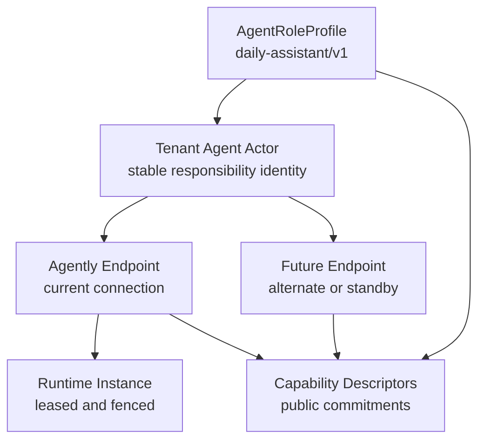
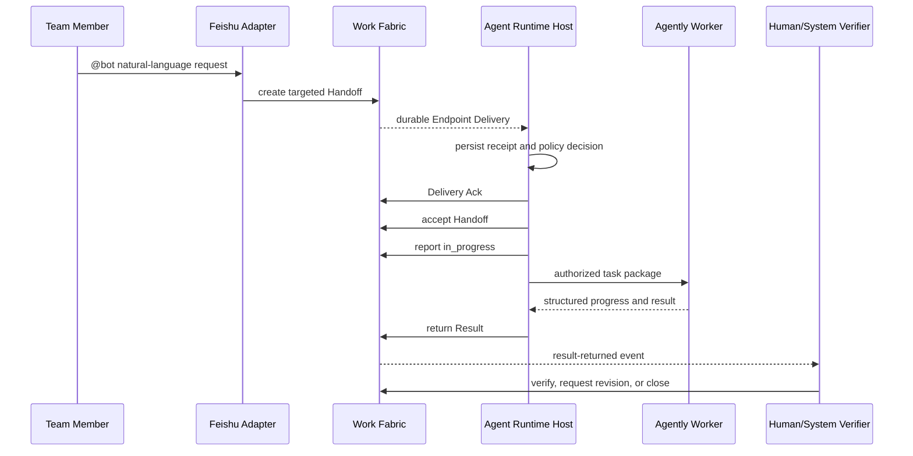

# Team Daily Assistant Agent Role Design

## Objective

Define the first Agently-backed Agent participant as a tenant-scoped,
team-shared "Daily Assistant Agent" that can collaborate with humans, other
Agents, and connected systems through the existing Work Fabric protocol.

The role must be useful as a general collaboration entry point without
becoming:

- a personal proxy for one human;
- an implicit tenant administrator;
- an unrestricted general-purpose executor;
- a scheduler embedded in Work Fabric;
- or a source of authority merely because of its display name.

This design specializes the pluggable Runtime described in the
[Agently Agent Runtime Adapter Design](./2026-07-26-agently-agent-runtime-adapter-design.md).
It does not change the Work Fabric architectural boundary.

## Decision

The Daily Assistant is an independent Agent Actor shared by one tenant. It is
instantiated from a versioned deployment-side `AgentRoleProfile`, connected
through one or more Agent Endpoints, and advertises only the Capabilities that
the current Runtime can actually fulfill.

Work Fabric continues to reason only about protocol facts:

- Actor identity;
- Endpoint and Runtime availability;
- Capability declarations;
- explicit Handoff targets;
- AuthorityScope;
- responsibility transfer;
- status and Result facts.

The role name, prompt, Agently implementation, model provider, Runtime state,
and Workspace remain outside WFPP Core.

## Considered role models

### Personal proxy

Bind the Agent to one Human Actor and allow it to act on that person's behalf.

This is not selected because the requested Agent is shared by the team.
Personal representation also requires explicit Delegation and a substantially
different privacy and authority model.

### Display name on one generic Agent

Rename the existing Agent to "Daily Assistant" without defining a reusable
role profile or explicit Capabilities.

This is not selected because the system will contain many human and Agent
roles. A display name alone cannot support consistent provisioning,
capability discovery, policy validation, or future role upgrades.

### Deployment-side role profile compiled into protocol facts

Define a versioned role template outside WFPP Core, then provision a
tenant-specific Actor, Endpoint descriptors, Capability descriptors, and
Runtime policy from that template.

This is selected because it supports many roles without teaching Work Fabric
their internal meaning. The role system can evolve independently while all
participants continue to use the same protocol.

## Identity model



### AgentRoleProfile

`AgentRoleProfile` is a deployment and Runtime configuration concept, not a
new WFPP Core entity. It defines:

- stable role ID and version;
- localized display name and description;
- the Capability set expected for that version;
- Runtime acceptance policy;
- prompt and structured-output profile references;
- permitted Driver classes;
- default operational limits.

It does not define credentials, tenant-wide authority, or an automatic target
selection algorithm.

### Actor

Each tenant provisions its own Agent Actor instance from the role profile.
That Actor is a first-class responsibility holder, equal in protocol semantics
to other Agent, Human, and System Actors.

The Actor:

- is independent of every individual Human Actor;
- does not automatically represent the person who sent a message;
- has one stable ID across Runtime restarts and Endpoint implementation
  changes;
- never shares responsibility identity across tenants.

The current local deployment may retain the existing stable
`actor-intake-agent` ID and bind it to the `daily-assistant/v1` role. Actor IDs
are identifiers, not user-facing role names. Existing immutable Handoff
history must not be rewritten only to obtain a more descriptive ID. New
deployments may use a configurable ID such as `agent-daily-assistant`.

### Endpoint and Runtime Instance

An Endpoint is the Agent Actor's protocol connection, not its role identity.
The same Actor may later have multiple Endpoints for different bindings or
Runtime implementations.

The first Endpoint uses the external Agently Runtime Host. Session fencing,
heartbeat, Delivery Ack, and recovery remain Agent Gateway concerns. Replacing
Agently or moving the Runtime does not create a new Actor.

## First-version capabilities

The role profile declares three versioned Capability descriptors.

### `collaboration.request.intake`

Accept a natural-language request supplied through a Handoff and normalize it
into a structured collaboration request.

It may identify:

- request intent;
- relevant context;
- constraints;
- missing information;
- suggested acceptance criteria;
- and the kind of downstream participant that may be required.

It does not itself commit a downstream business-system mutation.

### `information.synthesis`

Summarize, organize, or answer questions from content actually supplied and
authorized in the Handoff. A future Context Provider may add materialized
Context after applying its visibility and Authority checks.

It does not imply access to all tenant documents, conversations, knowledge
systems, or the contents behind a Context reference. The first version has no
Context materialization or long-term Memory Provider.

### `collaboration.handoff.draft`

Return a structured proposal for a downstream Handoff, including proposed
intent, context references, acceptance criteria, and required capability.

The first version returns the proposal as Result data. It does not submit
target resolution or create the downstream Handoff.

### Capability advertisement

Each Capability uses a semantic version, accepted input/output media types,
structured schema references when available, asynchronous interaction, status
updates, and explicit constraints.

The Endpoint advertises only Capabilities supported by the deployed role
version and Runtime Driver. A prompt mentioning a possible skill is not a
Capability declaration.

Future Capabilities such as the following require their own implementation,
contract tests, authority rules, and role-version update:

- `collaboration.handoff.create`;
- `work.status.query`;
- `notification.request`;
- `requirement.create`;
- `calendar.manage`.

## Explicit non-capabilities

The first version cannot:

- represent a Human Actor without an explicit Delegation;
- sign, approve, purchase, or make contractual commitments;
- rank and select among candidate Agents on behalf of Work Fabric;
- mutate an external business system;
- execute unrestricted shell, code, browser, filesystem, or MCP actions;
- read tenant knowledge that was not included or authorized;
- dispatch the Handoff proposal it produces;
- verify or close its own Result unless explicitly assigned as Verifier by a
  separate authorized workflow.

## Responsibility and acceptance policy

Responsibility is established only by the normal Handoff lifecycle.

```text
Delivery received
  -> persist Runtime receipt
  -> acknowledge Delivery signal
  -> verify target, lifecycle, deadline, capability, and authority
  -> accept or decline through WFPP
  -> execute only after authoritative acceptance
```

Delivery Ack means that the Endpoint durably received the signal. It never
means that the Agent accepted responsibility.

The default first-version Runtime policy is:

```yaml
acceptance:
  mode: accept_all_targeted
  require_explicit_target: true
  reject_expired_handoffs: true
  require_authority_scope: true
  allowed_capability_ids:
    - collaboration.request.intake
    - information.synthesis
    - collaboration.handoff.draft
```

An eligible Handoff must:

- be explicitly targeted to this Actor or Endpoint, including a committed
  external Target Resolution;
- still be in an acceptable lifecycle state;
- be within its acceptance deadline;
- satisfy the configured Capability allowlist when a Capability Requirement
  is present;
- contain the authority required for the intended interaction;
- not already have a logical Runtime execution.

The Host applies this deterministic policy. The model and Agently do not
decide whether the Agent accepts responsibility.

## Authority model

Role and Capability are descriptions, not grants.

Work Fabric authenticates the Runtime Principal and validates that it may act
as the configured Actor through the configured Endpoint. Command authorization
is enforced separately for each protocol operation.

Each Handoff supplies the minimum AuthorityScope needed for its work. The
first version needs only authority to:

- read the public Handoff package, including its Context reference but not
  repository content hidden behind that reference;
- accept or decline its assigned Handoff;
- report execution status;
- return a Result.

Reading shared knowledge, querying unrelated work, creating a downstream
Handoff, sending a notification, or mutating an external service requires
additional explicit authority and a compatible Connector or Runtime
Capability.

The Agent cannot widen its own AuthorityScope. Credentials and bearer tokens
must not enter prompts, Context Bundles, Agently Workspace data, status
messages, or Results.

## End-to-end collaboration flow

The initial Feishu path is:



The Feishu Adapter is an ingress and notification channel. It does not become
the Agent Runtime, and the browser Console is not part of task execution.

## State and memory boundary

The implementation uses four distinct state categories.

### Work Fabric state

Work Fabric remains authoritative for Handoff lifecycle, responsibility,
events, status reports, Results, and Endpoint participation facts.

### Agent Runtime state

A pluggable Runtime State Provider stores:

- Delivery deduplication;
- logical one-run-per-Handoff records;
- command idempotency records;
- execution attempts;
- progress checkpoints;
- terminal outcome digests;
- leases and recovery fencing.

The first local adapter uses a separate SQLite database. It is not the Work
Fabric Event Store and can later be replaced without changing the Agent
Runtime Host contract.

### Agently Workspace

Each Handoff receives an isolated Workspace for task-local intermediate data
and checkpoints. Tenant and Handoff identifiers are mapped to safe,
non-guessable storage paths.

Workspace data is external participant state. It is not canonical Work Fabric
Context, is not automatically shared with another Handoff, and must not
contain long-lived credentials.

### Future Memory Provider

Long-term team preferences, semantic memory, and reusable experience are not
implemented in the first version.

A future `MemoryProvider` SPI may connect a dedicated memory service, vector
store, or knowledge system. Its results must be filtered by tenant, Actor, and
AuthorityScope before becoming Context for a Handoff. Memory content never
overrides protocol state or authority.

## Configuration ownership

The Daily Assistant is configured in the separate Agent Runtime deployment,
using the existing Configuration Provider and Secret Resolver abstractions.
The Work Fabric service configuration contains identity and authorization
facts required to admit the Runtime Principal, but no Agently model settings.

An illustrative role section is:

```yaml
role:
  role_id: daily-assistant
  version: 1
  display_name: 日常助理 Agent
  description: 团队共享的协作入口与日常事务助理

participant:
  actor_id: actor-intake-agent
  actor_type: agent
  endpoint_id: endpoint-intake-agent

capabilities:
  - collaboration.request.intake
  - information.synthesis
  - collaboration.handoff.draft
```

Actor and Endpoint IDs remain deployment-owned values. The role profile is
portable; the participant instance is tenant-specific.

## Failure handling

- Runtime offline: Work Fabric retains unacknowledged Delivery state and the
  Endpoint resumes from the durable cursor.
- Duplicate Delivery: the Runtime ledger prevents duplicate acceptance and
  execution.
- Target or authority mismatch: decline or reject before launching Agently.
- Model timeout or invalid structured output: report `failed`; never fabricate
  a successful Result.
- Runtime crash: recover from the separate Runtime state and resume without
  creating a second logical run.
- Handoff cancellation or terminal transition: cancel the active Worker with
  bounded graceful and forced termination.
- Workspace failure: fail the current execution and preserve diagnostic facts
  without affecting another Handoff.
- Result race: re-read authoritative Handoff state and converge through
  expected-version and idempotency behavior.

## Observability

Operational telemetry identifies:

- tenant, role version, Actor, Endpoint, and Runtime instance;
- Delivery receipt and Ack state;
- deterministic acceptance-policy outcome;
- Handoff ID and current lifecycle;
- Runtime attempt and recovery state;
- Agently Worker duration and terminal code;
- status and Result command outcomes.

Credentials, raw Context, prompts, model transcripts, Result content, and
Workspace content are excluded from default logs and metrics.

## Verification

### Contract tests

- Role Profile validation rejects unknown or duplicate Capability IDs.
- Capability descriptors conform to WFPP schemas.
- Each Runtime deployment config must bind one tenant Actor and one
  Runtime-owned Endpoint to the role; the Actor may have other Endpoints in
  other deployments.
- Advertised Capabilities match the deployed Driver support.
- Role version changes cannot silently add authority.

### Policy tests

- explicit eligible targets are accepted;
- non-targeted, expired, terminal, unauthorized, and unsupported Handoffs are
  rejected before model execution;
- Ack does not imply acceptance;
- duplicate Delivery does not create a duplicate run;
- the model cannot affect the responsibility decision.

### State tests

- Runtime State Provider conformance passes for in-memory and SQLite Runtime
  State adapters;
- restart at each Ack, Accept, execution, and Result boundary converges;
- Workspace data is isolated across Handoffs and tenants;
- no credential appears in persisted task or Workspace records.

### End-to-end acceptance

1. start Work Fabric with the Feishu Adapter and local SQLite;
2. provision the team Daily Assistant Actor and Agently Endpoint;
3. start the external Agent Runtime;
4. mention the Feishu bot with a supported natural-language request;
5. observe Delivery Ack, Handoff acceptance, progress, and structured Result;
6. verify that a downstream request is only a draft;
7. restart after the validated Result is durable and prove the completed
   Handoff does not call the model again;
8. send a second request and prove continued operation.

## Success criteria

The design is successful when the Daily Assistant:

- participates as a normal independent Agent Actor;
- is shared by one tenant without impersonating team members;
- exposes explicit and truthful Capabilities;
- accepts responsibility only through deterministic WFPP policy;
- operates with minimum per-Handoff authority;
- survives restart and duplicate Delivery;
- keeps Runtime state, task Workspace, and future long-term memory separate;
- can later coexist with many Human and Agent roles without a Work Fabric
  protocol change.
