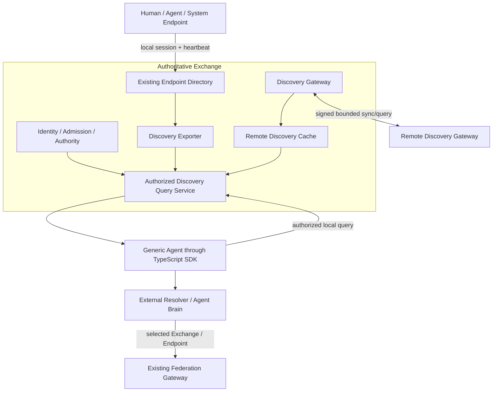

# Work Fabric Participation Discovery Design

**Date:** 2026-08-01
**Status:** Proposed for implementation
**Profile:** `workfabric.discovery.v1`

## 1. Purpose

Work Fabric needs a discovery layer through which a newly connected human,
Agent, or system can learn which collaboration domains, participants,
Endpoints, capabilities, and channel bindings are available to it. The layer
must work inside an enterprise and across explicitly connected external
Exchanges without creating a global database, central scheduler, or broadcast
network.

The intended outcome is:

> An authenticated Agent can obtain its authorized view of the Work Fabric
> network, inspect the capabilities and usable channels declared by visible
> nodes, select a target outside Work Fabric, and then invoke the existing
> Handoff or Federation path under a fresh authorization decision.

Discovery returns attributable facts. It does not rank candidates, establish
trust automatically, grant invocation authority, accept responsibility, or
execute participant work.

## 2. Fit with the Work Fabric boundary

Participation Discovery is a connection-layer capability. It completes the
existing path between the tenant-local Endpoint Directory and the
already-selected-target Federation profile:

```text
Endpoint Directory       authoritative local Endpoint and Capability facts
Participation Discovery  find Exchanges and authorized candidate facts
External Resolver        compare candidates and select one explicit target
Federation               transfer to an already-selected remote Exchange
Handoff Core             record offer, acceptance, responsibility, and result
```

This division preserves the existing architectural rules:

- every Exchange remains authoritative only for its local collaboration facts;
- Exchange Core remains transport-free;
- Target Resolution remains outside the connection layer;
- Federation still starts only after a Source has selected a Target Exchange;
- external Runtimes continue to own reasoning, scheduling, tools, and work;
- discovery data never mutates a Handoff directly;
- remote cached records are claims from their origin, not local truth.

Participation Discovery belongs outside Exchange Core, Cluster Runtime, and
the WFPP Handoff state machine. It is composed at the service edge through a
technology-neutral SPI, a strict runtime, replaceable stores, an authenticated
transport binding, and the public TypeScript SDK.

## 3. Definitions and discovery levels

The term "node" is too ambiguous for the protocol. The profile distinguishes
four stable objects and one deliberately hidden runtime object.

| Object | Meaning | Authority | Cross-Exchange disclosure |
|---|---|---|---|
| Exchange | An independently authoritative collaboration domain | The Exchange itself | Optional public or peer-scoped summary |
| Actor | A human, Agent, or system that can bear responsibility | Actor's authoritative Exchange | Private by default; explicit policy only |
| Endpoint | An Actor's protocol ingress/egress address | Endpoint's authoritative Exchange | Summary or detail according to policy |
| Capability | Versioned work the Endpoint declares it can accept | Active local Endpoint Session | Aggregated or detailed according to policy |
| RuntimeInstance | A transient process behind an Endpoint | Local Endpoint Directory | Never exported |

The public API exposes three related operations:

1. **Exchange Discovery** finds reachable collaboration domains and their
   supported discovery/federation profiles.
2. **Capability Discovery** finds Exchanges or authorized Endpoints declaring
   a requested capability and compatible channel properties.
3. **Participant Discovery** expands Actor and Endpoint details only after the
   authoritative Exchange applies caller-specific disclosure policy.

"All nodes" always means all non-expired, actively published records visible
to the caller. The protocol does not promise knowledge of hidden nodes, offline
nodes, disconnected network components, or a globally complete snapshot.

## 4. Recommended architecture



### 4.1 Local declarations remain authoritative

The existing Endpoint provision, Session, Heartbeat, lease, fencing, and
Capability validation remain unchanged. Runtime heartbeats never cross an
Exchange boundary. A Discovery Exporter derives stable, policy-filtered
records from the projected local Endpoint Directory.

The exporter coalesces rapid Session changes. It publishes a new revision only
when the externally visible semantic digest changes. Internal fencing tokens,
session IDs, heartbeat sequences, tenant IDs, credentials, and deployment
addresses are never exported.

### 4.2 Remote data is a separate cache

Remote records are stored separately from local registrations. The cache
retains origin, issuer, source peer, revision, digest, expiry, path, and
verification result. A remote record can never satisfy an administrative
provision operation or overwrite a local Endpoint registration.

Expired and withdrawn records are excluded from normal discovery results.
Stale records may remain in bounded diagnostic storage but cannot be returned
as an eligible target.

### 4.3 Agents query their local Exchange

Ordinary participants do not connect to every remote Exchange. They
authenticate to their local Exchange and use the shared SDK. The local query
service combines:

- caller-authorized local Endpoint facts;
- fresh caller-authorized cached remote summaries;
- optionally, a bounded on-demand federated query.

Results are deterministic and unranked. Each result reports its source,
freshness, authority Exchange, and whether it is a summary or authoritative
detail.

### 4.4 Discovery peers exchange only bounded facts

Discovery Gateways communicate over authenticated, request/response
transports. Version 1 does not use multicast or network-wide publish/subscribe.
Peer connections are explicit or obtained from a configured bootstrap
mechanism. An unknown Exchange may request admission, but it is not trusted or
allowed to sync until local policy accepts its identity and key material.

Direct peer sync is the default. Transitive queries are optional and disabled
unless both the origin export policy and each relay's import/export policy
allow them.

## 5. Discovery records

All cross-Exchange records use canonical JSON and an origin signature. The
common envelope contains:

```ts
interface DiscoveryRecord<T> {
  profile: "workfabric.discovery.v1";
  record_id: string;
  record_kind:
    | "exchange"
    | "capability_route"
    | "participant"
    | "endpoint";
  origin_exchange_id: string;
  revision: number;
  issued_at: string;
  expires_at: string;
  visibility: "public" | "federated" | "peer";
  audiences: readonly string[];
  transitive: boolean;
  max_hops: number;
  payload: T;
  payload_digest: string;
  key_id: string;
  signature: string;
}
```

`audiences` is empty only for a public record. Tenant identifiers and local
policy names are not exported. A deployment maps a remote Exchange or trust
group into its own tenant-scoped discovery view.

### 5.1 Exchange record

An Exchange record contains only public connection metadata:

- stable `exchange_id` and display name;
- supported discovery and federation profile versions;
- public discovery and federation binding references;
- supported authentication schemes;
- signing key IDs or verifiable key references;
- record expiry and operator contact reference when deliberately disclosed.

Private IPs, credentials, internal service roles, database/Broker addresses,
and deployment replica information are forbidden.

### 5.2 Capability route record

A capability route is the normal cross-Exchange advertisement. It contains an
aggregated statement that the origin Exchange currently exposes one or more
authorized Endpoints for a capability:

- capability ID and supported version range;
- supported input/output media types and Schema references that are safe to
  disclose;
- interaction modes;
- safe Channel/Binding types;
- coarse availability: `available`, `constrained`, or `unavailable`;
- authoritative detail-query reference.

It does not contain individual Runtime state, load, cost, quality score,
private constraints, or a preferred Endpoint. Aggregation prevents Runtime
churn from becoming federation traffic.

### 5.3 Participant and Endpoint detail records

Participant and Endpoint records are returned only from an authoritative,
caller-authorized detail query or an explicit peer export. They may contain the
existing Actor reference, Endpoint descriptor fields, Capability descriptors,
and safe Binding descriptors after policy redaction.

The response must not reveal that a hidden record exists. Unauthorized and
absent records share the same external result.

### 5.4 Channel and Binding semantics

Discovery reuses the existing `BindingDescriptor` and Capability interaction
modes. It does not create a second channel model. A safe published binding may
state:

- `binding_type`, such as Work Fabric Handoff HTTP, Federation, SSE, webhook,
  Feishu, or a namespaced extension;
- compatible protocol versions;
- authentication/security scheme names;
- public connection URI only when the export policy permits it;
- media types and Schema references through the Capability descriptor.

Credentials, bearer tokens, signed URLs, connector secrets, conversation IDs,
and internal callback URIs are never discovery data.

## 6. Protocol operations

The cross-Exchange profile defines four request/response operations. All
requests have a message ID, source and target Exchange, issued time, expiry,
maximum response bytes, and signature. All responses bind the request ID,
request digest, and responder identity.

### 6.1 `exchange_manifest.get`

Fetches one bounded signed Exchange record from a known bootstrap URI. It is
used to verify identity before a peering request. Retrieval is not trust on
first use: deployments must validate the identity through configured keys,
enterprise PKI, DNSSEC-backed material, an approved directory, or manual
admission policy.

### 6.2 `directory.sync`

Pulls a caller-specific Snapshot or delta page:

```text
request:  peer_id + previous_cursor/etag + accepted_profile + page limit
response: additions + replacements + withdrawals + next_cursor + new etag
```

The response is generated after export policy evaluation. Cursors are opaque,
peer-specific, monotonic positions. If a cursor is too old, the responder
requires a new bounded Snapshot instead of returning an unbounded history.

### 6.3 `discovery.query`

Searches by declared facts:

- record kind;
- capability ID and version constraint;
- input/output media types;
- interaction modes;
- Binding/channel types;
- coarse availability;
- result limit and cursor.

Queries never contain prompts, work Context, credentials, or ranking weights.
Responses are unranked and deterministically ordered by origin and record ID.

### 6.4 `discovery.resolve`

Expands one summary at its authoritative Exchange. It is not Target
Resolution. It returns policy-filtered Actor/Endpoint/Capability/Binding facts
and a signed proof of freshness. The caller or an external Resolver still
selects the final target.

### 6.5 Withdrawal and expiry

An origin publishes a higher-revision tombstone to withdraw a record early.
Peers retain tombstones for at least the maximum record TTL plus allowed clock
skew so an older advertisement cannot resurrect the record. If a withdrawal
is lost, expiry removes the record. Re-announcement requires a higher revision.

## 7. Join, discovery, and invocation flow

### 7.1 Participant joins a local Exchange

1. The transport authenticates the Principal.
2. Collaboration Admission or administrative provision establishes the stable
   Actor/Endpoint binding.
3. The Runtime opens one fenced Endpoint Session.
4. The Session declares only provisioned Capabilities and availability.
5. Local heartbeats renew the lease.
6. Export policy may derive an aggregated external record.

Joining locally does not automatically publish the participant externally.

### 7.2 External Exchange joins the discovery network

1. Operator configuration, DNS, a well-known URI, or an existing trusted peer
   supplies a bootstrap Exchange address.
2. The requester fetches the signed Exchange manifest.
3. Local trust and admission policy validates identity and key material.
4. A `PeerBinding` records allowed import, export, query, transit, rate, and
   size policies.
5. The new peer performs a conditional bounded sync with random jitter.

An open network means any compliant Exchange may request this process. It does
not mean anonymous sync, automatic trust, or automatic visibility.

### 7.3 Agent discovers and invokes a capability

1. Agent authenticates to its local Exchange.
2. Agent calls `discovery.findCapabilities` with bounded filters.
3. The local Exchange applies discovery Authority and record visibility.
4. Fresh local/cache results are returned immediately.
5. If requested and budget permits, the gateway asks selected peers and marks
   the response partial if some peers fail.
6. Agent or external Resolver compares candidates and selects one.
7. The authoritative Exchange expands the selected summary if necessary.
8. The Agent creates a normal Handoff or an explicit Federation transfer.
9. Existing Identity, Authority, eligibility, and Handoff rules run again.
10. Only `handoff.accept` transfers responsibility.

## 8. Authorization and privacy

The profile reuses existing authentication, representation, Admission,
Authority, and tenant isolation. It adds disclosure policy rather than a
parallel identity system.

### 8.1 Independent decisions

| Decision | Question |
|---|---|
| Join/Admission | May this Principal become or represent this participant? |
| Declaration | May this Endpoint declare this Capability or Binding? |
| Publish | May a local fact become a discovery record? |
| Read | May this caller query this kind and scope? |
| Export | May this exact record be sent to this Peer? |
| Transit | May the Peer relay the origin-signed record or query? |
| Invoke | May this caller perform the requested Handoff/operation? |

Each decision fails closed. Discoverability never supplies Invocation
Authority.

### 8.2 New Authority actions

The service binding adds narrow actions:

```text
workfabric.discovery.query.v1
workfabric.discovery.resolve.v1
workfabric.discovery.peer.read.v1
workfabric.discovery.peer.manage.v1
workfabric.discovery.sync.v1
workfabric.discovery.export.v1
```

Peer sync uses a dedicated service Principal and cannot represent arbitrary
Actors. Participant queries continue through the same Identity and Authority
pipeline as other HTTP/SDK operations.

### 8.3 Disclosure defaults

- local Endpoint records are private by default;
- externally exported records default to aggregate capability routes;
- Actor and individual Endpoint details require explicit policy;
- transit is disabled by default;
- public records must be explicitly configured;
- absence and unauthorized visibility are externally indistinguishable;
- responses include no secret or user-generated work content.

### 8.4 Signing and trust

Cross-Exchange messages use canonical bytes, a digest, explicit audience,
short TTL, and asymmetric signatures. The implementation may reuse an injected
cryptographic adapter, but Discovery SPI must not depend on the Federation
Runtime package. Key custody remains in deployment Secret/HSM/KMS boundaries.

Signature validity proves who issued bytes; it does not prove that a
Capability is useful, safe, or honest. Reputation, certification, ranking, and
business trust remain external.

## 9. Broadcast-storm and load control

The design has no network-wide broadcast path. The following controls are
mandatory conformance behavior, not optional operational advice.

### 9.1 Stable data plane

- Runtime Session heartbeats remain local.
- Cross-Exchange records are semantic summaries.
- A new revision is emitted only when the externally visible digest changes.
- Changes within a coalescing window collapse to the final revision.
- Withdrawals and updates are delta records, not full network snapshots.

### 9.2 Pull-first synchronization

- Peer sync is conditional Pull using cursor/ETag.
- No-change responses are small.
- Poll intervals include random jitter.
- Failure uses bounded exponential backoff and circuit breaking.
- A Peer cannot instruct another Peer to shorten its sync interval.

### 9.3 Bounded queries

Every query enforces:

- maximum request and response bytes;
- maximum results and pages;
- deadline and TTL;
- maximum peer fan-out;
- maximum hop count;
- total query budget;
- caller, Peer, tenant-view, and capability rate limits;
- bounded concurrent work and queue capacity.

Large responses are sent only to an authenticated, verified requester. A small
unauthenticated request cannot cause a larger response to a third-party
address.

### 9.4 Loop and duplicate suppression

Transitive requests carry a query ID, visited Exchange path, remaining hop
count, remaining fan-out, and remaining result/byte budget. A gateway:

- drops a repeated query ID during the deduplication window;
- refuses a path containing its own Exchange ID;
- never increases any remaining budget;
- never forwards after the first deadline or TTL expires;
- returns one bounded partial response rather than causing downstream retries.

### 9.5 Cache strategy

- positive cache lives no longer than the origin record TTL;
- negative cache uses a short bounded TTL and query fingerprint;
- callers may force authoritative refresh only within stricter quotas;
- identical concurrent queries are single-flighted;
- cache capacity is bounded per origin, Peer, and local tenant view;
- eviction never turns stale data into fresh data.

## 10. Consistency and failure semantics

Discovery is intentionally eventually consistent.

| Condition | Required behavior |
|---|---|
| Peer unavailable | Return fresh cached/local results and mark the response partial |
| Cache record expires | Exclude it from eligible results |
| Signature or digest invalid | Reject before cache mutation and emit bounded audit |
| Duplicate update | Return the existing result without mutation |
| Same revision, different digest | Fail closed as a conflicting replay |
| Older revision | Ignore without extending expiry |
| Cursor too old | Require a bounded resnapshot |
| Lost withdrawal | TTL expiry removes the record |
| Query deadline exceeded | Return bounded partial results; do not retry recursively |
| Policy changes | New reads re-evaluate policy; export produces withdrawals as needed |
| Clock skew outside bound | Reject the message |
| Cache/storage outage | Local Endpoint/Handoff operation continues; discovery reports unavailable |

The API reports `complete`, `partial`, or `authoritative` result coverage. It
never labels a federated open-network result as globally complete.

## 11. Package and dependency boundaries

The implementation is split into focused packages:

```text
discovery-spi
  Canonical types, store/source/policy/transport/crypto ports, capability profile

discovery-runtime
  Codec, validation, signatures, cache state machine, sync/query gateway

adapter-discovery-memory
  Bounded reference cache, peer store, revision/change-log store

adapter-discovery-node-crypto
  Node Ed25519 signer and explicit trust resolver

adapter-storage-sqlite / adapter-storage-postgres
  Durable peer, record, cursor, tombstone, and audit-safe discovery stores

transport-http
  Authenticated participant discovery routes and optional peer binding

sdk-typescript
  Local participant discovery client only

service-node
  Explicit composition, limits, roles, lifecycle, and configuration

exchange-conformance
  Reusable discovery profile tests
```

Dependency rules:

```text
discovery-spi              -> no runtime/transport/database dependency
discovery-runtime          -> discovery-spi only
technology adapters        -> discovery-spi (+ runtime only when required by codec boundary)
transport-http             -> service interfaces, never concrete stores
sdk-typescript             -> public HTTP contract only
Exchange Core              -> no discovery dependency
Federation Runtime         -> no discovery dependency
Endpoint Directory         -> no remote cache or peer transport dependency
```

The Discovery Exporter consumes a narrow local source port. An adapter may
read the existing `EndpointDirectoryService` or a safe projection. The
existing Endpoint SPI is not expanded with Peer, cache, or transport concerns.

## 12. Public HTTP and SDK surface

Participant-facing routes use the existing HTTP authentication and Authority
pipeline:

```text
GET  /v1/discovery/exchanges/{exchange_id}
GET  /v1/discovery/capabilities
GET  /v1/discovery/participants/{actor_id}
GET  /v1/discovery/endpoints/{endpoint_id}
POST /v1/discovery/queries
```

`POST /queries` supports bounded on-demand federation and returns a resource
with coverage, results, warnings, and no internal Peer topology.

Peer-facing routes are a separate optional binding and service identity:

```text
GET  /.well-known/work-fabric
POST /v1/discovery/peer/sync
POST /v1/discovery/peer/query
POST /v1/discovery/peer/resolve
```

The TypeScript SDK adds:

```ts
client.discovery.getExchange(...)
client.discovery.findCapabilities(...)
client.discovery.getParticipant(...)
client.discovery.getEndpoint(...)
client.discovery.query(...)
```

The SDK does not cache authoritative state, select targets, retry writes, or
invoke a discovered Binding automatically.

## 13. Operability

Discovery exposes bounded administrative views for:

- Peer health and last successful sync;
- fresh/expired/withdrawn/conflicting record counts;
- sync and query latency;
- rejected signature, audience, expiry, policy, budget, and rate-limit reasons;
- cache utilization and eviction;
- coalesced update and prevented-forward counts.

Metrics use fixed low-cardinality reason and operation labels. Exchange,
Peer, Actor, Endpoint, Capability, record, query, URL, signature, tenant, and
credential values are forbidden metric labels. Detailed identifiers may appear
only in authorized, retention-bounded audit records.

Peer management and forced resync are explicit administrative operations with
expected versions and idempotency keys. They do not edit local Endpoint or
Handoff facts.

## 14. Verification strategy

### 14.1 Unit tests

- closed canonical JSON Schema and unknown-member rejection;
- Unicode, duplicate-key, timestamp, size, digest, signature, and audience
  validation;
- revision, expiry, withdrawal, conflicting replay, and stale-cache behavior;
- disclosure/export/transit policy precedence;
- query validation, deterministic ordering, cursor binding, and negative cache;
- coalescing, jitter bounds, backoff, rate limit, fan-out, hop, and byte budgets;
- redaction of credentials, internal addresses, tenant IDs, and Runtime fields.

### 14.2 Conformance profiles

Reusable profiles validate every Store, crypto adapter, local source, policy,
and Peer transport implementation against identical semantics.

### 14.3 Integration tests

1. Two Exchanges with independent local Endpoint Directories.
2. An Agent joins Exchange A and declares a provisioned capability.
3. Export policy publishes an aggregate route to Exchange B.
4. A generic Agent on B discovers the capability and authorized channel.
5. An external Resolver selects A.
6. Existing Federation creates the target local Handoff.
7. The target Endpoint receives and explicitly accepts it.
8. Discovery data never mutates either Handoff directly.

### 14.4 Storm and fault tests

- hundreds of local heartbeats produce zero cross-Exchange messages when the
  exported semantic digest does not change;
- rapid availability changes coalesce to a bounded number of updates;
- a cyclic three-Exchange topology terminates each transitive query once;
- duplicate, reordered, delayed, and lost delta pages converge by revision and
  expiry;
- a malicious Peer cannot exceed response, fan-out, CPU, or queue limits;
- outage recovery uses conditional sync rather than a simultaneous full-mesh
  refresh;
- policy revocation produces withdrawal and blocks detail reads immediately.

### 14.5 Boundary gates

Static tests fail if:

- Exchange Core imports Discovery;
- Discovery imports a database, HTTP server, NATS, Agent Runtime, model, or
  tool SDK outside its declared Adapter;
- Federation Runtime imports Discovery or vice versa;
- raw credentials or sensitive identifiers enter schemas, logs, or metrics;
- Runtime heartbeat/session fields enter cross-Exchange record schemas;
- SDK adds candidate ranking or automatic target selection.

## 15. Implementation sequence

The feature should be delivered as one vertical profile through small,
reviewable stages:

1. Discovery SPI, closed schemas, canonical fixtures, and boundary tests.
2. Runtime codec, signature/trust validation, record/cache state machine, and
   conformance fixtures.
3. Bounded Memory adapters and local Endpoint export projection.
4. Authorized local query service and disclosure/export policies.
5. Signed direct-peer conditional sync and explicit Peer binding.
6. HTTP participant/peer bindings and TypeScript SDK.
7. SQLite and PostgreSQL durable adapters through the same conformance suite.
8. Service composition, configuration limits, operations, and documentation.
9. Two-Exchange discovery-to-Federation-to-Handoff end-to-end proof.
10. Three-Exchange loop/storm/fault tests and repository-wide boundary review.

Memory remains a reference and development profile. `sqlite-local` composes
the SQLite implementation for restart-safe single-process use; PostgreSQL
provides the production multi-host profile. Neither durable adapter may be
advertised until it passes the same cache, revision, cursor, tombstone,
isolation, and recovery conformance suite.

## 16. Explicit non-goals

Version 1 does not provide:

- a central global registry or globally complete member list;
- anonymous broadcast, multicast, or full-mesh Gossip;
- automatic trust-on-first-use;
- candidate scoring, ranking, recommendation, or target selection;
- service quality certification or reputation;
- arbitrary RPC/tool invocation or API crawling;
- NAT traversal, relay networking, or general-purpose routing;
- employee/customer directory synchronization;
- global transactions, ordering, or remote state replication;
- business content, prompts, Context, Result, or Credential discovery;
- Runtime scheduling, model/tool calls, or participant execution.

## 17. Acceptance criteria

The design is complete when the reference implementation proves all of the
following:

1. A generic authenticated Agent can join, query, and understand its authorized
   view of Exchanges, capabilities, Endpoints, and safe channels.
2. Hidden records are neither returned nor revealed by different not-found
   behavior.
3. Discovery results retain origin, signature verification, revision, and
   freshness information.
4. Actual invocation is rejected unless the existing target Exchange
   authorizes it, regardless of discovery visibility.
5. Local heartbeat volume does not translate into cross-Exchange traffic when
   the public semantic summary is unchanged.
6. Cycles, duplicates, stale records, Peer outages, and lost withdrawals
   terminate safely under fixed budgets.
7. Discovery remains optional: local Endpoint/Handoff behavior and explicitly
   addressed Federation continue to work when it is disabled or unavailable.
8. Static dependency and sensitive-data gates preserve the existing Work
   Fabric project boundary.
